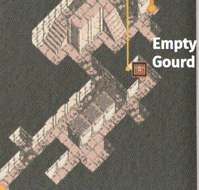
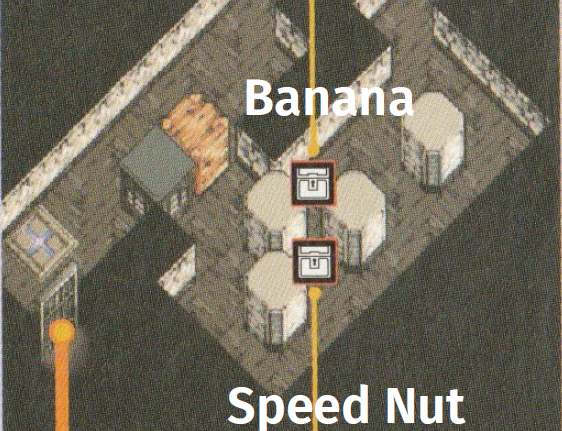
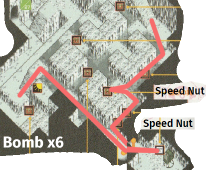

# 28 Dungeons

## Map

[Open full size <i class="fa fa-arrows-alt" aria-hidden="true"></i>](./assets/images/28D_map.png)

## Run video

<iframe
  style="aspect-ratio: 2/1"
  src="https://www.youtube.com/embed/uHMaErqqU_E"
  title="Boktai 1 28 Dungeons in 2:16:15"
  allowfullscreen
></iframe>

## Route

- In-game start time: 3:40 AM

### Small Cave

- 

### Gate of the Dead

### Ancient Forest

- Get Empty Gourd in first room

### Catacomb

- 
- 

### Bloodrust Mansion

- 

### Solar Tree

- plant 2 Speednuts

### 3x Deserted Arsenal

- Gains a total of +18 Speednuts and +3 Bombs

### Stairs of Trial

- Don't use a Speednut after the puzzle
- 

### Ruined Cemetery

### Firetop Mountain

- 

### Noname Fortress

- 

### Death Cliff

### Crumbling Mine

### Suffering House

- 
- 

### Permafrost

- 

### Stench Forest

- Sword Boss

### Remaining Tower

- 

### Scar of the Land

- 
- <kbd>↓</kbd>, <kbd>↓</kbd>, wait, <kbd>↓ →</kbd>, <kbd>→ ↑</kbd>, <kbd>→</kbd>
- Frost Lens, Spear Frame, Heal, use Flame Nut

### Forgotten Tomb

- 
- destroy Shield, use Bombs

### Abyss

- Use Banana for puzzles, 1 speednut after first puzzle
- 
- +1 Speednut on light bridge
- Get Javelin

### Delusion Forest

- Entering: 4x straight, 2x left
- Get reward
- Leaving: right, then move to entrance

### Valley of Ice

- Take top path in slide room

### Sol City

- 
- Don't pick up the grenades after Sabata until after Carmilla
- two speednuts in north trap
- Carmilla: use 15+1 Grenades

---

Need 3 Empty Gourd at this point. If less, do not gourd out of water demon's cage!

---

### House of Darkness

- 
- 
- Exit with Empty Gourd

### Fire Dragon's Grave

- 
- Exit with Empty Gourd

### Water Demon's Cage

- Sol 3 + Fencer swing
- Exit with Empty Gourd if you have more than 1

### Fallen Devil Castle

- 
- (First Floor)  
  
- Exit with Empty Gourd

### Frost Tower

- Use banana after mini

### Cloud Tower

- Block puzzle: `=`, `+`, `/`

### Dark Castle Core

- Don't need anything after the tentacle trap.
  - Top: 10 Golden Apples
  - Middle: 10 Solar Nuts
  - Bottom: 5 Speednuts
- 53 / 254
