# Boktai 1 Any% (Normal 2)

```admonish danger title="Work in Progress"
This guide is currently being rewritten because of route improvements.  
Feel free to contribute on Discord or on the GitHub repository.
```

<a href="./assets/images/any_map.webp">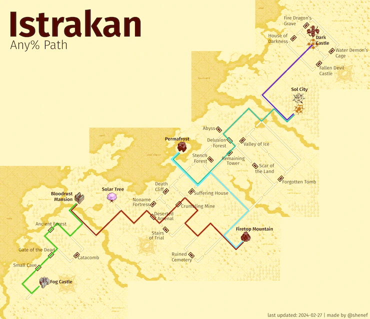</a>
[Click for full size <i class="fa fa-arrows-alt" aria-hidden="true"></i>](./assets/images/any_map.webp)

## About this Guide

This Guide is intended for the Japanese version of Boktai: The Sun is in your Hands and the Any% Category at the Normal 2 difficulty. It should work exactly the same for other languages but JP is significantly faster.  
Credits go to the entire [Taiyoh Network Community](https://discord.gg/0dUb9OmJrIrRPFGf) and the many casual players that found strategies we use today.

### Videos

Some sections have videos attached that show that section being played. Watch those videos for chests, pathing and enemies that need to be killed as that will be omitted from the text description. If a section has no video, there will be no chests you need and every enemy is a mandatory kill.  
The strategies shown in the videos are ideal scenarios, don't worry if a trap or boss fight doesn't work out exactly as shown.  
When there are route updates, there can be small differences like inventory item order or amount that may not be worth updating a video.  
Generally, if you pick up the same chests and kill the same enemies, you should be fine.

### Solar Gauge

A recommendation on which sun strength to use for that dungeon to prevent overheat and ensure you reach the required dungeon rank where necessary.  
For purifications always use the highest possible solar gauge level.

### Terminology

- **Stun**: Shooting an enemy in the back with a sufficiently strong frame will cause it to be stunned for several seconds. Stunned enemies have no hitbox, and can't see you.
- **Detection**: An enemy detects you if a **red** exclamation mark appears above the enemy. Being detected increases the "being found" counter on the dungeons result screen, which reduces your dungeon rank and therefore the reward(s) you receive after completing the dungeon. White or blue exclamation marks do not count as detections. Enemies in traps never detect you.

### General instructions

- Ignore every enemy unless the guide instructs you to do otherwise. The guide will tell you if there is a limit on how often you can get detected in a dungeon.
- Pick up every item marked on the maps. Many of these will be in invisible chests. You can open invisible chests by pressing A, just like normal chests.
- While picking up healing items (like apples) is optional, skip them at your own peril.
- Use healing items as necessary.

## Before the run

Check the Leaderboard rules to make sure your run will be valid!

If you want to play on an emulator, currently only mGBA and BizHawk are allowed.  
In the case of BizHawk, you should use _at least_ version 2.6.3 since that adds the ability to emulate an empty cartridge battery.

- BizHawk: GBA > Settings > Sync Settings:
  - Set "Skip BIOS" to "False"
  - Set "RTC use Real Time" to "False"
  - Set "RTC" to "False"
- mGBA:
  - TODO: instructions on how to set up empty battery

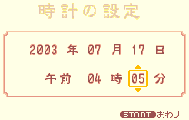</img>
Then in-game, set the Date and Time to

- 2003 年 07 月 17 日
- 午前 04 時 05 分

With this starting time you will

- get Ghouls instead of Spiders outside Fog Castle,
- get better enemies in Firetop Mountain,
- skip the Night to Day cutscene if you are fast enough to get it between Firetop and Permafrost,
- reach Delusion Forest during the early morning.

Optional on Emulator: Increase the Light on the Start Screen (visualized by Sun animation speed)

To start a new run

- create a new save file,
- reduce the name to one character,
- keep the default region setting,
- keep the default difficulty (Normal 2),
- start the timer when confirming on the Summary Screen.

## Intro

Once you gain control, pause the game and set the text speed to "Fast".  
Inputs needed to change the text speed:

- <kbd>start</kbd>, <kbd>↓</kbd>, <kbd>↓</kbd>, <kbd>A</kbd>, <kbd>↓</kbd>, <kbd>→</kbd>, <kbd>A</kbd>, <kbd>B</kbd>

Text speed saves about 3-4 seconds.

## Fog Castle &nbsp; 

| Resource     | Start with | Get   | Consume | End with
|--------------|------------|-------|---------|----------
| Sol Lens EXP | 0          | +106  |         | 106
| Speed Nut    | 0          | +5    | -1      | 4

Follow the only path through this dungeon. Pick up the **Knight Frame** from the green chest on the way, and equip it immediately. Kill the Bok in the next room by hitting it with 3 ticks of your guns spread.

Kill all bats in the coffin room without running out of energy. This spawns a chest containing ![][icon_speed_nut] 5 Speed Nuts. Then drag the coffin back out.

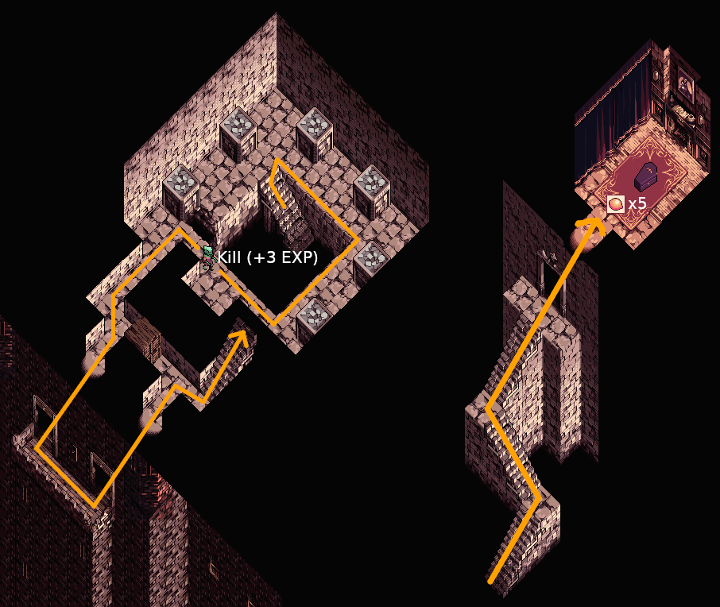

When the coffin starts shaking in this hallway, drop the coffin, kill the stationary Bok near the skylight (+3 EXP), and knock on the wall behind the skylight. The second Bok will move into the skylight and die, allowing you to drag the coffin out unimpeded:

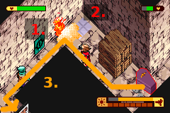

First, charge the left tower of the pile driver. Then charge the right tower by standing on the pile driver activation spot. After charging that tower, press A immediately to start the purification, skipping a text box:

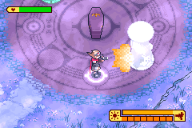

Use a ![][icon_speed_nut] Speed Nut just before completing the purification (+100 EXP).

## Small Cave &nbsp; 

| Resource     | Start with | Get   | Consume | End with
|--------------|------------|-------|---------|----------
| Sol Lens EXP | 106        | +3    |         | 109
| Speed Nut    | 4          | +3    | -1      | 6
| Banana       | 0          | +1    |         | 1

You _must_ get an S-rank in this dungeon. This requires at most one detection, and ideally your one detection is from the last Bok just before the door to the trap.

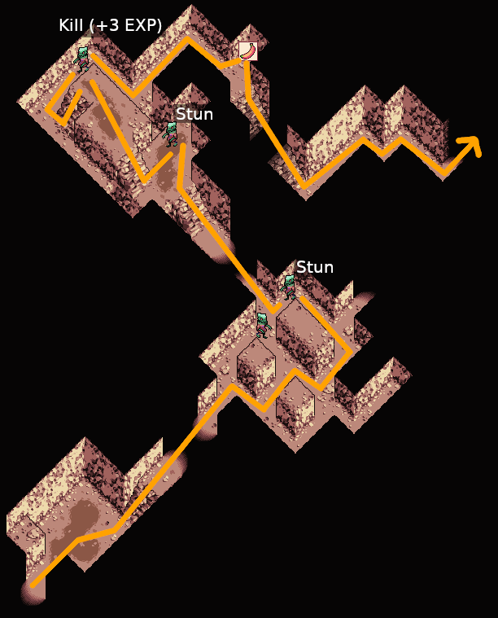

Before getting the key, stun the enemy to the north. Do this by entering the door to the key while holding right, and immediately firing a shot once you emerge in the big room. Then get the ![][icon_key_triangle] Triangle Key from the chest and go to the trap, while avoiding detections by the Boks.

You should charge your energy to full on the skylight while waiting for the Bok on the right to turn away.

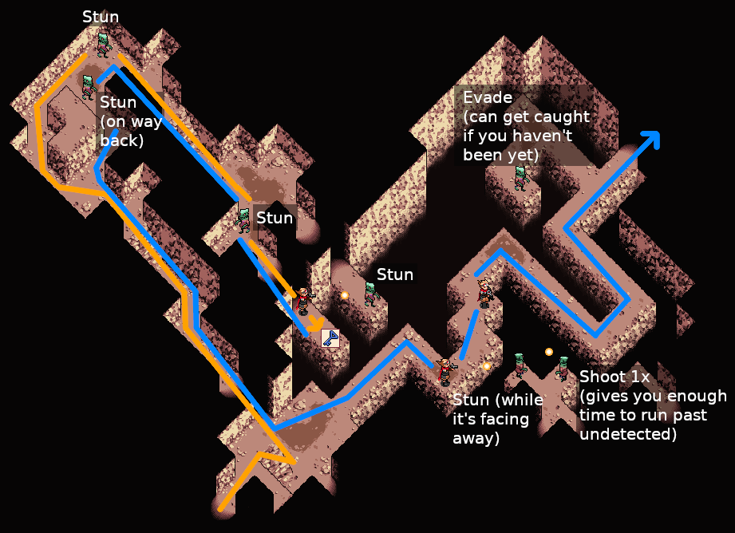

Clear the trap. If you S-ranked this dungeon, you will receive a reward chest with ![][icon_speed_nut] 3 Speed Nuts. Use a ![][icon_speed_nut] Speed Nut before leaving the dungeon.

## Gate of the Dead &nbsp; 

| Resource     | Start with | Get   | Consume | End with
|--------------|------------|-------|---------|----------
| Sol Lens EXP | 109        | +30   |         | 139
| Speed Nut    | 6          |       | -1      | 5
| Banana       | 1          | +3    |         | 4

You _must_ get an S-rank in this dungeon. You _cannot_ be detected at all. In the first room, stun the right Bok by firing 9 shots at it from the bottom of the room. Because you're out of its vision range here, it will not see you:

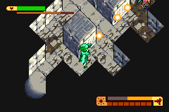

The other enemies in this dungeon require no interaction. Their vision range is too short to detect you:

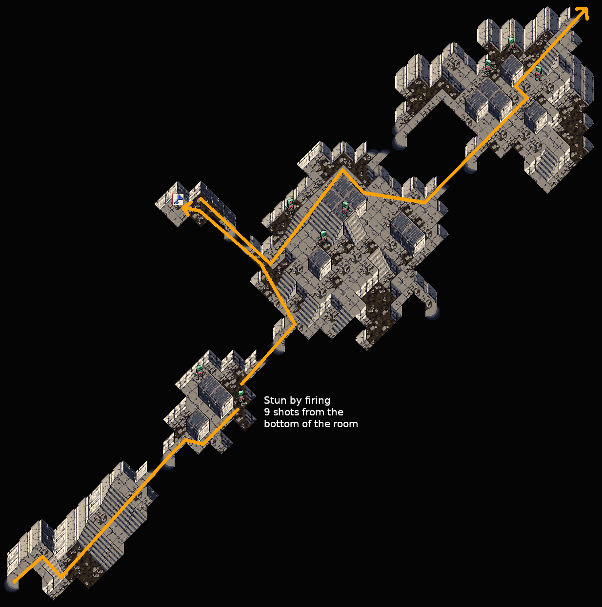

### <span class="trap">Trap</span>

Use your guns spread to defeat the Sword. Try to reflect the small swords back into the big sword to speed up the fight. To conserve energy don't fire the spread continuously, but let go of the B button while the sword is invincible between your attacks.

Clear the trap (+30 EXP), open the reward chest containing ![][icon_banana] 3 Bananas, and use a ![][icon_speed_nut] Speed Nut before leaving the dungeon.

## Ancient Forest &nbsp; 

| Resource     | Start with | Get   | Consume | End with
|--------------|------------|-------|---------|----------
| Sol Lens EXP | 139        | +40   |         | 179
| Speed Nut    | 5          |       | -1      | 4

There is no required rank in this dungeon, so there's no limit on how often you can be detected.

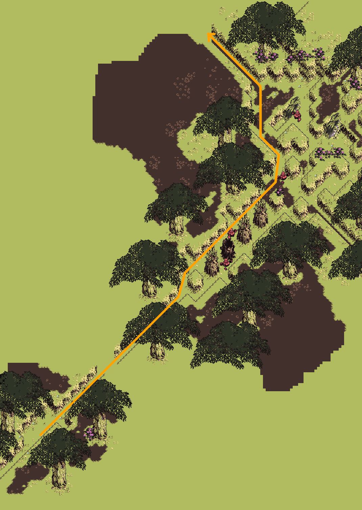

The only item you have to pick up is the **Spear Frame** from the green chest. Equip it before entering the trap. Ignore all other chests.

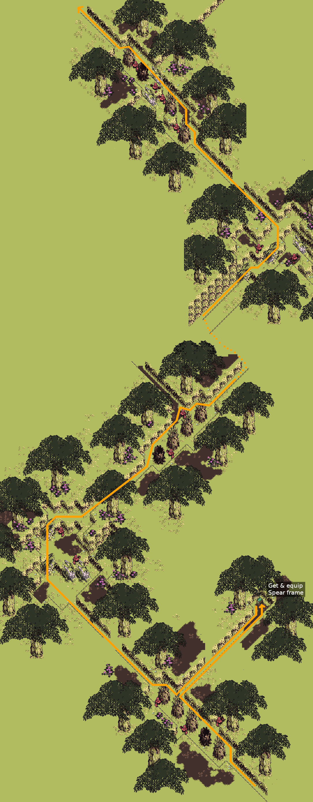

### <span class="trap">Trap</span>

Walk over the puddle and back as indicated to attract the Golems. Once they are in your line of fire, knock them away with the Spear Frame. By doing this, all Golems will be stunned and bunched up at the same spot, and you can kill them at the same time:

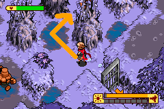
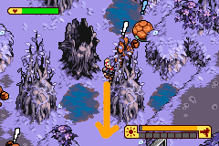
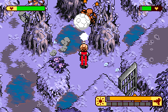

Do not let the golems kill each other. If they do, you'll be short 5 EXP for every Golem that didn't die from your gun. In that case, you'll need to kill extra enemies later in the run (before Sabata in Dark Castle) to make up the missing EXP. Any Golem, Mummy, and Cockatrice-type enemy will give at least 5 EXP, as will any Bok _except_ for the green ones.

Clear the trap (+40 EXP), skip the reward chest, and use a  Speed Nut before leaving the dungeon.

## Bloodrust Mansion &nbsp; 

For the Count fight increase Sun to 8, then keep it at 8 to ensure S-Rank.

- Garden puzzle numbers: 3 > 9 > 8 > 6 > 5 (best to worst)
- Time Puzzle: 7, 9, 10, 1, 3, 5, 8

## Solar Tree &nbsp; 

Talk to Lita, plant a single Green Apple (A, start, A).  
Alternative, not properly tested, strategy: Plant a Gold Apple. The idea is that if you have very good Sunlight management, you will never get the "plant is grown" message.

## Deserted Arsenal

TODO

## Crumbling Mine

TODO

## Firetop Mountain

TODO

## Permafrost

TODO

## Remaining Tower 1

TODO

## Delusion Forest

TODO

## Sol City

Chicken Trap has ![][icon_speed_nut] 5 Speed Nuts and ![][icon_banana] 5 Bananas

## Crusader Frame

TODO

## Flame Tower

TODO

## Earth Tower

TODO

## Frost Tower

TODO

## Cloud Tower

TODO

## Central Tower

TODO

## Sabata

### Phase 1

TODO

### Phase 2

TODO

## Hel

### Phase 1

TODO

### Phase 2

TODO

## Lens Exp Routing (Outdated)

{{#include assets/tables/normal-2_any_lens-exp.html}}

<!-- Items -->
[icon_speed_nut]: ./assets/images/icons/icon_speed_nut.webp
[icon_banana]: ./assets/images/icons/icon_banana.webp
[icon_key_triangle]: ./assets/images/icons/icon_key_triangle.webp
