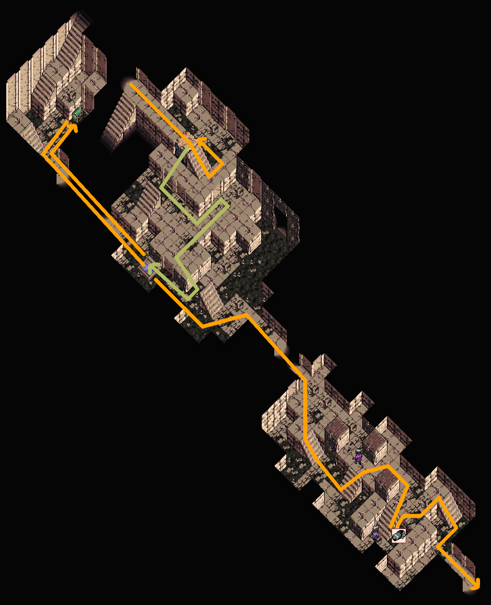
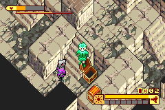
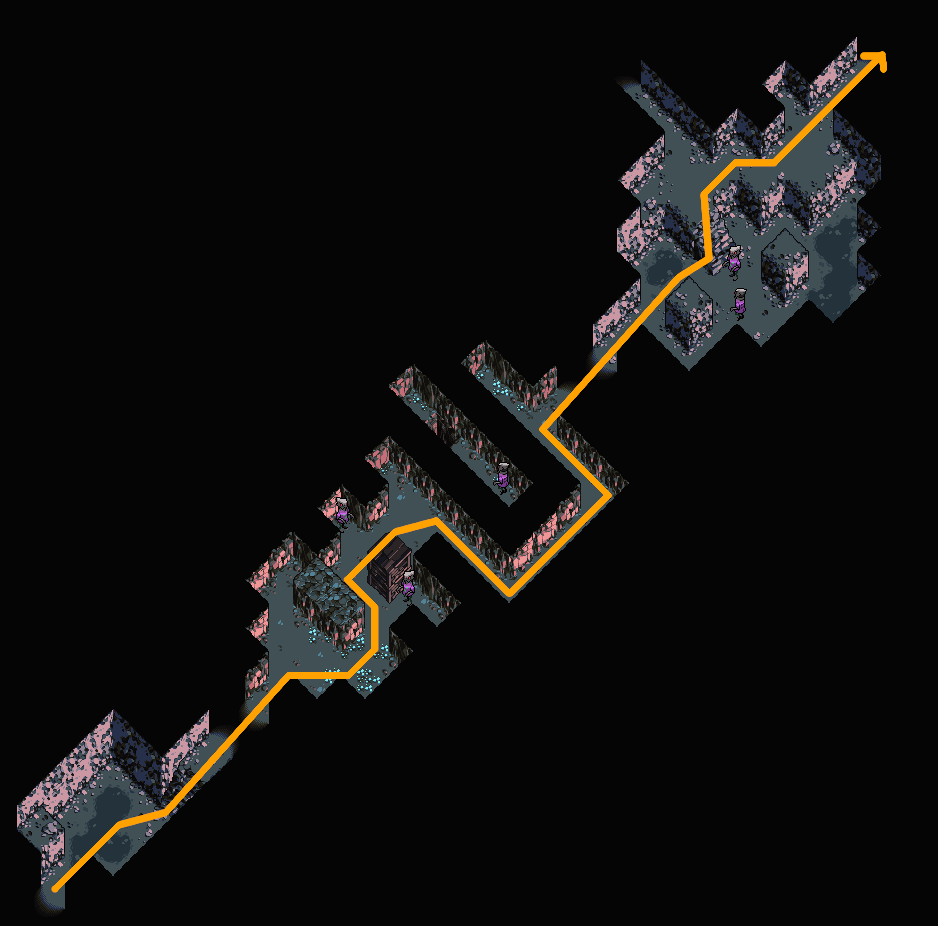
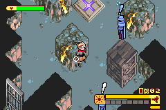
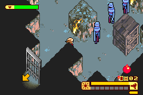
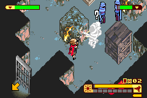
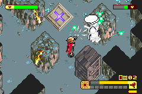
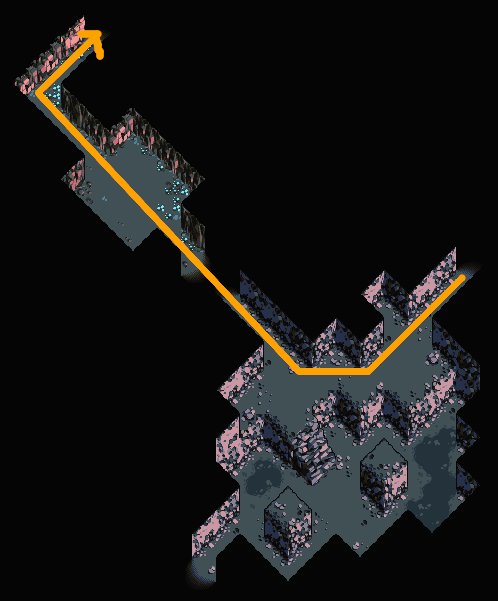

# Boktai 1 Any% (Normal 2)

```admonish danger title="Work in Progress"
This guide is currently being rewritten because of route improvements.  
Feel free to contribute on Discord or on the GitHub repository.
```

<a href="./assets/images/any_map.webp"></a>
[Click for full size <i class="fa fa-arrows-alt" aria-hidden="true"></i>](./assets/images/any_map.webp)

## About this Guide

This Guide is intended for the Japanese version of Boktai: The Sun is in your Hands and the Any% Category at the Normal 2 difficulty. It should work exactly the same for other languages but JP is significantly faster.  
Credits go to the entire [Taiyoh Network Community](https://discord.gg/0dUb9OmJrIrRPFGf) and the many casual players that found strategies we use today.

### Videos

Some sections have videos attached that show that section being played. Watch those videos for chests, pathing and enemies that need to be killed as that will be omitted from the text description. If a section has no video, there will be no chests you need and every enemy is a mandatory kill.  
The strategies shown in the videos are ideal scenarios, don't worry if a trap or boss fight doesn't work out exactly as shown.  
When there are route updates, there can be small differences like inventory item order or amount that may not be worth updating a video.  
Generally, if you pick up the same chests and kill the same enemies, you should be fine.

### Solar Gauge

A recommendation on which sun strength to use for that dungeon to prevent overheat and ensure you reach the required dungeon rank where necessary.  
For purifications always use the highest possible solar gauge level.

### Terminology

- **Stun**: Shooting an enemy in the back with a sufficiently strong frame will cause it to be stunned for several seconds. Stunned enemies have no hitbox, and can't see you.
- **Detection**: An enemy detects you if a **red** exclamation mark appears above the enemy. Being detected increases the "being found" counter on the dungeons result screen, which reduces your dungeon rank and therefore the reward(s) you receive after completing the dungeon. White or blue exclamation marks do not count as detections. Enemies in traps never detect you.

### General instructions

- Ignore every enemy unless the guide instructs you to do otherwise. The guide will tell you if there is a limit on how often you can get detected in a dungeon.
- Pick up every item marked on the maps. Many of these will be in invisible chests. You can open invisible chests by pressing A, just like normal chests.
- While picking up healing items (like apples) is optional, skip them at your own peril.
- Use healing items as necessary.
- Hold B to clear text boxes optimally. Mash A/B to clear undead dungeon intros. Mash A/Start to clear immortal dungeon intros. Mash A/B to clear dungeon result screens.
- You can (and should) cut corners on every staircase, both at the top and at the bottom. This saves time, and allows you to sneak past some enemies.

## Before the run

Check the Leaderboard rules to make sure your run will be valid!

If you want to play on an emulator, currently only mGBA and BizHawk are allowed.  
In the case of BizHawk, you should use _at least_ version 2.6.3 since that adds the ability to emulate an empty cartridge battery.

- BizHawk: GBA > Settings > Sync Settings:
  - Set "Skip BIOS" to "False"
  - Set "RTC use Real Time" to "False"
  - Set "RTC" to "False"
- mGBA:
  - TODO: instructions on how to set up empty battery

</img>

Then in-game, set the Date and Time to

- 2003 年 07 月 17 日
- 午前 04 時 05 分

With this starting time you will

- get Ghouls instead of Spiders outside Fog Castle,
- get better enemies in Firetop Mountain,
- skip the Night to Day cutscene if you are fast enough to get it between Firetop and Permafrost,
- reach Delusion Forest during the early morning.

Optional on Emulator: Increase the Light on the Start Screen (visualized by Sun animation speed)

To start a new run

- create a new save file,
- reduce the name to one character,
- keep the default region setting,
- keep the default difficulty (Normal 2),
- start the timer when confirming on the Summary Screen.

## Intro

Once you gain control, pause the game and set the text speed to "Fast".  
Inputs needed to change the text speed:

- <kbd>start</kbd>, <kbd>↓</kbd>, <kbd>↓</kbd>, <kbd>A</kbd>, <kbd>↓</kbd>, <kbd>→</kbd>, <kbd>A</kbd>, <kbd>B</kbd>

Text speed saves about 3-4 seconds.

## Fog Castle &nbsp; 

| Resource     | Start with | Get   | Consume | End with
|--------------|------------|-------|---------|----------
| Sol Lens EXP | 0          | +106  |         | 106
| Speed Nut    | 0          | +5    | -1      | 4

Follow the only path through this dungeon. Pick up the **Knight Frame** from the green chest on the way, and equip it immediately. Kill the Bok in the next room by hitting it with 3 ticks of your guns spread.

Kill all bats in the coffin room without running out of energy. This spawns a chest containing ![][icon_speed_nut] 5 Speed Nuts. Then drag the coffin back out.


When the coffin starts shaking in this hallway, drop the coffin, kill the stationary Bok near the skylight (+3 EXP), and knock on the wall behind the skylight. The second Bok will move into the skylight and die, allowing you to drag the coffin out unimpeded:


First, charge the left tower of the pile driver. Then charge the right tower by standing on the pile driver activation spot. After charging that tower, press A immediately to start the purification, skipping a text box:


The basic strategy for purifications is:

1. Evade the immortal's attacks (there won't be any attacks during _this_ purification).
2. If one of the Solar Piles is not at full power (= the ray is partially dark), spread at the corresponding generator until it's back at full power. Not having all piles at full power significantly increases the time required for purification.
3. Otherwise, spread at the coffin.

Use a ![][icon_speed_nut] Speed Nut just before completing the purification (+100 EXP). When the screen with the Boktai logo appears, mash A/B to clear it.

## Small Cave &nbsp; 

| Resource     | Start with | Get   | Consume | End with
|--------------|------------|-------|---------|----------
| Sol Lens EXP | 106        | +3    |         | 109
| Speed Nut    | 4          | +3    | -1      | 6
| Banana       | 0          | +1    |         | 1

You _must_ get an S-rank in this dungeon. This requires at most one detection, and ideally your one detection is from the last Bok just before the door to the trap.


Before getting the key, stun the enemy to the north. Do this by entering the door to the key while holding right, and immediately firing a shot once you emerge in the big room. Then get the ![][icon_key_triangle] Triangle Key from the chest and go to the trap, while avoiding detections by the Boks.

You should charge your energy to full on the skylight while waiting for the Bok on the right to turn away.


Clear the trap. If you S-ranked this dungeon, you will receive a reward chest with ![][icon_speed_nut] 3 Speed Nuts. Use a ![][icon_speed_nut] Speed Nut before leaving the dungeon.

## Gate of the Dead &nbsp; 

| Resource     | Start with | Get   | Consume | End with
|--------------|------------|-------|---------|----------
| Sol Lens EXP | 109        | +30   |         | 139
| Speed Nut    | 6          |       | -1      | 5
| Banana       | 1          | +3    |         | 4

You _must_ get an S-rank in this dungeon. You _cannot_ be detected at all. In the first room, stun the right Bok by firing 9 shots at it from the bottom of the room. Because you're out of its vision range here, it will not see you:


The other enemies in this dungeon require no interaction. Their vision range is too short to detect you:


### <span class="trap">Trap</span>

Use your guns spread to defeat the Sword. Try to reflect the small swords back into the big sword to speed up the fight. To conserve energy don't fire the spread continuously, but let go of the B button while the sword is invincible between your attacks.

Clear the trap (+30 EXP), open the reward chest containing ![][icon_banana] 3 Bananas, and use a ![][icon_speed_nut] Speed Nut before leaving the dungeon.

## Ancient Forest &nbsp; 

| Resource     | Start with | Get   | Consume | End with
|--------------|------------|-------|---------|----------
| Sol Lens EXP | 139        | +40   |         | 179
| Speed Nut    | 5          |       | -1      | 4

There is no required rank in this dungeon, so there's no limit on how often you can be detected.


The only item you have to pick up is the **Spear Frame** from the green chest. Equip it before entering the trap. Ignore all other chests.


### <span class="trap">Trap</span>

Walk over the puddle and back as indicated to attract the Golems. Once they are in your line of fire, knock them away with the Spear Frame. By doing this, all Golems will be stunned and bunched up at the same spot, and you can kill them at the same time:


Do not let the golems kill each other. If they do, you'll be short 5 EXP for every Golem that didn't die from your gun. In that case, you'll need to kill extra enemies later in the run (before Sabata in Dark Castle) to make up the missing EXP. Any Golem, Mummy, and Cockatrice-type enemy will give at least 5 EXP, as will any Bok _except_ for the green ones.

Clear the trap (+40 EXP), skip the reward chest, and use a ![][icon_speed_nut] Speed Nut before leaving the dungeon.

## Bloodrust Mansion &nbsp; 

| Resource     | Start with | Get   | Consume | End with
|--------------|------------|-------|---------|----------
| Sol Lens EXP | 179        | +109  |         | 288
| Speed Nut    | 4          | +5    | -3      | 6
| Banana       | 4          | +2    | -6      | 0
| Bomb         | 0          | +4    | -3      | 1
| Evil Banana  | 0          | +3    |         | 3

Avoid getting seen, because you must S-rank this dungeon.


Get the circle key by pushing the top-most block left:


After your Speed Nut expires, use a ![][icon_banana] Banana for the box push puzzle, then use 2 ![][icon_speed_nut] Speed Nuts.


Make sure to pick up the Double Battery from the green chest, but don't equip it yet. The spiders in the next room are unable to detect you, and only the red spiders have a hitbox at all.


In the next room, step on these pressure plates in order to open the staircase, and go downstairs:  
7, 9, 10, 1, 3, 5, 8


Use a ![][icon_banana] Banana to solve the next box push puzzle, then use one more ![][icon_speed_nut] Speed Nut.


You can push the Bok onto the pressure plate by setting up a back attack. Use the floor tiles as a visual reference:

1. Position Django on the light floor tile
2. Wait until the Bok steps onto the 3rd row of floor tiles
3. Fire a shot at the Bok, this will knock it onto the pressure plate:

(Backup strat: Use Knight Frame + Luna Lens)


In the room with the Vaniboks, it's OK to get detected once on each visit.


Flip the lever and go back to enter the next puzzle where you must place two Boks onto the pressure plates at the same time to unlock the exit. To solve this puzzle quickly:

1. Knock on the pillar near the entrance to attract both Boks.
2. Sneak up behind the lower Bok and follow it.
3. Once that Bok turns right, fire a shot to stun it and knock it onto the pressure plate simultaneously.
4. Stand on the upper pressure plate and knock on the pillar to attract the upper Bok.
5. Hide and wait for the door to open.

([Video](https://www.twitch.tv/a_raphi/clip/InspiringFunnyAsteriskTinyFace-YN1PtDHDSxqtVwdO))

This requires some practice, if you're not fast enough then the upper Bok will spot you. The strategy works without a Speed Nut active.  
(Backup strat: Use Knight Frame + Sol Lens to stun the Boks, and Luna Lens to knock them around)


For the Count fight increase Sun to  8, then keep it at 8 for the remainder of the dungeon to ensure S-Rank. Equip the bombs, and ensure you have the Sol Lens and Spear Frame equipped.

### The Count

1. Start the fight by mashing L until you have thrown 3 bombs.
2. Wait for the count to start moving, then position yourself on the stone floor to the south of the center window.
3. Wait for the count to throw a sword at you, and shoot to knock it back at him (you can shoot the sword as soon as it starts spinning).
4. Wait for the count to start moving, run to the north of the skylight (taking contact damage from one of the swords if necessary), and knock another sword back at the count.
5. Wait for the count to start moving again, and run to the south of the skylight.
6. Wait for the count to start his dash attack, and run to the north of the skylight again. If done correctly, the count will dash into the skylight and die (+50 EXP).

([Video](https://www.twitch.tv/a_raphi/clip/SleepyBumblingLapwingJKanStyle-wTso6E4Db9UkDj9V))


### Purification

Equip the Knight Frame, and use all 4 remaining ![][icon_banana] Bananas to drag the coffin back to the pile driver. Go back the way you came undetected:

- _In the room with the two Boks and two pressure plates_: Stun the upper Bok to leave the room undetected.
- _In the room with the Vaniboks_: Leave the coffin at the entrance, pull the lever, and start dragging the coffin again.
- _After the garden_: Go south at the intersection and push the box out of the way. Alternate between pushing the box and dragging the coffin:


At the pile driver, activate two generators simultaneously using your gun's spread.

Complete the purification (+50 EXP), which should give you an S-rank. Open the two chests on the right (3 ![][icon_evil_banana] Evil Bananas, 2 ![][icon_speed_nut] Speed Nuts) and walk to the Solar Tree.

## Solar Tree &nbsp; 

Talk to Lita, then plant a single Green Apple (A, start, A).

```admonish info
If you have gotten a random Gold Apple drop, you can instead plant a Gold Apple + either a Green or a Red Apple. This skips a "The solar tree is calling..." text box after Firetop Mountain.
```

## Deserted Arsenal &nbsp; 

| Resource     | Start with | Get   | Consume | End with
|--------------|------------|-------|---------|----------
| Sol Lens EXP | 288        | +70   |         | 358
| Evil Banana  | 3          |       | -1      | 2
| Speed Nut    | 6          | +6    | -1      | 11
| Bomb         | 1          | +1    |         | 2

Use an ![][icon_evil_banana] Evil Banana to solve the box push puzzle.
Get the Fencer Frame from the green chest, then equip it and use a ![][icon_speed_nut] Speed Nut. Avoid detection by the Steps and the Boks in the final room to ensure S-rank.



You can open the chest containing the Bomb from the staircase, this avoids having to stun the Bok below:



### Trap

Defeat the Sword with the Fencer Frame by holding B, and alternate pressing Right and Down on the D-pad to create a spread. With the Fencer Frame, the spread created by changing direction deals the most damage. Do not hold two directions on the D-pad at the same time. After clearing the trap (+70 EXP), open the reward chest for 6 ![][icon_speed_nut] Speed Nuts.

## Crumbling Mine &nbsp; 

| Resource     | Start with | Get   | Consume | End with
|--------------|------------|-------|---------|----------
| Sol Lens EXP | 358        | +80   |         | 438
| Banana       | 0          | +2    |         | 2
| Speed Nut    | 11         |       | -1      | 10

The target rank for this dungeon is A. You can ignore all enemies in this dungeon: You will get detected 3 times, but this will still be enough to get an A rank.



## Trap

Start by equipping the Double Battery and the Spear Frame, then kill the Mummies by bunching them up against a wall:

1. Knock on the center rock.
2. Hug the wall directly to the south, and wait for the Mummies to be bunched up.
3. Use the Spear Frame to push them towards the north rock.
4. Now you just shoot them until they all die. Stay close to the mummies because the damage output of the Spear Frame decreases with distance.

([Video](https://www.twitch.tv/a_raphi/clip/RudeEvilPieBatChest-zneuvExvIdxp6Ox6))






After clearing the trap (+80 EXP), open the reward chests for 2 ![][icon_banana] Bananas and the ![][icon_key_triangle] Triangle Key. Use a ![][icon_speed_nut] Speed Nut and leave the dungeon:



## Firetop Mountain

TODO

## Permafrost

TODO

## Remaining Tower 1

TODO

## Delusion Forest

TODO

## Sol City

Chicken Trap has ![][icon_speed_nut] 5 Speed Nuts and ![][icon_banana] 5 Bananas

## Crusader Frame

TODO

## Flame Tower

TODO

## Earth Tower

TODO

## Frost Tower

TODO

## Cloud Tower

TODO

## Central Tower

TODO

## Sabata

### Phase 1

TODO

### Phase 2

TODO

## Hel

### Phase 1

TODO

### Phase 2

TODO

## Lens Exp Routing (Outdated)

{{#include assets/tables/normal-2_any_lens-exp.html}}

<!-- Items -->
[icon_speed_nut]: ./assets/images/icons/icon_speed_nut.webp
[icon_banana]: ./assets/images/icons/icon_banana.webp
[icon_evil_banana]: ./assets/images/icons/icon_evil_banana.webp
[icon_key_triangle]: ./assets/images/icons/icon_key_triangle.webp
