# Boktai 3: Any% Route

{{#title Boktai 3: Alternate Any% Route (Clock Tower + Solar Bank interests)}}

```admonish danger title="Work in Progress"
This guide focuses on a potential new route involving a new money route that uses the Clock Tower and Solar Bank interests to get Solls.

Many cards are skipped, as they were either used for money or are considered to be not worth getting (time cost too high compared to benefits from using the card).
```

## About this guide

Directions for paths and exits will use ↖️, ↗️, ↙️ and ↘️.

## Before starting

If playing on BizHawk, set Skip BIOS to FALSE and RTC to FALSE in the GBA Settings (Requires v2.6.3+):  


Set the system time to July 28th 2002 23:55 (2002/07/28 23:55):  


## Setting up the Grand Master password

When making a new file, select the left option, then input the password.

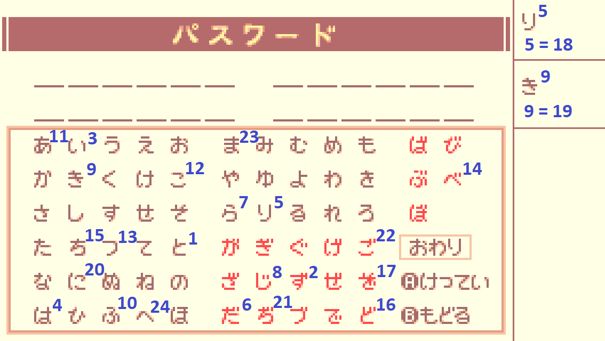

Use the characters to the **right** of the numbers!

The Grand Master title grants +2 VIT, +2 SPR, +2 STRG and adds the following items in the inventory (in order from left to right):

- 2 ![icon][earthly_nut] Earthly Nuts
- 1 ![icon][speed_nut] Speed Nut
- 1 ![icon][green_card] "The Sun" Card (recovers all HP)
- 1 ![icon][tiptoe_nut] Tiptoe Nut
- 1 ![icon][see_all_nut] See-All Nut
- 1 ![icon][tasty_meat] Tasty Meat
- 1 ![icon][green_card] "The Moon" Card (recovers all ENE)

Use a single character for the player name (saves a few frames each time the name is displayed).

## Prologue

The prologue lasts a fixed amount of time, all you need to do is not die as Sabata.

## Sealed Dungeon

After the dialogs, open the chest next to the stairs to get a ![icon][solar_nut] Solar Nut.

Open the menu, change text speed to Fast and set markers to Off (inputs : A, Down, Right, Down, Right):  
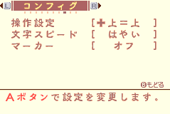

Then go into the inventory, use a ![icon][solar_nut] Solar Nut and a ![icon][speed_nut] Speed Nut and proceed in the ↗️ direction.

Keep going without stopping.
Once you reach the room with the 2 spiders, go to the right to get the ![icon][wizard_frame] Wizard Frame, then proceed in the ↖️ and ↗️ directions.

### <span class="trap">Skeleton Trap</span>

- Open the chest for a ![icon][solar_nut] Solar Nut.
- Open the menu, use the ![icon][solar_nut] Solar Nut & equip the ![icon][wizard_frame] Wizard Frame.
- Shoot the Skeleton until death.
- You are now **Lvl 2** _(12 EXP)_.

Keep going until you reach the **"+-shaped room"**, take the ↘️ path and step on the weight switch to get the ![icon][gradius] Gradius.

In the next room, break the first block with the ![icon][gradius] Gradius and fall to reach the ↖️ exit.

Then instead of getting close to the lever, switch to ![icon][wizard_frame] Wizard Frame and shoot to hit the lever from far away and skip an extra dialog, then proceed in the ↗️ direction.  


Keep going, and when you reach the room with klorofoluns, get the hidden ![icon][speed_nut] Speed Nut on the side of the stairs before proceeding in the ↗️ direction.

### <span class="trap">Armor Trap</span>

- Set sunlight to max.
- Shoot once with ![icon][fighter_frame] Fight Frame.
- Go on the skylight on the right.
- Aim up, and when the armor is aligned, keep shooting in rhythm to stunlock & prevent it from raising its shield until the trap is over. (approx time ~16.84s)
- You are now **Lvl 4** _(12 => 136 EXP)_.  
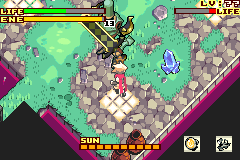

After the trap proceed in the ↗️ direction to leave the dungeon.  
Set the sunlight to 0.

## San Miguel

**Django's House**

- Talk to Violet & choose the first option.
- <span class="safety">Safety strat:</span> Get the ![icon][luna_lens] Luna Lens near the doll on the left.

Leave the house and visit the following places.  
On Map screens you can use the shoulder buttons navigate quickly.

**Lita - Item Shop**

- Talk to Lita
- Use a ![icon][speed_nut] Speed Nut, then open all chests to get 2 ![icon][earthly_nut] Earthly Nuts & 2 ![icon][healer] Healers.
- Sell the following items for money:
  - 1 ![icon][see_all_nut] See-All Nut
  - 1 ![icon][tiptoe_nut] Tiptoe Nut
  - 4 ![icon][earthly_nut] Earthly Nuts
  - 2 ![icon][healer] Healers
  - 1 ![icon][tasty_meat] Tasty Meat
  - 1 ![icon][green_card] "The Moon" Card
  - 1 ![icon][green_card] "The Sun" Card

**Solar Bank | Dark Loans**

- Withdraw all the money from the Solar Bank _(500+ solls)_.

**Clock Tower**

- Talk to Eliot (old man with glasses).
- Talk to Eliot again and change the time to July 21st 2005 20:00 (2005/07/21 20:00)  
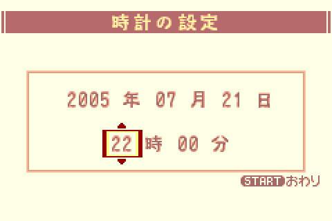

**Garage**

- Talk to the guy in the back.

**Lita - Item Shop 2**

- Buy 3 ![icon][power_nut] Power Nuts & sort your inventory before closing the shop menu and leaving.

**Accessory Shop**

- Buy ![icon][iron_clogs] Iron Clogs & ![icon][crest_of_diamonds] Crest of Diamonds.
- Before leaving, open the chest to get the ![icon][leather_armor] Leather Armor.

**Solar Smith**

- Talk to Smith.
- Talk to the first panel on the left.

**Weapon Shop**

- Talk to Cheyenne to get ![icon][dash] Dash magic.
- Buy ![icon][estoc] Estoc & ![icon][rapier] Rapier.

**Library**

- Talk to Lady.

**Inn**

- Talk to Zazie twice to get the ![icon][dark_loans_card] Dark Card.

Now exit to the World Map and head to Lifeless Town.  
You can check the Boktai 3 resource list for help with the Bike race.

## Lifeless Town

Open the menu:

Heal with moon bugs & proceed in the ↗️ direction.  
When you reach the room with 2 skeletons, take the ↗️ path.

### <span class="mission">Mission: Open the gate!</span> (Light the torch)

Take the stairs in the upper-↖️ direction.
Open the green chest to get ![icon][flame_lens] Flame Lens.

Go back and go in front of the gate.  
Equip ![icon][flame_lens] Flame Lens and shoot at the torch.  
Proceed in the ↗️ direction.

### <span class="trap">Skeletons Trap</span>

- Use ![icon][wizard_frame] Wizard Frame, start by shooting in the back
- _(136 => 224 EXP)_

Proceed in the ↘️ direction.

Take the upper-↖️ path and take the elevator on the left.  
Enter the ↖️ room and open the green chest for the **Knuckle Guard** bike part.  
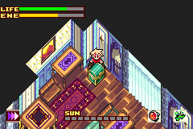

### <span class="manip">Stat card manip</span>

- Leave the room. _You should now be in the room with spikes on the floor._
- Save & Soft-reset (A + B + Start + Select).
- Set the time to July 21st 2005 20:00 (2005/07/21 20:00) :  

- Fall onto the spikes to reach the ↗️ room.
- After the dialogs, open the green chest to get a ![icon][red_card] +4 Stat card (400 solls) & then open the blue chest to get the ![icon][circle_key] Circle Key.
- Use the +4 Stat card to get +4 STR.

Leave the room and take the closest elevator to go back down.  
Take go through the ↘️ path & open the door to proceed in the ↗️ direction.

### <span class="trap">Armor Trap</span>

- Shoot once with ![icon][wizard_frame] Wizard Frame to force it to shield.
- Get closer and use ![icon][gradius] Gradius while aiming UP until the cutscene triggers. (approx time until cutscene: ~15.85s)
- After the cutscene, spam B as Black Django.
- You are now **Lvl 6** _(224 => 413 EXP)_.

Keep going in the ↗️ direction.  
In the room with mummies, proceed in the ↗️ direction, then ↖️ twice.  
Open the green chest to get the ![icon][hoop_frame] Hoop Frame.  
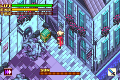

Go back and proceed in the ↘️ direction.  
Lure the ghoul on the weight switch, go through the ↗️ gate, then ↖️.

### <span class="mission">Mission: Find the yellow key!</span>

- Go up the stairs and dash above the traps to reach the last room.
- Open the left chest first to get a ![icon][jerky] Jerky, then open the blue chest to get the ![icon][triangle_key] Triangle Key and trigger the cutscene.

Go through the yellow door, then take the ↘️ path.  
After Otenko's dialogs, take the ↗️ path, then ↖️ twice.  
Open the green chest to get the **Tire Trail** bike part.  
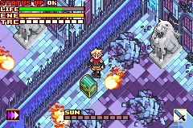

Go back once and proceed in the ↗️ direction to reach the boss room.

During dialog, spam A (the 2nd option is faster by a few frame, only worth menuing for TAS).  
Open the menu, put all your stat points into STR, equip ![icon][hoop_frame] Hoop Frame & ![icon][sol_lens] Sol Lens, then go through the door.

### <span class="boss">The Count</span>

- Use ![icon][hoop_frame] Hoop Frame on the Count. Do not bother with the windows.
- You are now **Lvl 7** _(413 => 662 EXP)_.

### Coffin

- Set sunlight to 0.
- Use a ![icon][power_nut] Power Nut and start going back.

In the room where Otenko summons a solar circle, take the ↙️ path.  
Push the wooden block on the weight switch, then go through the ↖️ path.  
Push the iron block and take the ↙️ path.

Once you get past the room where you fought the Armor (brown door), take the ↖️ path and keep going towards the entrance of the dungeon (the other path is for a sidequest and takes longer to go through because of puzzles).

### <span class="purification">The Count Purification</span>

- Go at the bottom of the piledriver and use ![icon][wizard_frame] Wizard Frame to activate all of them in one shot. During the shot, walk and activate the piledriver as soon as all 4 of them have been hit to skip dialogs.
- Start the purification and use ![icon][hoop_frame] Hoop Frame until the end.  
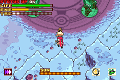
- _(662 => 743 EXP)_

## San Miguel (2)

### Django's House

- Equip **Tire Trail** & **Knuckle Guard** bike parts to get more HP & be able to drive on mud during bike races.

### Item Shop

- Buy 7 ![icon][power_nut] Power Nuts.

## Ancient Tree

Enter the tree, then take the ↖️ & ↗️ paths.

### <span class="trap">Ghouls & Bats Trap</span>

- Use ![icon][hoop_frame] Hoop Frame & ![icon][sol_lens] Sol Lens on Ghouls
- Use ![icon][gradius] Gradius on Bats.
- You are now **Lvl 8** _(743 => 847 EXP)_.

Proceed through the ↘️ gate & take the elevator to reach **2F**.  
After the elevator, take the ↙️ and ↖️ paths.

### <span class="mission">Mission: Make the Solar Roots grow!</span>

Proceed in the ↖️ direction, then ↗️ twice (you can pass from the left side in the room with purple slimes).

#### <span class="puzzle">Puzzle</span>

- Use a ![icon][power_nut] Power Nut.
- Push the first block once in ↗️ & ↖️ directions.
- Push the second block ↗️ once & open the green chest to get the ![icon][earth_lens] Earth Lens.

Go back, equip ![icon][earth_lens] Earth Lens.  
Grow the first plan, then alternate between the other 2 plans. Start with the left one because the right one will end the mission once fully grown.

Open the green chest on the left to get ![icon][dragoon_frame] Dragoon Frame, then proceed in the ↗️ direction.  
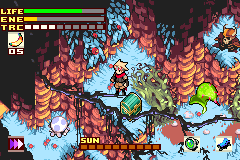

Push the blocks on the weight switches and take the elevator to reach **3F** (if you are fast enough, the Power Nut will still be active).

Proceed in the ↙️ twice, then ↖️ and ↙️ once each.

Equip ![icon][iron_clogs] Iron Clogs to negate the solar wind.

On the way, grow the plan to create a shortcut. Hug the left side when dashing towards it to prevent the bulb from exploding.
Replenish your energy and re-enter the tree from the ↘️ path, then:

- Unequip ![icon][iron_clogs] Iron Clogs.
- Equip ![icon][leather_armor] Leather Armor.
- Equip ![icon][crest_of_diamonds] Crest of Diamonds.
- Unequip ![icon][gradius] Gradius.
- Equip ![icon][estoc] Estoc.
- Put all stat points in STR.

### <span class="trap">Earth Armor Trap</span>

- Dash once to go under the skylight.
- Use ![icon][hoop_frame] Hoop Frame to shoot once.
- Use ![icon][estoc] Estoc to stunlock. You can prevent it from raising its shield if your position is good enough.
- When the shield breaks, move away because the Armor will spin, then go back to stunlocking with ![icon][estoc] Estoc.
- You are now **Lvl 9** _(847 => 1152 EXP)_.

Open the green chest to get the **Einherjar** bike part, then proceed in the ↗️ direction.  
After the cutscene, take the ↘️ path twice.

As soon as you enter the room, dash towards the nearest platform to take the ↘️ path.  
Push the iron block, then go back and take the other platform.  
During this room you can set the sunlight to 0 to delay overheating a bit.

Kill the 3 klorofoluns that hovers above the last moving platform with ![icon][hoop_frame] Hoop Frame _(1152 => 1165 EXP)_.  
_This isn't about getting EXP, but rather an extra TRC block for later._

After the last platform, take the ↘️ path, then ↙️.  
Grow the plan near the end of the room, then leave through the ↙️ path.  
After the cutscene about the beehive, go in the ↖️ direction and push the elemental blocks to activate the elevator.

Take the elevator to reach **4F**.

Proceed in the ↘️ direction.

### <span class="trap">Spiders & Golem Trap</span>

- Open the menu and put all your points into STR.
- Use ![icon][estoc] Estoc.
- Start with the golem, then the spiders. They should be more or less grouped together after killing the golem.
- _(1165 => 1247 EXP)_

Proceed in the ↙️ twice.

Replenish life and energy, then set sunlight between 1 and 8 to make the solar platform appear.  
Use it to reach the green chest and get the ![icon][chain_mail] Chain Mail, then go back inside the tree.

Grow the plants to take the ↖️ path, then proceed through the ↙️ and ↖️ paths.

### <span class="mission">Mission: Find the Red Key!</span>

- Use ![icon][fighter_frame] Fighter Frame & ![icon][flame_lens] Fire Lens.
- Go on the platform near you and light the 2 torches to open the ↖️ gate (you can shoot the 1st torch by shooting straight UP while on the platform).
- In the next room, light the 5 torches (only ![icon][fighter_frame] Fighter Frame allows you to light all 5 in one trip because of the delay between shots and the lack of recoil, you can also shoot the first torch by aiming to the left while on the platform).
- Continue in the ↘️ direction twice.
- Open the hidden blue chest to get the ![icon][circle_key] Circle Key, then go back and open the door.  
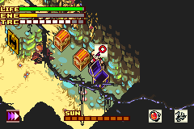

After opening the door, proceed in the ↗️ direction.

### <span class="puzzle">Puzzle</span>

- Use a ![icon][power_nut] Power Nut.
- Take the elevator to reach **5F**.

Take the ↘️ path, then ↗️ twice.
You should be in a room with ghouls, proceed in the ↖️ direction, then ↙️ 3 times.

Then take the ↖️ path to go outside.
Equip ![icon][iron_clogs] Iron Clogs, then go through the room, make sure to grow the plant before taking the ↘️ path.

Proceed through the ↗️ entry, and take the elevator to reach the boss.

### <span class="boss">Hresvelgr</span>

- _You are expected to be missing 2 TRC blocks at the start of this fight._
- Use use ![icon][hoop_frame] Hoop Frame until the TRC gauge is full.
- You can ![icon][dark_trans] Dark Trans and spam B right away, however the boss will get invulnerable and begin his wind attack.
- After the dialog, ignore Trinity and spam B with ![icon][dark_trans] Dark Trans until the fight is over.
- You are now **Lvl 11** _(1247 => 1747 EXP)_.

During the dialog, just hold B and choose the first option.

### Coffin

Open the menu and:

- Turn off the sunlight.
- Put all points into STR.
- Unequip ![icon][iron_clogs] Iron Clogs.
- Use a ![icon][power_nut] Power Nut.

Take the elevator and start going back to the entrance of the dungeon.  
Use the grown plant outside as a shortcut, then go back inside the tree and take the ↘️ path.  
Set sunlight to max, put the coffin on the first weight switch, then use ![icon][dash] Dash to step on the other one.

Grab the coffin and go through the ↗️ gate, use another ![icon][power_nut] Power Nut after the current one runs out.

Then take the elevator to go back to **4F**.

Take the ↙️ path, walk on the weight switch to go through the ↘️ gate.  
Then take the ↗️ path to reach the elevator and go back to **3F**.

Go through the ↘️, ↗️ paths, then walk on the grown plant & the iron block to proceed in the ↖️ direction.

You can reach the moving platform without using another ![icon][power_nut] Power Nut, so wait until you've reached the other side before using another one.

Then proceed in the ↖️ direction twice (watch out for the centipede), then ↙️ twice and ↖️ again to go outside.

Use the grown plant as a shortcut, stay on the left to prevent the bulb from exploding.
Take the ↘️ and ↗️ paths to go back inside the tree.

Proceed in the ↘️ direction (watch out for the golems), then ↗️ twice to take the elevator to go back to **2F**.

Go through the ↙️ and ↘️ paths, then go towards the ↗️ path, be careful when passing next to the bulb.

Take the elevator to go back to **1F**.

Proceed in the ↖️ direction, then ↙️, ↘️ and ↙️ twice to reach the purification area.
_The Power Nut effect should stop where the dialog begins._

### <span class="purification">Hresvelgr Purification</span>

- Go at the bottom of the piledriver and use ![icon][wizard_frame] Wizard Frame to activate all of them in one shot. During the shot, walk and activate the piledriver as soon as all 4 of them have been hit to skip dialogs.
- Start the purification and use ![icon][hoop_frame] Hoop Frame until the end.  

- During the purification do NOT avoid attacks & take damage on purpose, ideally you want to be at least in orange (40% Life).
- _(1747 => 1861 EXP)_

Dash in the ↙️ direction to trigger the next cutscene. Turn off the sunlight when it begins.

### <span class="boss">The Count</span>

- The Count will do 2 bat attacks: get hit on purpose until you reach critical (red) Life.
- The Count will now use Blood Rain and trigger the cutscene (by already being in critical state you won't have to wait as long).
- After the cutscene use B and ![icon][sol_trans] Sol Trans until the fight is over.  
_Note: unlike Dark Trans, the timing when pressing B matters. Sol Trans has the possibility to attack faster than Dark Trans, however timing is strict and attacks does NOT stun enemies._

## San Miguel (3)

### Django's House

- Equip **Einherjar** & bike part (lower acceleration, higher speed).

### Item Shop

- Buy 4 ![icon][power_nut] Power Nuts.

## White Forest

After the dialog, proceed in the ↗️ & ↖️ directions.  
Enter the cave and reach the end to get ![icon][bomber_frame] Bomber Frame.

Then go back, and after exiting the cave, take the ↘️ & ↗️ paths.

### <span class="mission">Mission: Open the cave</span>

- Equip ![icon][rapier] Rapier.
- Unequip ![icon][estoc] Estoc.
- Unequip ![icon][fighter_frame] Fighter Frame.
- Equip ![icon][bomber_frame] Bomber Frame.

After the mission take the ↖️ entrance, then ↗️ & ↘️, ↗️ & ↘️.

### <span class="trap">Hotdog & Vamp Trap</span>

- Use ![icon][Rapier] Rapier.
- You are now **Lvl 12** _(1861 => 2045 EXP)_
- Open the green chest for ![icon][frost_lens] Frost Lens.

Go back to the entrance of the cave, where the Centipede is.
Take the ↖️ entrance.

### <span class="puzzle">Puzzle</span>

- Push the 1st block in the ↖️ direction.
- Push the 2nd block ↗️ & ↖️.

Go through the ↗️ entrance & use ![icon][frost_lens] Frost Lens on the flame to go on the weight switch.

After the cutscene go back in the ↙️, ↘️ & ↗️ directions & keep going.

### <span class="trap">Frost Armor Trap</span>

- Shoot once to make the armor raise its shield & prevent it from moving.
- Use ![icon][sol_trans] Sol Trans to finish it.
- Try moving towards the exit while attacking.
- You are now **Lvl 13** _(2045 => 2572 EXP)_

After the cutscene with Carmilla, take the ↖️ exit, then ↗️ 4 times.
You should now be in a room where a mummy explodes : proceed in the ↖️ direction.

After the cutscene, slide on the ice to proceed in this ↗️ direction.

### <span class="mission">Mission: Open the door!</span>

- Proceed in the ↖️ direction twice.

### <span class="puzzle">Puzzle</span>

- Push the block on the left towards the ↖️ direction.
- Melt the first block on the right with ![icon][flame_lens] Flame Lens.
- Push the second block on the right in the ↖️ direction.
- Step on the weight switch on the right.
- Open the chest to get the ![icon][circle_key] Circle Key.
- Go back in the ↘️ direction twice & open the door to continue in the ↗️ direction.

Go down the stairs & take the ↖️ exit.

### <span class="puzzle">Puzzle</span>

- Use a ![icon][power_nut] Power Nut.
- Push the block in front of you in the ↙️ direction like this :  
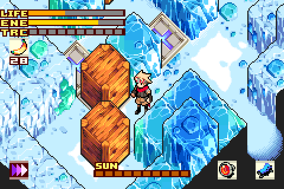
- Walk on the weight switch & push the block at the top on it.
- Walk around & push the 1st bottom block on the weight switch behind it.
- Push the last block (the one that used to in front of you when you entered the room) on the last weight switch.

Proceed in the ↗️ direction & use ![icon][frost_lens] Frost Lens to extinguish the candle.
Go back to the puzzle room, then take the ↘️ path once & ↗️ path twice.

- Replenish life.
- Equip ![icon][rapier] Rapier.
- Put all stat points in STR.

### <span class="boss">Sabata</span>

- _Expected to have a total of 40 STR_
- _Expected 3rd hit from a sword pattern attack is 55 (compared to 51 in Any% WR) during the 1st phase_

## REWRITING IN PROGRESS

<!-- markdownlint-disable MD053 -->
<!-- Items -->
[earthly_nut]: ./assets/images/icons/icon_earthly_nut.webp
[solar_nut]: ./assets/images/icons/icon_solar_nut.webp
[speed_nut]: ./assets/images/icons/icon_speed_nut.webp
[power_nut]: ./assets/images/icons/icon_power_nut.webp
[tiptoe_nut]: ./assets/images/icons/icon_tiptoe_nut.webp
[see_all_nut]: ./assets/images/icons/icon_see_all_nut.webp
[tasty_meat]: ./assets/images/icons/icon_tasty_meat.webp
[jerky]: ./assets/images/icons/icon_jerky.webp
[healer]: ./assets/images/icons/icon_healer.webp
[green_card]: ./assets/images/icons/icon_green_card.webp
[red_card]: ./assets/images/icons/icon_red_card.webp

<!-- Magic -->
[dash]: ./assets/images/icons/icon_dash.webp
[sol_trans]: ./assets/images/icons/icon_sol_trans.webp
[dark_trans]: ./assets/images/icons/icon_dark_trans.webp

<!-- Equips / Accessories -->
[leather_armor]: ./assets/images/icons/icon_leather_armor.webp
[iron_clogs]: ./assets/images/icons/icon_iron_clogs.webp
[crest_of_diamonds]: ./assets/images/icons/icon_crest_of_diamonds.webp
[chain_mail]: ./assets/images/icons/icon_chain_mail.webp
[plate_mail]: ./assets/images/icons/icon_plate_mail.webp
[bracelet]: ./assets/images/icons/icon_bracelet.webp
[proof_of_shinobi]: ./assets/images/icons/icon_proof_of_shinobi.webp
[burning_headband]: ./assets/images/icons/icon_burning_headband.webp

<!-- Swords -->
[gradius]: ./assets/images/icons/icon_gradius.webp
[estoc]: ./assets/images/icons/icon_estoc.webp
[rapier]: ./assets/images/icons/icon_rapier.webp
[epee]: ./assets/images/icons/icon_epee.webp

<!-- Gun frames -->
[fighter_frame]: ./assets/images/icons/icon_fighter_frame.webp
[wizard_frame]: ./assets/images/icons/icon_wizard_frame.webp
[hoop_frame]: ./assets/images/icons/icon_hoop_frame.webp
[bomber_frame]: ./assets/images/icons/icon_bomber_frame.webp
[dragoon_frame]: ./assets/images/icons/icon_dragoon_frame.webp

<!-- Gun lenses -->
[sol_lens]: ./assets/images/icons/icon_sol_lens.webp
[luna_lens]: ./assets/images/icons/icon_luna_lens.webp
[flame_lens]: ./assets/images/icons/icon_flame_lens.webp
[earth_lens]: ./assets/images/icons/icon_earth_lens.webp
[frost_lens]: ./assets/images/icons/icon_frost_lens.webp
[cloud_lens]: ./assets/images/icons/icon_cloud_lens.webp

<!-- Key items -->
[dark_loans_card]: ./assets/images/icons/icon_dark_loans_card.webp
[solar_bike]: ./assets/images/icons/icon_solar_bike.webp
[circle_key]: ./assets/images/icons/icon_circle_key.webp
[triangle_key]: ./assets/images/icons/icon_triangle_key.webp
[square_key]: ./assets/images/icons/icon_square_key.webp
[cross_key]: ./assets/images/icons/icon_cross_key.webp
