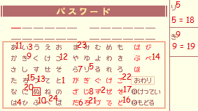
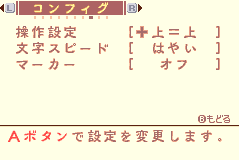
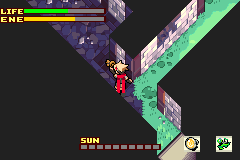
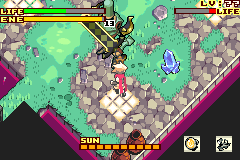
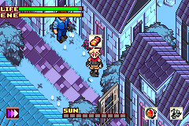
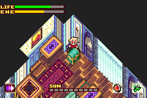
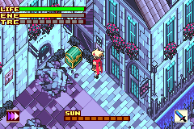
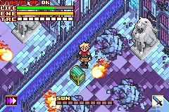
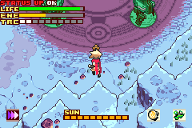

# Boktai 3 Any% Route

## About this guide

Directions for paths and exits will use ↖️, ↗️, ↙️ and ↘️.

## Before starting

If playing on BizHawk, set Skip BIOS to FALSE and RTC to FALSE in the GBA Settings(Requires v2.6.3+):  
  
Set the system time to July 21st 2005 at 8PM (2005/08/21 20:00):  

## Setting up the Grand Master password

When making a new file, select the left option, then input the password.

  
Use the characters to the **right** of the numbers!

The Grand Master title grants +2 VIT+SPR+STRG and adds the following items in the inventory (in order from left to right):

- 2 ![][icon_earthly_nut] Earthly Nuts
- 1 ![][icon_speed_nut] Speed Nut
- 1 ![][icon_green_card] "The Sun" Card (recovers all HP)
- 1 ![][icon_tiptoe_nut] Tiptoe Nut
- 1 ![][icon_see_all_nut] See-All Nut
- 1 ![][icon_tasty_meat] Tasty Meat
- 1 ![][icon_green_card] "The Moon" Card (recovers all ENE)

Use a single character for the player name (saves a few frames each time the name is displayed).

## Prologue

The prologue lasts a fixed amount of time, all you need to do is not die as Sabata.

## Sealed Dungeon

After the dialogs, open the chest next to the stairs to get a ![][icon_solar_nut] Solar Nut.

Open the menu, change text speed to Fast and set markers to Off (press right once on the 2nd & 3rd options):  

Then go into the inventory, use a ![][icon_solar_nut] Solar Nut and a ![][icon_speed_nut] Speed Nut and proceed in the ↗️ direction.

Keep going without stopping.
Once you reach the room with the 2 spiders, go to the right to get the ![][icon_wizard_frame] Wizard Frame, then proceed in the ↖️ and ↗️ directions.

### Trap: Skeleton

- Open the chest for a ![][icon_solar_nut] Solar Nut.
- Open the menu, use the ![][icon_solar_nut] Solar Nut & equip the ![][icon_wizard_frame] Wizard Frame.
- Shoot the Skeleton until death.
- You are now **Lvl 2** *(12 EXP)*.

Keep going until you reach the **"+-shaped room"**, take the ↘️ path and step on the weight switch to get the ![][icon_gradius] Gradius.

~~Then take the ↖️ path and kill all the bats for extra EXP (12 => 30 EXP).~~  
~~They also have a chance to drop a ![][icon_speed_nut] Speed Nut which you can use to save a few seconds.~~

In the next room, break the first block with the ![][icon_gradius] Gradius and fall to reach the ↖️ path.

Then instead of getting close to the lever, switch to ![][icon_wizard_frame] Wizard Frame and shoot to hit the lever from far away and skip an extra dialog, then proceed in the ↗️ direction.  

Keep going, and when you reach the room with klorofoluns, get the hidden ![][icon_speed_nut] Speed Nut on the side of the stairs before proceeding in the ↗️ direction.

### Trap: Armor

- Set sunlight to max.
- Shoot once with ![][icon_fighter_frame] Fight Frame.
- Go on the skylight on the right.
- Aim up, and when the armor is aligned, keep shooting in rhythm to stunlock & prevent it from raising its shield until the trap is over. (approx time ~16.84s)
- You are now **Lvl 4** *(12 => 136 EXP)*.  

After the trap proceed in the ↗️ direction to leave the dungeon.  
Set the sunlight to 0.

## San Miguel (1)

### Django's House

- Talk to Violet & choose the first option for less text.
- *Safety strat: get the ![][icon_luna_lens] Luna Lens near the doll on the left.*

### Solar Smith

- Talk to the first panel on the left.
- Talk to Smith.

### Weapon Shop

- Talk to Cheyenne to get ![][icon_dash] Dash magic.
- Buy ![][icon_estoc] Estoc & ![][icon_rapier] Rapier.

### Library

- Talk to Lady.

### Inn

- Talk to Zazie twice to get the ![][icon_dark_loans_card] Dark Card.

### Solar Bank | Dark Loans

- Widthdraw all the money from the Solar Bank *(500 solls)*.

### Clock Tower

- Talk to Eliot (old man with glasses).

### Garage

- Talk to the guy in the back.

### Item Shop

- Talk to Lita, then open all chests to get 2 ![][icon_earthly_nut] Earthly Nuts & 2 ![][icon_healer] Healers.
- Sell at least the following items for money:
  - 1 ![][icon_see_all_nut] See-All Nut
  - 1 ![][icon_speed_nut] Speed Nut
  - 1 ![][icon_tiptoe_nut] Tiptoe Nut
  - 2 ![][icon_earthly_nut] Earthly Nuts
  - 2 ![][icon_healer] Healers
- Buy 3 ![][icon_banana] Bananas & sort your inventory before closing the shop menu and leaving.

### Accessory Shop

- Buy ![][icon_iron_clogs] Iron Clogs & ![][icon_crest_of_diamonds] Crest of Diamonds.
- Before leaving open the chest to get the ![][icon_leather_armor] Leather Armor.

## Lifeless Town

Open the menu:

- Put stat points into STR
- Equip ![][icon_leather_armor] Leather Armor & ![][icon_crest_of_diamonds] Crest of Diamonds.

Heal with moon bugs & proceed in the ↗️ direction.  
When you reach the room with 2 skeletons, take the ↘️ path and go to the end of the room for a ![][icon_red_card] VIT+2 card (300 solls).

Go back in the previous room and take the ↗️ path.

### MISSION: Open the gate! (Light the torch)

Take the stairs in the upper-↖️ direction.
Open the green chest to get ![][icon_flame_lens] Flame Lens.

Go back and go in front of the gate.
Equip ![][icon_flame_lens] Flame Lens and shoot at the torch.

*Safety strat: get the ![][icon_tasty_meat] Tasty Meat from Trinity.*  
*Safety strat: get the hidden ![][icon_jerky] Jerky in the ↘️ room, then go back to the previous room (Jerky doesn't perish over time and this one can be kept for endgame).*  

Proceed in the ↗️ direction.

### TRAP: Skeletons

- Use ![][icon_wizard_frame] Wizard Frame, start by shooting in the back
- *(136 => 224 EXP)*

Proceed in the ↘️ direction.

Take the upper-↖️ path and take the elevator on the left.  
Open the green chest for the **Knuckle Guard** bike part.  

Leave the room and fall onto the spikes to reach the ↗️ room.  
After the dialogs, open both chests to get a ![][icon_red_card] +4 stat card (400 solls) & the ![][icon_circle_key] Circle Key.

Leave the room and take the closest elevator to go back down.  
Take go through the ↘️ path & open the door to proceed in the ↗️ direction.

### TRAP: Armor

- Shoot once with ![][icon_wizard_frame] Wizard Frame to force it to shield.
- Get closer and use ![][icon_gradius] Gradius while aiming UP until the cutscene triggers. (approx time until cutscene : ~15.85s)
- After the cutscene, spam B as Black Django.
- You are now **Lvl 6** *(224 => 413 EXP)*.

Keep going in the ↗️ direction.  
In the room with mummies, proceed in the ↗️ direction, then ↖️ twice.  
Open the green chest to get the ![][icon_hoop_frame] Hoop Frame.  

Go back and proceed in the ↘️ direction.  
Lure the ghoul on the weight switch, go through the ↗️ gate, then ↖️.

### MISSION: Find the yellow key!

- Go up the stairs and dash above the traps to reach the last room.
- Open the left chest first to get a ![][icon_jerky] Jerky, then open the blue chest to get the ![][icon_triangle_key] Triangle Key and trigger the cutscene.

Go through the yellow door, then take the ↘️ path.  
After Otenko's dialogs, take the ↗️ path, then ↖️ twice.  
Open the green chest to get the **Tire Trail** bike part.  

Go back once and proceed in the ↗️ direction to reach the boss room.

During dialog, spam A (the 2nd option is faster by a few frame, only worth menuing for TAS).  
Open the menu, put all your stats into STR, equip ![][icon_hoop_frame] Hoop Frame & ![][icon_sol_lens] Sol Lens, then go through the door.

### BOSS: The Count

- Use ![][icon_hoop_frame] Hoop Frame on the count. Do not bother with the windows.
- You are now **Lvl 7** *(413 => 662 EXP)*.

### COFFIN

- Set sunlight to 0.
- Use a ![][icon_banana] Banana and start going back.

In the room where Otenko summons a solar circle, take the ↙️ path.  
Push the wooden block on the weight switch, then go through the ↖️ path.  
Push the iron block and take the ↙️ path.

Once you get past the room where you fought the Armor (brown door), take the ↖️ path and keep going towards the entrance of the dungeon (the other path is for a sidequest and takes longer to go through because of puzzles).

### PURIFICATION

- Go at the bottom of the piledriver and use ![][icon_wizard_frame] Wizard Frame to activate all of them in one shot. During the shot, walk and activate the piledriver as soon as all 4 of them have been hit to skip dialogs.
- Start the purification and use ![][icon_hoop_frame] Hoop Frame until the end.  

- *(662 => 743 EXP)*

## San Miguel (2)

### Django's House

- Equip **Tire Trail** & **Knuckle Guard** bike parts to get more HP & be able to drive on mud during bike races.

### Item Shop

- Sell both ![][icon_red_card] cards.
- Buy 7 ![][icon_banana] bananas.

<!-- Items -->
[icon_earthly_nut]: ./assets/images/icons/icon_earthly_nut.png
[icon_solar_nut]: ./assets/images/icons/icon_solar_nut.png
[icon_speed_nut]: ./assets/images/icons/icon_speed_nut.png
[icon_banana]: ./assets/images/icons/icon_banana.png
[icon_tiptoe_nut]: ./assets/images/icons/icon_tiptoe_nut.png
[icon_see_all_nut]: ./assets/images/icons/icon_see_all_nut.png
[icon_tasty_meat]: ./assets/images/icons/icon_tasty_meat.png
[icon_jerky]: ./assets/images/icons/icon_jerky.png
[icon_healer]: ./assets/images/icons/icon_healer.png
[icon_green_card]: ./assets/images/icons/icon_green_card.png
[icon_red_card]: ./assets/images/icons/icon_red_card.png

<!-- Magic -->
[icon_dash]: ./assets/images/icons/icon_dash.png
[icon_sol_trans]: ./assets/images/icons/icon_sol_trans.png
[icon_dark_trans]: ./assets/images/icons/icon_dark_trans.png

<!-- Equips / Accessories -->
[icon_leather_armor]: ./assets/images/icons/icon_leather_armor.png
[icon_iron_clogs]: ./assets/images/icons/icon_iron_clogs.png
[icon_crest_of_diamonds]: ./assets/images/icons/icon_crest_of_diamonds.png
[icon_plate_mail]: ./assets/images/icons/icon_plate_mail.png
[icon_bracelet]: ./assets/images/icons/icon_bracelet.webp
[icon_proof_of_shinobi]: ./assets/images/icons/icon_proof_of_shinobi.webp
[icon_burning_headband]: ./assets/images/icons/icon_burning_headband.webp

<!-- Swords -->
[icon_gradius]: ./assets/images/icons/icon_gradius.png
[icon_estoc]: ./assets/images/icons/icon_estoc.png
[icon_rapier]: ./assets/images/icons/icon_rapier.png
[icon_epee]: ./assets/images/icons/icon_epee.png

<!-- Gun frames -->
[icon_fighter_frame]: ./assets/images/icons/icon_fighter_frame.png
[icon_wizard_frame]: ./assets/images/icons/icon_wizard_frame.png
[icon_hoop_frame]: ./assets/images/icons/icon_hoop_frame.png
[icon_bomber_frame]: ./assets/images/icons/icon_bomber_frame.png
[icon_dragoon_frame]: ./assets/images/icons/icon_dragoon_frame.png

<!-- Gun lenses -->
[icon_sol_lens]: ./assets/images/icons/icon_sol_lens.png
[icon_luna_lens]: ./assets/images/icons/icon_luna_lens.png
[icon_flame_lens]: ./assets/images/icons/icon_flame_lens.png
[icon_earth_lens]: ./assets/images/icons/icon_earth_lens.png
[icon_frost_lens]: ./assets/images/icons/icon_frost_lens.png
[icon_cloud_lens]: ./assets/images/icons/icon_cloud_lens.png

<!-- Key items -->
[icon_dark_loans_card]: ./assets/images/icons/icon_dark_loans_card.png
[icon_solar_bike]: ./assets/images/icons/icon_solar_bike.png
[icon_circle_key]: ./assets/images/icons/icon_circle_key.png
[icon_triangle_key]: ./assets/images/icons/icon_triangle_key.png
[icon_square_key]: ./assets/images/icons/icon_square_key.png
[icon_cross_key]: ./assets/images/icons/icon_cross_key.png