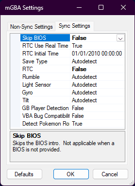
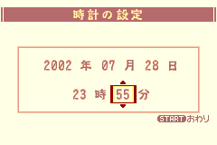
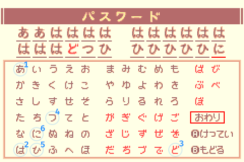
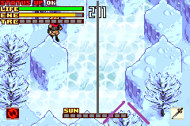

# Boktai 3: Any% Route

{{#title Boktai 3: Any% Route}}

```admonish danger title="Work in Progress"
This guide is currently being rewritten because of route improvements.  
Feel free to contribute on Discord or on the GitHub repository.
```

## About this guide

Directions for paths and exits will use ↖️, ↗️, ↙️ and ↘️.

## Before starting

</img>

When playing on BizHawk, load a ROM, go to GBA > Settings and make sure "Skip BIOS" and "RTC" are set to "False".  
This requires at least BizHawk v2.6.3 and makes sure that Emulator runs are comparable to console and that you can properly set the time in-game.

### <span class="manip">Solar Bank interest rate manip</span>

_The goal of this manip is to have the interest rate change to 18% during the prologue, which will carry over to San Miguel 1.  
By then changing the time via the Clock Tower at that point, we'll go from ~1400 to ~7900 Solls._

Add a -2mn47s delay to your timer (AKA LiveSplit).  
_Note: depending on your setup, you might have to adjust this delay._
</img>

Set the system time to July 28th 2002 at 23:55

- 2002 年 07 月 28 日
- 23 時 55 分
</img>

```admonish warning title="Start timer"
Upon confirming settings, start the timer.  
You now have 2mn47s to reach the name entry screen.
Failing this will prevent the interest rate manip to work and most likely prevent you from having enough Solls to finish the game.
```

## Setting up the Boktai 2 password

Create a new file, select the left option, then enter this password:



<!-- Inputs: 2x A, Up, 13x A, 2x Left, 2x Down, A, 4x Right, A, 2x Down, Left, 6x A, Up, A, Start, A -->

This password grants +2 VIT, +2 SPR, +2 STRG and the following items:

- 1 ![icon][green_card] "The Sun" Card (recovers all ENE)
- 1 ![icon][speed_nut] Speed Nut
- 1 ![icon][green_card] "The Moon" Card (recovers all HP)

Use a single character for the player name (saves a few frames each time the name is displayed).

```admonish warning title="Starting delay"
Wait for the timer to reach 0:00 before confirming and starting a new game.  
This is extremely important as starting the game at precisely 23:57:47 IGT will allow the interest rate to change to 18% during the prologue after Sabata gets hit by Vanargandr.
```

## Prologue

The Sabata gameplay segment always lasts 30 seconds. Simply hold B to make the text go faster.

## Sealed Dungeon

After the dialogs, open the chest next to the stairs to get a ![icon][solar_nut] Solar Nut.

Open the menu, change text speed to Fast (A, Down, Right, A):
<!-- Removed disabling markers as there currently is no evidence that it saves time in RTA. Inputs: A, Down, Right, Down, Right, A -->


Then go into the inventory, use a ![icon][solar_nut] Solar Nut and a ![icon][speed_nut] Speed Nut and proceed in the ↗️ direction.

Keep going without stopping.
Once you reach the room with the 2 spiders, go to the right to get the ![icon][wizard_frame] Wizard Frame, then proceed in the ↖️ and ↗️ directions.

### <span class="trap">Skeleton Trap</span>

- Open the chest for a ![icon][solar_nut] Solar Nut.
- Open the menu, use the ![icon][solar_nut] Solar Nut & equip the ![icon][wizard_frame] Wizard Frame.
- Shoot the Skeleton until death.
- You are now **Lvl 2** _(12 EXP)_.

Keep going until you reach the **"+-shaped room"**, take the ↘️ path and step on the weight switch to get the ![icon][gradius] Gradius.

In the next room, break the first block with the ![icon][gradius] Gradius and fall to reach the ↖️ exit.

Then instead of getting close to the lever, switch to ![icon][wizard_frame] Wizard Frame and shoot to hit the lever from far away and skip an extra dialog, then proceed in the ↗️ direction.  


Keep going, and when you reach the room with klorofoluns, get the hidden ![icon][speed_nut] Speed Nut on the side of the stairs before proceeding in the ↗️ direction.

### <span class="trap">Armor Trap</span>

- Set sunlight to max.
- Shoot once with ![icon][fighter_frame] Fight Frame.
- Go on the skylight on the right.
- Aim up, and when the armor is aligned, keep shooting in rhythm to stunlock & prevent it from raising its shield until the trap is over. (approx time ~16.84s)
- You are now **Lvl 4** _(12 => 136 EXP)_.  


After the trap proceed in the ↗️ direction to leave the dungeon.  
Set the sunlight to 0.

## San Miguel

**Django's House**

- Talk to Violet & choose the first option.
- Get the ![icon][luna_lens] Luna Lens near the doll on the left.

Leave the house and visit the following places.  
On Map screens you can use the shoulder buttons to navigate quickly.

**Lita - Item Shop**

- Talk to Lita
- Open all chests to get 2 ![icon][earthly_nut] Earthly Nuts & 2 ![icon][healer] Healers.
- Sell the following items for money:
  - 4 ![icon][earthly_nut] Earthly Nuts
  - 2 ![icon][healer] Healers
  - 1 ![icon][green_card] "The Sun" Card.
  - 1 ![icon][green_card] "The Moon" Card.

**Solar Bank | Dark Loans**

- Transfer all Solls from the Solar Station to the Solar Bank (~500).

**Clock Tower**

- Talk to Ennio (old man with glasses).

### <span class="manip">IGT & Solar Bank interests exploits</span>

The goal of these exploits is to get a big amount of Solls in order to be able to buy every item needed to finish the game.
_This is affected by the interest rate manip done when starting a new game._

- Talk to Ennio again and change the time to July 21st 2005 10PM. Minutes aren't important so you can keep these.
  - 2005 年 07 月 21 日
  - 22 時 XX 分
</img>
- Leave the Clock Tower and go to the garage.
- _You should now have over 7900 Solls and be able to buy all the necessary items to finish the game._

**Garage**

- Use a ![icon][speed_nut] Speed Nut, then talk to the guy in the back.

**Lita - Item Shop 2**

- Buy 10 ![icon][power_nut] Power Nuts & sort your inventory before closing the shop menu and leaving (3 for Lifeless Town, 7 for Ancient Tree).

**Accessory Shop**

- Buy ![icon][iron_clogs] Iron Clogs & ![icon][crest_of_diamonds] Crest of Diamonds.
- Before leaving, open the chest to get the ![icon][leather_armor] Leather Armor.

**Solar Smith**

- Talk to Smith.
- Talk to the first panel on the left.

**Weapon Shop**

- Talk to Cheyenne to get ![icon][dash] Dash magic.
- Buy 1 ![icon][estoc] Estoc & 2 ![icon][rapier] Rapiers (2nd ![icon][rapier] Rapier will be used to skip an additional San Miguel trip just for forging ![icon][epee] Epee later).

**Library**

- Talk to Lady.

**Inn**

- Talk to Zazie twice to get the ![icon][dark_loans_card] Dark Card.

Now exit to the World Map and head to Lifeless Town.  
You can check the Boktai 3 resource list for help with the Bike race.

## Lifeless Town

Heal with moon bugs & proceed in the ↗️ direction.  
When you reach the room with 2 skeletons, take the ↗️ path.

### <span class="mission">Mission: Open the gate!</span> (Light the torch)

Take the stairs in the upper-↖️ direction.
Open the green chest to get ![icon][flame_lens] Flame Lens.

Go back and go in front of the gate.

Open the menu and:

- Equip ![icon][flame_lens] Flame Lens & ![icon][wizard_frame] Wizard Frame.
- Equip ![icon][crest_of_diamonds] Crest of Diamonds & ![icon][leather_armor] Leather Armor.
- Put all points into STRG

Shoot at the torch and proceed in the ↗️ direction.

### <span class="trap">Skeletons Trap</span>

- Use ![icon][wizard_frame] Wizard Frame, start by shooting in the back
- _(136 => 224 EXP)_

Proceed in the ↘️ direction.

Take the upper-↖️ path and take the elevator on the right.  
After the elevator go through the ↗️ entrance.

Leave the room and fall on the spikes to reach the ↗️ entrance.  
After the cutscene with Trinity, open the green chest for a ![icon][red_card] +4 Stat card and open the blue chest to get the ![icon][circle_key] Circle Key.  
_Do NOT use the Card yet._

Leave the room and take the elevator on the right to go back down.  
Take go through the ↘️ path & open the door to proceed in the ↗️ direction.

### <span class="trap">Armor Trap</span>

- Shoot once with ![icon][wizard_frame] Wizard Frame to force it to shield.
- Get closer and use ![icon][gradius] Gradius while aiming Up until the cutscene triggers. (approx time until cutscene: ~15.85s)
- After the cutscene, spam B as Black Django.
- You are now **Lvl 6** _(224 => 413 EXP)_.

Keep going in the ↗️ direction.  
In the room with mummies, proceed in the ↗️ direction, then ↖️ twice.  
Open the green chest to get the ![icon][hoop_frame] Hoop Frame.  


Go back and proceed in the ↘️ direction.  
Lure the ghoul on the weight switch, go through the ↗️ gate, then ↖️.

### <span class="mission">Mission: Find the yellow key!</span>

- Go up the stairs and dash above the traps to reach the last room.
- Open the left chest first to get a ![icon][jerky] Jerky, then open the blue chest to get the ![icon][triangle_key] Triangle Key and trigger the cutscene.

Go through the yellow door, then take the ↗️ path to get a ![icon][red_card] +2 STRG card.  


Go back and take the ↘️ path. After Otenko's dialogs, take the ↗️ path, then ↖️ twice.

Open the green chest to get the **Trial** Tire bike part.  


Go back once and proceed in the ↗️ direction to reach the boss room.

During dialog, spam A (the 2nd option is faster by a few frame, only worth menuing for TAS).  
Open the menu:

- Equip ![icon][hoop_frame] Hoop Frame & ![icon][sol_lens] Sol Lens.
- Use the ![icon][red_card] +2 STRG card (it's the one on the last row).
- Put all your stat points into STRG.

Then go through the door.

### <span class="boss">The Count</span>

- Use ![icon][hoop_frame] Hoop Frame on the Count. Do not bother with the windows.
- You are now **Lvl 7** _(413 => 662 EXP)_.

### Coffin

- Set sunlight to 0.
- Equip ![icon][estoc] Estoc.
- Unequip ![icon][gradius] Gradius.
- Put all points into STRG.
- Use a ![icon][power_nut] Power Nut and start going back.

In the room where Otenko summons a solar circle, take the ↙️ path.  
Push the wooden block on the weight switch, then go up the stairs (↗️).

- Talk to Snake.
- Buy a ![icon][redshroom] Redshroom.

Go back and take the ↖️ path.  
Then push the iron block and take the ↙️ path.

Once you get past the room where you fought the Armor (brown door), take the ↖️ path and keep going towards the entrance of the dungeon (the other path is for a sidequest and takes longer to go through because of puzzles).

### <span class="purification">The Count Purification</span>

- Go at the bottom of the piledriver and use ![icon][wizard_frame] Wizard Frame to activate all of them in one shot. During the shot, walk and activate the piledriver as soon as all 4 of them have been hit to skip dialogs.
- Start the purification and use ![icon][hoop_frame] Hoop Frame until the end.  

- _(662 => 743 EXP)_

## Ancient Tree

Enter the tree, then take the ↖️ & ↗️ paths.

### <span class="trap">Ghouls & Bats Trap</span>

- Use ![icon][estoc] Estoc.
- You are now **Lvl 8** _(743 => 847 EXP)_.

Proceed through the ↘️ gate & take the elevator to reach **2F**.  
After the elevator, take the ↙️ and ↖️ paths.

### <span class="mission">Mission: Make the Solar Roots grow!</span>

Proceed in the ↖️ direction, then ↗️ twice.  
On the way kill the 2 purple slimes on the right with ![icon][estoc] Estoc _(847 => 880 EXP)_.

#### <span class="puzzle">Puzzle</span>

- Use a ![icon][power_nut] Power Nut.
- Push the first block once in ↗️ & ↖️ directions.
- Push the second block ↗️ once & open the green chest to get the ![icon][earth_lens] Earth Lens.

Go back, kill the 2 purple slimes on the right with ![icon][estoc] Estoc again _(880 => 913 EXP)_.  
_Killing both slimes twice gives enough EXP to reach lvl 10 earlier but most importantly it also gives TRC which will help for the Hresvelgr quick kill._

Equip ![icon][earth_lens] Earth Lens & ![icon][fighter_frame] Fighter Frame.  
Once back to the first room, grow the first plant, then alternate between the other 2 plans. Start with the left one because the right one will end the mission once fully grown.

Open the green chest on the left to get ![icon][dragoon_frame] Dragoon Frame, then proceed in the ↗️ direction.  


Push the blocks on the weight switches and take the elevator to reach **3F** (if you are fast enough, the Power Nut will still be active).

Proceed in the ↙️ twice, then ↖️ and ↙️ once each.
Equip ![icon][iron_clogs] Iron Clogs to negate the solar wind.

On the way, grow the plan to create a shortcut. Hug the left side when dashing towards it to prevent the bulb from exploding.
Replenish your energy and re-enter the tree from the ↘️ path, then before going through the ↗️ exit:

- Unequip ![icon][iron_clogs] Iron Clogs.
- Equip ![icon][estoc] Estoc.
- Put all stat points in STRG.

### <span class="trap">Earth Armor Trap</span>

- Use ![icon][estoc] Estoc to stunlock. You can prevent it from raising its shield if your position is good enough.
- When the shield breaks, move away because the Armor will spin, then go back to stunlocking with ![icon][estoc] Estoc.
- You are now **Lvl 9** _(913 => 1218 EXP)_.

Proceed in the ↗️ direction, then take the ↘️ path twice after the cutscene.

As soon as you enter the room, dash towards the nearest platform to take the ↘️ path.  
Push the iron block, then go back and take the other platform.  
During this room you can set the sunlight to 0 to delay overheating a bit.

Kill the 3 klorofoluns that hovers above the last moving platform with ![icon][hoop_frame] Hoop Frame _(1218 => 1231 EXP)_.  
_This isn't about getting EXP, but rather getting more TRC for the Hresvelgr quick kill._

After the last platform, take the ↘️ path, then ↙️.  
Grow the plan near the end of the room, then leave through the ↙️ path.

After the cutscene about the beehive, go in the ↖️ direction and push the elemental blocks to activate the elevator.
Take the elevator to reach **4F** & proceed in the ↘️ direction.

### <span class="trap">Spiders & Golem Trap</span>

- Use ![icon][estoc] Estoc.
- Start with the golem, then the spiders. If you're lucky they will be grouped together after killing the golem.
- You are now **Lvl 10** _(1231 => 1313 EXP)_.

Proceed in the ↙️ direction twice.

Replenish life and energy, then set sunlight between 1 and 8 to make the solar platform appear.  
Use it to reach the green chest and get the ![icon][chain_mail] Chain Mail, then go back inside the tree.

Grow the plants to take the ↖️ path, then proceed through the ↙️ and ↖️ paths.

### <span class="mission">Mission: Find the Red Key!</span>

- Use ![icon][fighter_frame] Fighter Frame & ![icon][flame_lens] Fire Lens.
- Go on the platform near you and light the 2 torches to open the ↖️ gate (you can shoot the 1st torch by shooting straight UP while on the platform).
- In the next room, light the 5 torches
  - Only ![icon][fighter_frame] Fighter Frame allows you to light all 5 in one trip because of the delay between shots and the lack of recoil
  - You can shoot the first torch by aiming to the left while on the platform, although sometimes you will hit the mushroom first and have to fire 2 shots.
- Continue in the ↘️ direction twice.
- Open the hidden blue chest to get the ![icon][circle_key] Circle Key, then go back and open the door.  


After opening the door, proceed in the ↗️ direction.

### <span class="puzzle">Puzzle</span>

- Use a ![icon][power_nut] Power Nut.
- See the video below for the optimal solution:

<iframe
  style="aspect-ratio: 16/9"
  src="https://youtu.be/F7lhABlDlMU?feature=shared&t=2914"
  title="2:39:35 Boktai 3 - Any% Sensor-less Speedrun / 新・ボクらの太陽 RTA"
  allowfullscreen
></iframe>

- Take the elevator to reach **5F**.

Take the ↘️ path, then ↗️ twice.
You should be in a room with ghouls, proceed in the ↖️ direction, then ↙️ 3 times.

Then take the ↖️ path to go outside.  
Equip ![icon][iron_clogs] Iron Clogs, then go through the room, make sure to grow the plant before taking the ↘️ path.  
Proceed through the ↗️ entry, and take the elevator to reach the boss.

### <span class="boss">Hresvelgr</span>

- _You are expected to be missing 1 TRC block at the start of this fight._
- Use ![icon][fighter_frame] Fighter Frame until the TRC gauge is full (3~4 shots).
- Dash once to get closer to Hresvelgr.
- Use ![icon][dark_trans] Dark Trans and spam B right away, if you're too slow the boss will begin his wind attack and be invulnerable until it ends.
  - Trinity being pushed against the vines around the area will trigger a cutscene, however you can ignore him if that happens.
- Spam B with ![icon][dark_trans] Dark Trans until the fight is over.
- You are now **Lvl 11** _(1313 => 1813 EXP)_.

During the dialog, just hold B and choose the first option.

### Coffin

Open the menu and:

- Turn off the sunlight.
- Unequip ![icon][iron_clogs] Iron Clogs.
- Put all points into STRG.
- Use a ![icon][power_nut] Power Nut.

Take the elevator and start going back to the entrance of the dungeon.  
Use the grown plant outside as a shortcut, then go back inside the tree and take the ↘️ path.  
Set sunlight to max, put the coffin on the first weight switch, then use ![icon][dash] Dash to step on the other one.

Grab the coffin and go through the ↗️ gate, use another ![icon][power_nut] Power Nut after the current one runs out.

Then take the elevator to go back to **4F**.

Take the ↙️ path, walk on the weight switch to go through the ↘️ gate.  
Kill the green slime with ![icon][estoc] Estoc, use ![icon][dash] Dash and open the green chest for a ![icon][red_card] +4 Stat card _(1813 => 1831 EXP)_.  
_Do NOT use the Card yet._

Then take the ↗️ path to reach the elevator and go back to **3F**.

Go through the ↘️ gate.
Then take the ↗️ path, walk on the grown plant & the iron block to continue in the ↖️ direction.  
_You can reach the moving platform without using another ![icon][power_nut] Power Nut, so wait until you've reached the other side before using another one._

Then proceed in the ↖️ direction twice (watch out for the centipede), then ↙️.  
In the Earth Armor room open the green chest to get the **Einherjar** bike part, then take the ↙️ and ↖️ paths to go outside.

Use the grown plant as a shortcut, stay on the left to prevent the bulb from exploding.  
Take the ↘️ and ↗️ paths to go back inside the tree.

Proceed in the ↘️ direction (watch out for the golems), then ↗️ twice to take the elevator to go back to **2F**.

Go through the ↙️ and ↘️ paths, then go towards the ↗️ path, be careful when passing next to the bulb.

Take the elevator to go back to **1F**.

Proceed in the ↖️ direction, then ↙️, ↘️ and ↙️ twice to reach the purification area.
_The Power Nut effect should stop where the dialog begins._

### <span class="purification">Hresvelgr Purification</span>

- Go at the bottom of the piledriver and use ![icon][wizard_frame] Wizard Frame to activate all of them in one shot.
- Start the purification and use ![icon][hoop_frame] Hoop Frame until the end.  

- During the purification do NOT avoid attacks & take damage on purpose, this will make the next fight a bit faster.
- _(1831 => 1945 EXP)_

Dash in the ↙️ direction to trigger the next cutscene. Turn off the sunlight when it begins.

### <span class="boss">The Count</span>

- The Count will do 2 bat attacks: get hit on purpose until you reach critical (red) Life (you can take 4 hits before going into critical state if you are at full Life).
- The Count will now use Blood Rain and trigger the cutscene (by already being in critical state you won't have to wait as long).
- After the cutscene use B and ![icon][sol_trans] Sol Trans until the fight is over.  
_Note: unlike Dark Trans, the timing when pressing B matters. Sol Trans has the possibility to attack faster than Dark Trans, however timing is more strict and attacks does NOT stun enemies._

## San Miguel (2)

### Solar Smith

- Forge ![icon][epee] Epee (![icon][rapier] Rapier + ![icon][chain_mail] Chain Mail).

### Django's House

- Equip the **Trial** Tire bike (able to drive on mud).
- Equip **Einherjar** bike part (lower acceleration, higher speed).

### Item Shop

- Sell ![icon][redshroom] Redshroom.
- Buy 12 ![icon][power_nut] Power Nuts (4 for White Forest, 8 for Pirate Island).

## White Forest

After the dialog, proceed in the ↗️ & ↖️ directions.  
Enter the cave and reach the end to get ![icon][bomber_frame] Bomber Frame.

Open the menu and:

- Equip ![icon][rapier] Rapier.
- Unequip ![icon][estoc] Estoc.
- Unequip ![icon][fighter_frame] Fighter Frame.
- Equip ![icon][bomber_frame] Bomber Frame.

Then go back, and after exiting the cave, take the ↘️ direction twice, then ↗️ twice to enter a cave.

### <span class="manip">RNG manip</span>
<!--Source: https://x.com/beige006956/status/1892260575658529216 -->

The goal of this RNG manip is to get a ![icon][burning_headband] Burning Headband and a total of +12 Strength from cards that would otherwise give points to a random stat.

```admonish info title="Video" collapsible=true
<video class="center" controls muted>
  <source src="./assets/video/white_forest_manip.webm" type="video/webm" />
</video>
```

**Many steps during this manip are time sensitive because of how RNG works!**  
If you struggle with the manip or have further questions, please contact us and we'll help you!

- Once inside the cave, save and do a soft-reset (Press <kbd>A</kbd>, <kbd>B</kbd>, <kbd>Start</kbd> and <kbd>Select</kbd> at the same time. You can buffer that input while it's still saving).</img>
- Set the time to July 11th 2006 10PM (2006/07/11 22:00) to get extra Solls via the Solar Bank interests.
  - _At this point you shouldn't need more Solls, but this is a free occasion to get more so you may as well do it._
- Buffer the up + right input to start walking as soon as possible. Keep walking in the ↗️ direction until you are past the chest and very close to the wall.
- With ![icon][bomber_frame] Bomber Frame & ![icon][sol_lens] Sol Lens, shoot at the Red Slime two times. _(1945 => 1971 EXP)_
  - **You must attack the Red Slime as soon as you arrive at the target location. Once it has split, both halves must die at the same time.**
- If your timing was right, the Red Slime will have dropped a ![icon][burning_headband] Burning Headband.
- Get the drop and open the green chest for a ![icon][red_card] +4 Stat card.
- Use any of the ![icon][red_card] three red stat cards you have picked up so far. It should give you +4 STRG.
- Make sure to have sunlight and leave the cave. (Without sunlight it will be snowing outside which changes the RNG)
- Mash <kbd>Start</kbd> to open the menu as soon as possible.
  - **You have about 0.5 seconds to open the menu!** Otherwise the RNG will change because the sunlight killed the enemies outside.
- Now use the two remaining ![icon][red_card] +4 Stat cards to get +8 STRG.
- Also equip the ![icon][burning_headband] Burning Headband.

Now proceed in the ↖️ direction to trigger the cutscene with Trinity.

### <span class="mission">Mission: Open the cave</span>

- Use ![icon][bomber_frame] Bomber Frame to open the entrance.

Then enter the cave via the ↖️ entrance, then the ↗️ & ↘️, ↗️ & ↘️ directions.

### <span class="trap">Hotdog & Vamp Trap</span>

- Use ![icon][rapier] Rapier.
- You are now **Lvl 12** _(1971 => 2155 EXP)_
- Open the green chest for ![icon][frost_lens] Frost Lens.

Go back to the entrance of the cave, where the Centipede is.
Take the ↖️ entrance.

### <span class="puzzle">Puzzle</span>

- Push the 1st block in the ↖️ direction.
- Push the 2nd block ↗️ & ↖️.

Go through the ↗️ entrance, equip ![icon][wizard_frame] Wizard Frame and ![icon][frost_lens] Frost Lens, then shoot and go on the weight switch.

After the cutscene go back in the ↙️, ↘️ & ↗️ directions & keep going.

### <span class="trap">Frost Armor Trap</span>

- Move towards the center of the room.
- Use ![icon][sol_trans] Sol Trans.
- You are now **Lvl 13** _(2155 => 2682 EXP)_

After the cutscene with Carmilla, take the ↖️ exit, then ↗️ 3 times.
You should now be in a room with a dog: proceed in the ↖️ & ↙️ directions.

Open the green chest near the blue slime to get a ![icon][red_card] +2 STRG card.  


Then take the ↗️ exit 2 times. After the cutscene, slide on the ice to proceed in this ↗️ direction.

### <span class="mission">Mission: Open the door!</span>

- Proceed in the ↖️ direction twice.

### <span class="puzzle">Puzzle</span>

- Push the block on the left towards the ↖️ direction.
- Move in front of the first block on the right.
- Melt it in one shot with ![icon][flame_lens] Flame Lens & ![icon][wizard_frame] Wizard Frame.
- Push the second block on the right in the ↖️ direction.
- Step on the weight switch on the right.
- Open the chest to get the ![icon][circle_key] Circle Key.
- Go back in the ↘️ direction twice & open the door to continue in the ↗️ direction.

Go down the stairs & take the ↖️ exit.

### <span class="puzzle">Puzzle</span>

- Use a ![icon][power_nut] Power Nut.
- Push the block in front of you in the ↙️ direction like this:  

- Walk on the weight switch & push the block at the top on it.
- Walk around & push the 1st bottom block on the weight switch behind it.
- Push the last block (the one that used to in front of you when you entered the room) on the last weight switch.

Proceed in the ↗️ direction & use ![icon][frost_lens] Frost Lens to extinguish the candle.
Go back to the puzzle room, then take the ↘️ path once & ↗️ path twice.

Open the menu and:

- Use ![icon][red_card] +2 STRG card.
- Put all stat points in STRG.

Then select ![icon][rapier] Rapier, replenish life if necessary and keep going.

### <span class="boss">Sabata</span>

#### 1st phase

- Lure Sabata by knocking on the block next to you.
- Attack with ![icon][rapier] Rapier to force him to do his spinning attack.
- Evade with ![icon][dash] Dash, then hit the dark spread with ![icon][rapier] Rapier to stun him.
- Hit Sabata with a 3-hits combo using ![icon][rapier] Rapier.
- Repeat until phase 2.

#### 2st phase

- Move the camera to keep track of Sabata.
- When he stops moving, go to him and attack with ![icon][rapier] Rapier.

#### 3rd phase

- At the start you can hit the dark spread to stun him.
- Then use ![icon][dark_trans] Dark Trans to finish him.

### Coffin

- You are now **Lvl 15** _(2682 => 3430 EXP)_.
- Set sunlight to 0.
- Use a ![icon][power_nut] Power Nut.

Go back through the same areas.
When you reach the room outside with ice, you can slide using these directions:  


### <span class="purification">Sabata Purification</span>

- Go at the bottom of the piledriver and use ![icon][wizard_frame] Wizard Frame to activate all of them in one shot.
- Start the purification and use ![icon][hoop_frame] Hoop Frame until the end.  

- _(3430 => 3553 EXP)_

## Pirate Island

<!-- - Get the ![icon][red_card] +2 STRG card. -->

After the cutscene, circle around the room to keep going in the ↙️ direction.  
Then go to the left & open the green chest to get ![icon][cloud_lens] Cloud Lens before going through the upper ↗️ exit.

Avoid the golems and take the stairs to keep going until you reach a room with a centipede and a block blocking the ↖️ exit.

Open the menu:

- Put all points into STRG.
- Unequip ![icon][rapier] Rapier.
- Equip ![icon][epee] Epee.
- Equip ![icon][cloud_lens] Cloud Lens.
- Equip ![icon][wizard_frame] Wizard Frame.

Then break the block and continue ↖️ to board the 1st ship.

### 1st ship

Go ↙️ and dash onto the moving platform (be quick or you'll barely miss it), then go ↙️ again and use the ship's wheel.  
After the cutscene, go back and push the block onto the weight switch. Get on the moving platform and take the elevator.

Go to the left and open the chest to get the ![icon][circle_key] Circle Key, then go back down and proceed through the upper ↗️ exit and lower ↙️ exits.  
Keep going and go downstairs, then keep dashing in the ↗️ direction (you can dash on every spike trap safely).

### <span class="mission">Mission: Open all chests!</span>

TODO add vid or ideally map with traps and chests

After the mission proceed through the ↙️ gate & the ↘️ door, go upstairs and walk past the slimes to go through the ↙️ exit and go downstairs again.  
Go through the door and proceed in the ↙️ direction 3 times.

Push the block then go back once and go downstairs, then though the ↘️ and upper ↖️ path.

### <span class="trap">Wind cannons & Leys Trap</span>

- Select ![icon][epee] Epee.
- Dash to the left of the blue wind cannon, then destroy it.
- Dash over the weight switch & skylight towards the red wind cannon, then destroy it.
- The leys should have went over the skylight and died, if that's not the case stand on it and kill them.
- Go through the ↗️ gate.
- _(3553 => 3569 EXP)_

### <span class="puzzle">Puzzle</span>

- Use a ![icon][power_nut] Power Nut and follow this:

TODO add vid

Go through the gate & downstairs.
When you reach the room with burrnuns (flame klorofoluns):

- Equip ![icon][flame_lens] Flame Lens & ![icon][bomber_frame] Bomber Frame.
- Lure the burrnuns so that they're grouped together.
- Shoot at them until the TRC gauge is full.
  - _Hitting enemies with Bomber Frame gives 50 TRC per hit which allows filling the TRC gauge extremely fast as long as there are multiple enemies._
  - _Flame Lens prevents the burrnuns from dying directly & allows you to shoot again if the TRC gauge is not full._
-_You are not meant to get any kills or EXP here._

Once the TRC gauge is full, proceed in the ↗️ direction.

### <span class="trap">Flame Armor Trap</span>

- Use ![icon][dark_trans] Dark Trans and spam B.
- You are now **Lvl 16** _(3569 => 4157 EXP)_.

Continue in the ↗️ direction and get on the moving platform after the dialogs.
After the Carmilla cutscene **take the magic circle twice**. _This is extremely important as it will be used later._

Enter through the upper ↗️ entrance and keep going upstairs. Then proceed until you're outside.
Once outside there will be a moving platform at the end of the path: go on it to board the **2nd ship**.

### 2nd ship


## REWRITING IN PROGRESS

<!-- markdownlint-disable MD053 -->
<!-- Items -->
[earthly_nut]: ./assets/images/icons/icon_earthly_nut.webp
[solar_nut]: ./assets/images/icons/icon_solar_nut.webp
[speed_nut]: ./assets/images/icons/icon_speed_nut.webp
[power_nut]: ./assets/images/icons/icon_power_nut.webp
[tiptoe_nut]: ./assets/images/icons/icon_tiptoe_nut.webp
[see_all_nut]: ./assets/images/icons/icon_see_all_nut.webp
[redshroom]: ./assets/images/icons/redshroom.webp
[tasty_meat]: ./assets/images/icons/icon_tasty_meat.webp
[jerky]: ./assets/images/icons/icon_jerky.webp
[healer]: ./assets/images/icons/icon_healer.webp
[green_card]: ./assets/images/icons/icon_green_card.webp
[red_card]: ./assets/images/icons/icon_red_card.webp

<!-- Magic -->
[dash]: ./assets/images/icons/icon_dash.webp
[sol_trans]: ./assets/images/icons/icon_sol_trans.webp
[dark_trans]: ./assets/images/icons/icon_dark_trans.webp

<!-- Equips / Accessories -->
[leather_armor]: ./assets/images/icons/icon_leather_armor.webp
[iron_clogs]: ./assets/images/icons/icon_iron_clogs.webp
[crest_of_diamonds]: ./assets/images/icons/icon_crest_of_diamonds.webp
[chain_mail]: ./assets/images/icons/icon_chain_mail.webp
[plate_mail]: ./assets/images/icons/icon_plate_mail.webp
[bracelet]: ./assets/images/icons/icon_bracelet.webp
[proof_of_shinobi]: ./assets/images/icons/icon_proof_of_shinobi.webp
[burning_headband]: ./assets/images/icons/icon_burning_headband.webp

<!-- Swords -->
[gradius]: ./assets/images/icons/icon_gradius.webp
[estoc]: ./assets/images/icons/icon_estoc.webp
[rapier]: ./assets/images/icons/icon_rapier.webp
[epee]: ./assets/images/icons/icon_epee.webp

<!-- Gun frames -->
[fighter_frame]: ./assets/images/icons/icon_fighter_frame.webp
[wizard_frame]: ./assets/images/icons/icon_wizard_frame.webp
[hoop_frame]: ./assets/images/icons/icon_hoop_frame.webp
[bomber_frame]: ./assets/images/icons/icon_bomber_frame.webp
[dragoon_frame]: ./assets/images/icons/icon_dragoon_frame.webp

<!-- Gun lenses -->
[sol_lens]: ./assets/images/icons/icon_sol_lens.webp
[luna_lens]: ./assets/images/icons/icon_luna_lens.webp
[flame_lens]: ./assets/images/icons/icon_flame_lens.webp
[earth_lens]: ./assets/images/icons/icon_earth_lens.webp
[frost_lens]: ./assets/images/icons/icon_frost_lens.webp
[cloud_lens]: ./assets/images/icons/icon_cloud_lens.webp

<!-- Key items -->
[dark_loans_card]: ./assets/images/icons/icon_dark_loans_card.webp
[solar_bike]: ./assets/images/icons/icon_solar_bike.webp
[circle_key]: ./assets/images/icons/icon_circle_key.webp
[triangle_key]: ./assets/images/icons/icon_triangle_key.webp
[square_key]: ./assets/images/icons/icon_square_key.webp
[cross_key]: ./assets/images/icons/icon_cross_key.webp
