# Crossover Battle

{{#title Crossover Battle}}

## Compatible games

### Version 1

- Boktai 2: Solar Boy Django
- Mega Man Battle Network 5: Team Protoman
- Mega Man Battle Network 5: Team Colonel

_Note: Games must be of the same region (Japan, USA or Europe)._

### Version 2

- Shin Bokura no Taiyō: Gyakushū no Sabata / Boktai 3: Sabata's Counterattack
- Rockman.EXE 6: Dennōjū Gureiga / Mega Man Battle Network 6: Cybeast Gregar
- Rockman.EXE 6: Dennōjū Faruzā / Mega Man Battle Network 6: Cybeast Falzar

_Note: Since Boktai 3 was only released in Japan, only the japanese version of MMBN 6 is supported._

## Requirements

### Games

- 1 copy of Boktai 2 or 3 with a save file
- 1 copy of MMBN 5 or Rockman.EXE 6

_Note: A save file for MMBN 5 or Rockman.EXE 6 is not required, however data will be lost upon resetting the game if there is none._

### Console

- 2 GBAs or 2 GBPlayers
- 2 wireless adapters

### Emulators

- Retroarch emulator

## Setting up

### Connecting via Retroarch

_Note: This step is not needed if you're playing on real hardware._

#### 1. Enabling the gbSP core

Both players must use the _gbSP_ core on Retroarch.  
Simply put, it is currently the most compatible core for Crossover Battle.

Open the main menu and go to _Settings -> Core -> Manage Cores_.
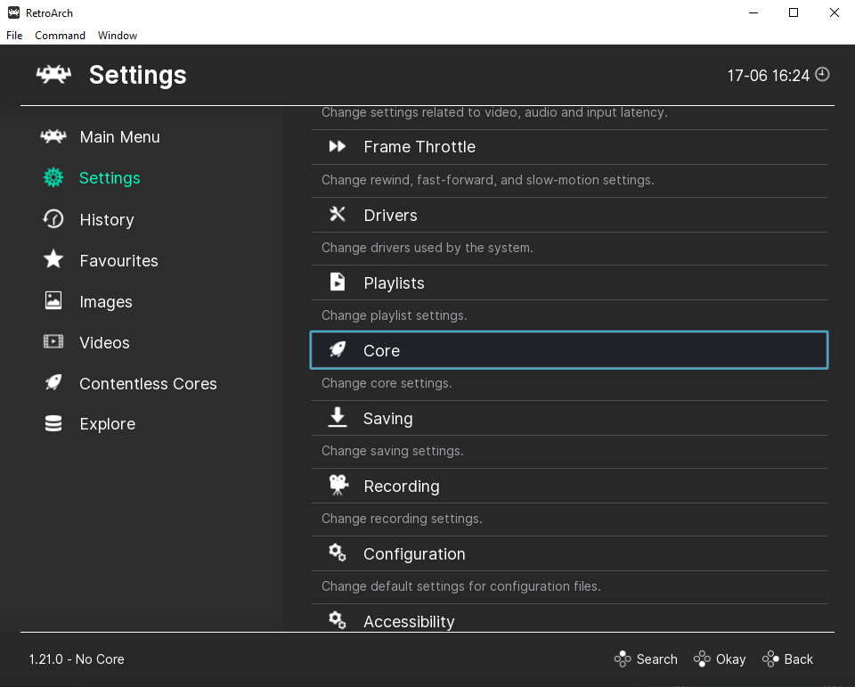
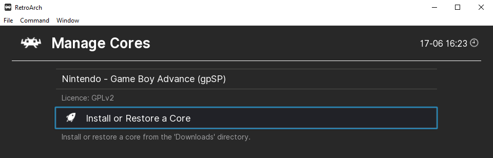

Make sure _Nintendo - Game Boy Advance (gbSP)_ is visible.
Now go to _Main Menu -> Load Core_ and select the gbSP core.

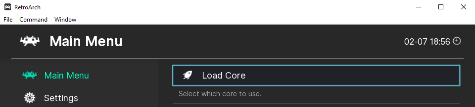
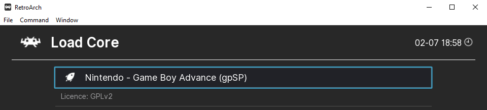

**Make sure all players have the same version of the core!**

##### If the core isn't visible

If the gbSP core isn't visible, you'll have to add it first.  
_A quick Google search for "gbSP core" should allow you to find and download it._

Once you have downloaded the core (it should a .dll file), go to:
_Your Retroarch repository -> cores_

Copy the .dll file inside and rename it _gpsp_libretro.dll_.
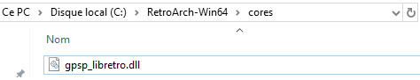

#### 2. Enabling the Wireless Adapter

First, load a game in order to access the Retroarch's _Quick Menu_ (F1 key).
Scroll down until you see _Core Options_ and access it.

Scroll down until you see _Link Cable Connectivity_ then set it to _GBA Wireless Adapter_.
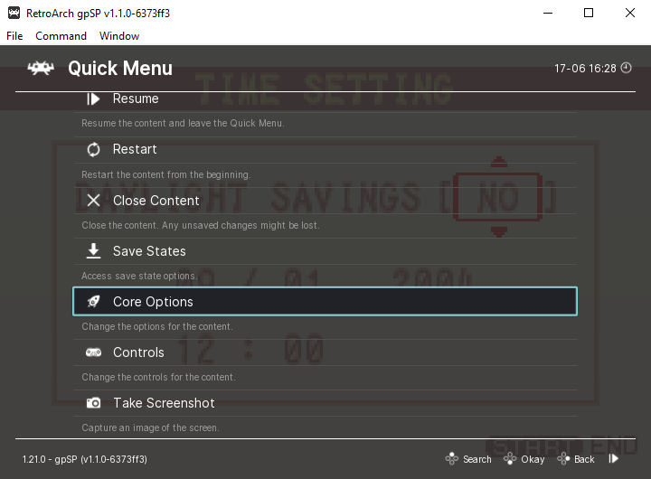
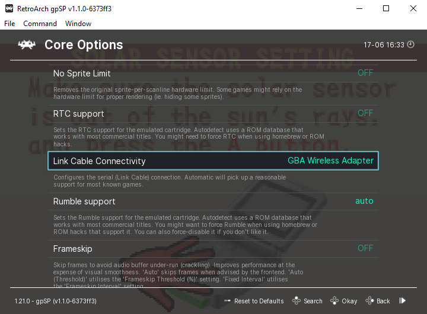

Just in case, restart the game to apply changes via _Quick Menu -> Restart_.

#### 3. Adding a GBA BIOS file

While a GBA BIOS file is usually optional, it is recommended in this case due to more accurate emulation. Crossover Battle is very unique and thus can be finnicky without a BIOS.

_Sharing BIOS files is illegal and you will have to find one yourself._

Put the BIOS file in the following folder:  
_Your Retroarch repository -> system_

**Make sure the file is named gba_bios.bin, Retroarch is very finnicky about this.**

If you've done everything correctly, the BIOS file should be detected and shown in _Main Menu -> Settings -> Core -> Manage Core -> Nintendo - Game Boy Advance (gbSP) -> Firmware section_.
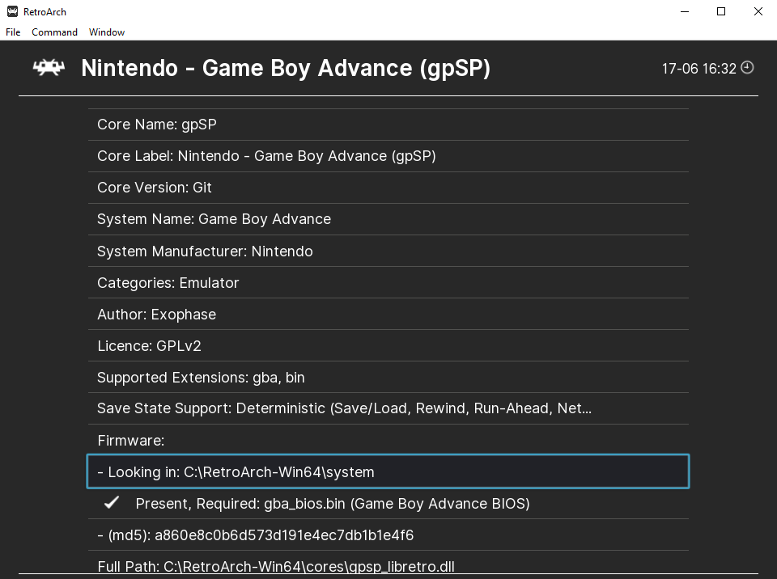

#### 4. Hosting a game

Once all players have the same version of the gbSP core with Wireless Adapter enabled, one player must Host while other players will join as Clients.

Go to _Main Menu -> Settings -> Network_.  
It is recommended to enable _Publicly Announced Net-play_, _Use Relay Server_ and tochoose a _Relay Server Location_ close to you to simplify.

**You should also specify a password to prevent random people from joining.**
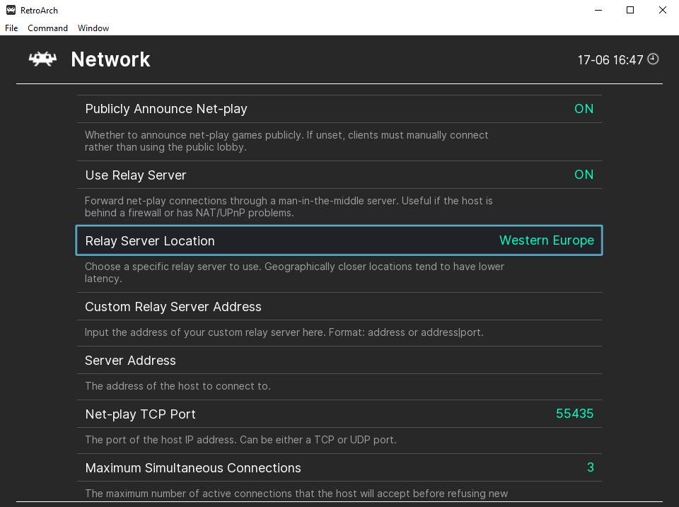

##### 4a. As the Host

Go to _Main Menu -> Net-play -> Host_ and click on _Start Net-play Host_.  
**Your hosting session will automatically starts as soon as you load a game.**
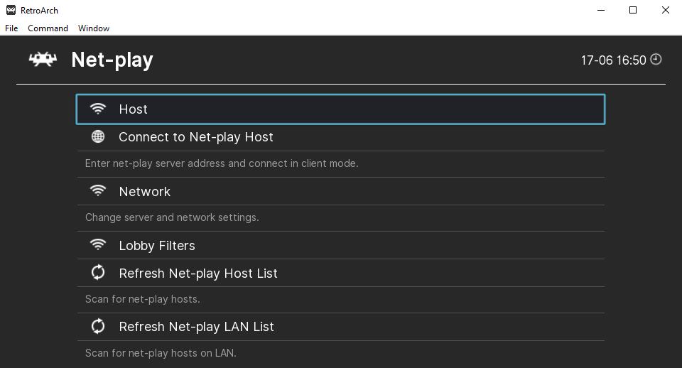

##### 4b. As a Client

Go to _Main Menu -> Net-play_ and click on _Refresh Net-play Host List_.  
This will add a list of current Hosts at the bottom.

Look for the player you want to join and click on it. Input the password and load your game if you haven't yet.
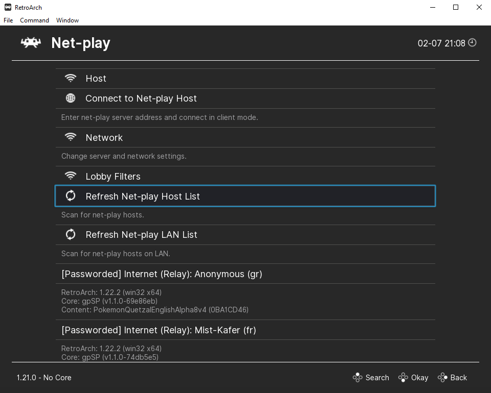

### Accessing Crossover Battle menu

#### Battle Network

- Connect a wireless adapter before starting the game
- Enter the last menu at the bottom (CrossBattle / Crossover Battle 2)
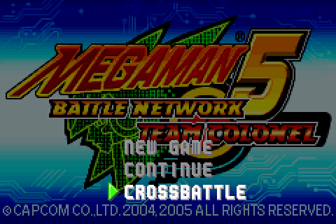
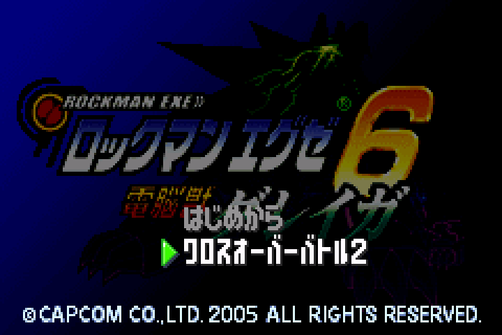

#### Boktai 2

- Enter the Link menu
- Press the following buttons: _L R L R L L R R R R L L Select Start Select Start_
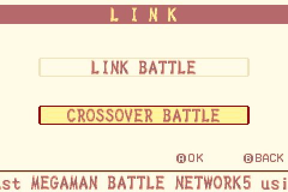
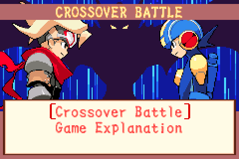

#### Boktai 3

- Enter the Link menu
- Press the following buttons: _L L L L L R R R R R L R L R Select Start_
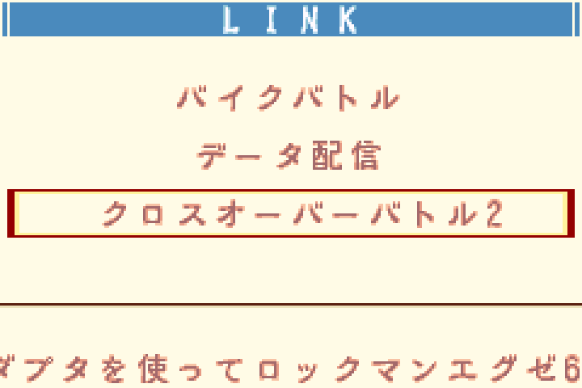
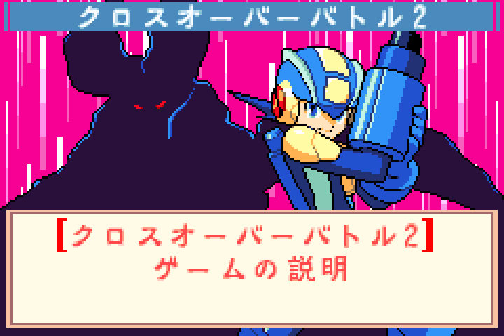

### Creating and joining a session

#### 1. Creating a lobby

The Boktai side has to create a session for Crossover Battle first.
This can be done by accessing the Crossover Battle lobby (1st option at the top) and waiting.

_Note: Profile for Crossover Battle will use the save file name ("Django" in this example)._
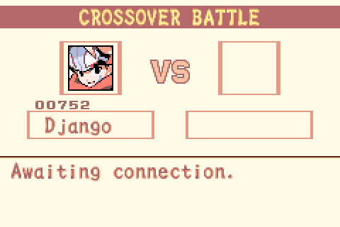

#### 2. Joining a lobby

The Battle Network side will detect Boktai lobbies via its own Crossover Battle (1st option at the top).

**If a profile wasn't created yet, the Battle Network side will be forced to create one first.**

Profiles must have a Name and a Catchphrase.
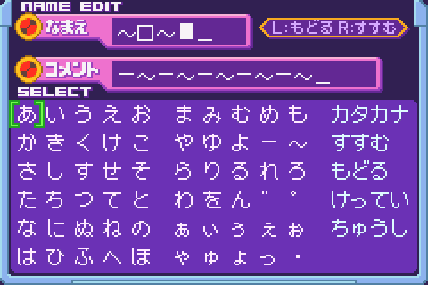

Once a profile has been created, accessing the Lobbies listing will be possible.
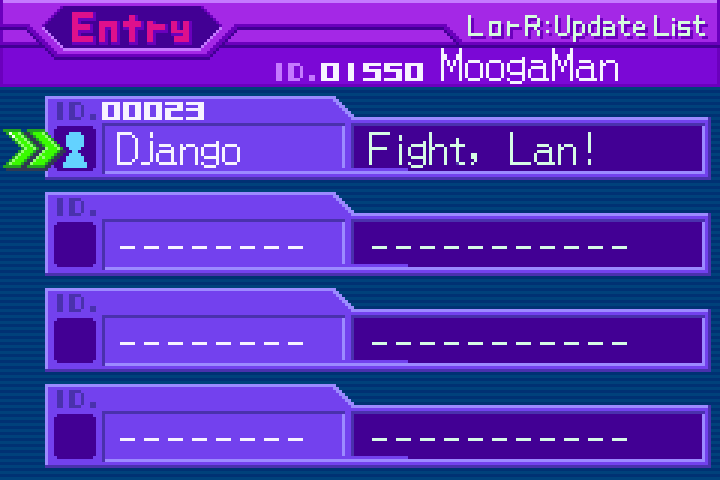

#### 3. Starting a match

The Battle Network side can choose a Boktai lobby and start a match by pressing A and confirming.
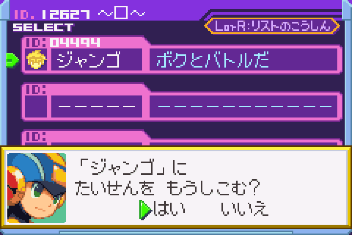

#### 4. Accepting a match

The Boktai side gets notified of a Battle Network opponent joining the lobby.
Upon pressing A to accept the match, Crossover Battle will begin.

_Note: The Catchphrase of the Battle Network player will be shown ("Pizza" here)._
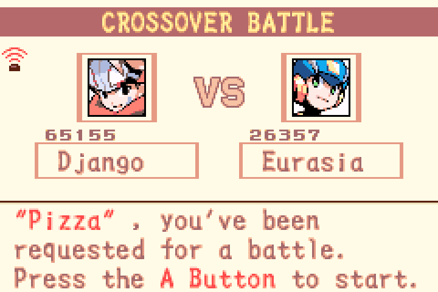
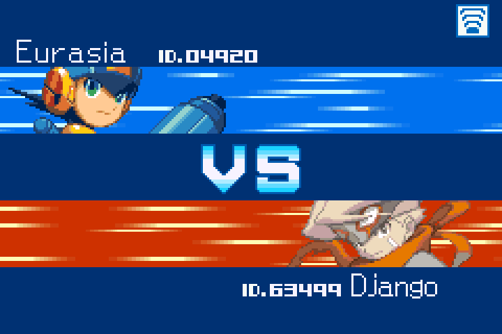

## FAQ

### Q: I don't know what anything does! What are the effects for?

A:  The Rockman EXE Zone got you covered! Check these out:

- [Crossover Battle Version 1](https://www.therockmanexezone.com/wiki/Boktai_Crossover_(MMBN5))
- [Crossover Battle Version 2](https://www.therockmanexezone.com/wiki/Boktai_Crossover_(MMBN6))

### Q: Do i need to restart the game after each match like on VBA Link?

A:  No, you can play multiple matches without having to restart the game.

### Q: Can i keep my progress (profile, win/lose ratio)?

A:  Yes, although if you are on the Battle Network side it is recommended to have a save file for this (if you don't have one, just start a New Game and save).

### Q: Do i need to wait until the game becomes stable like on VBA Link?

A:  No, you can start a match and immediately play. With Retroarch there should be no lag even if both players are far apart from each other.

### Q: Can i change my profile?

A:  On the Battle Network side this can be done in the Crossover Battle menu. On the Boktai side this requires starting a New Game and saving.

### Q: I can't connect to the Host despite using the correct password!

A:  If you can't connect, try switching who's Host and who's Client.  
    Currently i don't have any other solution, Retroarch is just weird sometimes.

### Q: I can't see the lobby in the list as a Battle Network player!

A:  Try refreshing the list in-game, restarting the game or switching who's Host and who's Client.

_Note that there can be a slight delay before you see a lobby depending on where each player lives._

### Q: How many players can join as Client?

A:  While you can only do one Crossover Battle at a time, there are no limits for how many players can connect via Retroarch.  
_However the more players, the more chance of the game becoming unstable and laggy._

### Q: I keep losing! My opponent wins in less than 3 turns!

A:  If you're playing Version 1 (Boktai 2 VS Battle Network 5), the Battle Network side is heavily advantaged. Otherwise, it mostly comes down to skill.