# Boktai 2 (JP) Any% Route

## About this guide

This guide assumes you are playing on the Japanese 1.0 release of Boktai 2.  
It will likely work fine for other releases but some strategies like RNG manipulation will need different timings.  
Directions for paths and exits will use ↖️, ↗️, ↙️ and ↘️.

### Terminology

- RNG manip: Short for "Random Number Generator Manipulation". Used to influence the randomness within the game to make things happen that are normally reliant on chance.
- Soft reset: Pressing A + B + Start & Select at the same time reboots the game. This is useful for RNG manip and can be used to skip dragging coffins back to town.
- STRG and AGIL: Strength and Agility. The third and fourth status point options. They influence your physical damage, movement speed and defense.

## Exp table

```admonish abstract collapsible=true title="Click to open"
{{#include assets/tables/any_exp.html}}
```

Imported from [this spreadsheet](https://docs.google.com/spreadsheets/d/18cLbO9WR_D8VkX3yPcxh9rGGoT2BN-L0g_95ECNCRuM/edit?usp=sharing).

## Before starting

Make sure you have an existing save file and that the Crossover option is unlocked in the Link menu.  
To unlock the Crossover option, go to the Link menu, then press the following buttons in order:  
`L R L R L L R R R R L L Select Start Select Start`.

### Emulator settings

- Requires BizHawk 2.6.3 or newer.
- Set "Skip BIOS" and "RTC" to False in the GBA Settings.

Setting "Skip BIOS" is mandatory as this creates parity with actual hardware.  
Disabling RTC simulates an empty cartridge battery which enables some of the strats in this guide.

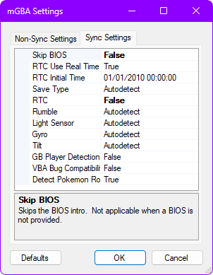

## Initial Game Settings

Ensure that no UV is reaching the solar sensor before confirming calibration settings (Not relevant for emulator play):  
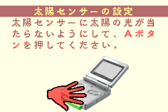

Set the system time to August 1st 2004 at 11:55PM (2004/08/01 23:55):  
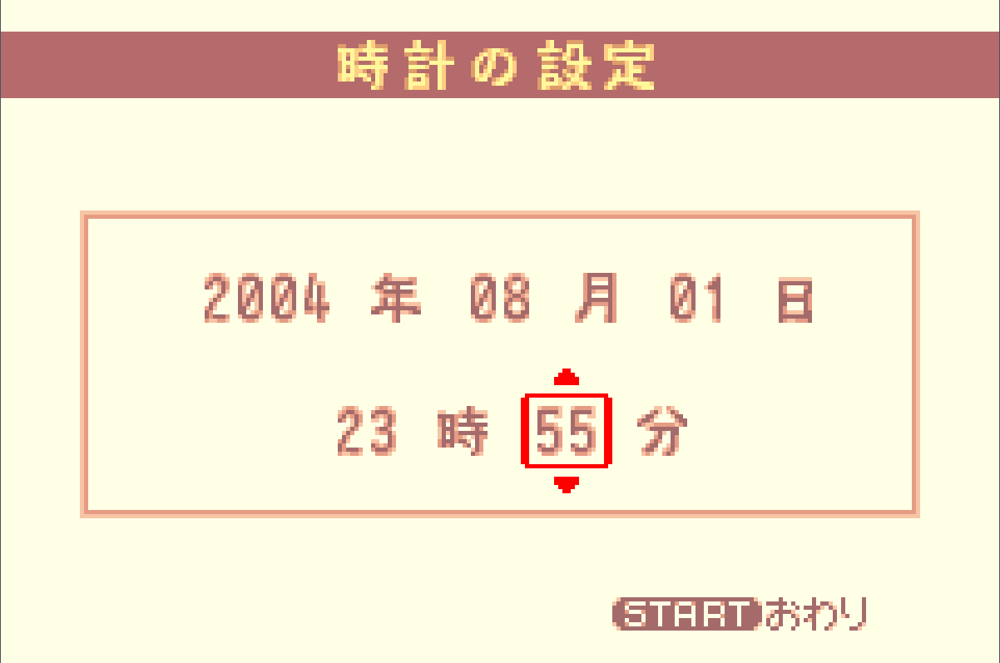

Use the default region selection.

Select New Game and enter the password for the "Dark Boy" title.  
This title grants +2 STRG, +2 AGIL, a ![][icon_power_nut] Power Nut and a ![][icon_bearnut] Bearnut.

Use the characters to the left of the numbers:

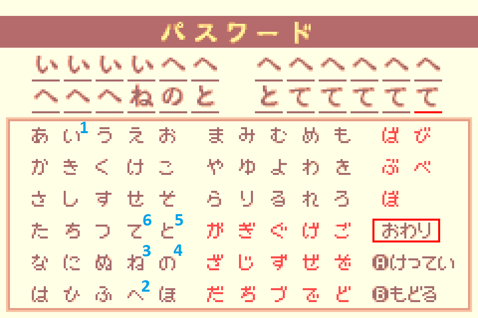

Use a single character for the player name. This saves a few frames each time the name is typed out in cutscenes.

Timing starts when confirming your settings.

## Tutorial

After the intro, progress through the linear route until you run into the trap.

### <span class="trap">Skeleton Trap</span>

- Proceed through the ↘️ exit to obtain the ![][icon_gladius] Gladius.
- Backtrack and hit the Skeleton from behind to reach **Lvl 2**.

Proceed through the ↖️ exit, then open the next green chest for a ![][icon_leather_armor] Leather Armor.  
Open the menu and change the text speed to Fast:  
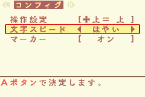  
Unequip your current armor (less defense, faster walking speed).

### <span class="trap">Zombie Trap</span>

- Hit the Zombie 3 times to trigger the cutscene, then hit it from the front twice.

## San Miguel

After the dialogs, kill the first Ghoul for EXP then proceed through the ↗️ exit.  
At the piledriver screen, proceed through the ↖️ exit.

Proceed towards the ↗️ exit, kill the Ghoul for EXP, enter the Cathedral.

## Cathedral

Kill two Ghouls to reach **Lvl 3**, raise AGIL to 17 and put your remaining stat point into STRG.

Push the blocks to progress and proceed through the ↗️ exit.  
After the cutscene, proceed through the ↘️ exit.

### <span class="puzzle">Block Puzzle</span>

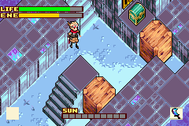  
Open the chest for a ![][icon_club] Club.

Backtrack, kill the Ghoul in the previous room for EXP.  
Destroy the first wooden block to push the 2 stone blocks, also open the chest for a ![][icon_power_nut] Power Nut.  
Proceed through the ↘️ exit by destroying the wooden block.

### <span class="puzzle">Graveyard & Basement Puzzles</span>

Proceed straight ahead to enter the Graveyard.

- 1st row: Push the 2nd tombstone
- 2nd row: Push 1st
- 3rd row: Push 2nd

Backtrack and take the stairs into the basement.  
Kill all Ghouls until you reach the 5th room. You should now be **Lvl 4**.  
In the 5th room, knock on the fifth wall block in the center of the room, then run along the right outside wall to avoid the Zombie.

In the remaining basement rooms, use ![][icon_flame] Flame with ![][icon_gladius] Sword to light torches and ![][icon_club] Club to activate levers.

Push the blocks as shown here, then touch the lamp:  
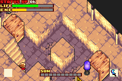

After leaving the basement, put all stat points into STRG.

### <span class="trap">Skeletons Trap</span>

- Use ![][icon_sol] Sol and hit the Skeletons from behind.
- You should reach **Lvl 5** after this fight.

Put all stat points into STRG.  
Open the chest for the ![][icon_yellow_orb] Yellow Orb and proceed through the bottom ↖️ exit.

Knock on the central wall to lure the Ghoul, then open the chest for a ![][icon_warp_leaf] Warp Leaf and proceed.  
Break and move the wooden blocks to get the ![][icon_triangle_key] key, then light the torch and place the ![][icon_yellow_orb] Yellow Orb.  
Refill life if under 50% and refill energy to at least 80% before leaving the room.

Backtrack to the trap room and kill a Ghoul, then proceed through the top ↘️ exit.

The ![][icon_red_orb] Red Orb will be in a random skylight.  
Check the spot directly next to the stairs, then take the stairs whether or not you found it.

### <span class="trap">Ghouls + Zombie Trap</span> & Short Sword RNG Manip

- Follow the RNG manip method in the below video to get a ![][icon_short_sword] Short Sword:

<iframe
  style="aspect-ratio: 16/9"
  src="https://www.youtube.com/embed/YmsQ1HICzCc"
  title="Boktai 2: Short Sword RNG Manip w/o Link Menu"
  allowfullscreen
></iframe>

Proceed through the ↖️ exit and fall down to get the ![][icon_spear] Short Spear.

Kill two Ghouls, then backtrack to this room:  


Use the spear on the lever to open the gate and proceed up the stairs.

Light the first torch with ![][icon_flame] Flame and place the ![][icon_red_orb] Red Orb if you already found it, otherwise continue upstairs.

Hold left upon entering the top floor to trigger the trapdoor and light the torch with hammer and ![][icon_flame] Flame to set up the timing to walk over the trapdoor.  
Talk to the hint panel in the bottom-left corner (necessary for a puzzle).  
Drop through a trapdoor and backtrack to the Red Orb room.

If you did not already get the ![][icon_red_orb] Red Orb, check all of the skylights whilst moving through the room, then light the torch with spear and ![][icon_flame] Flame.  
Proceed down the new stairs and go outside.

Once outside, destroy the 2 statues with spear and ![][icon_sol] Sol to obtain the ![][icon_blue_orb] Blue Orb.  
Open the orange chest in that area for a ![][icon_warp_leaf] Warp Leaf.

Backtrack to the Red Orb room.

If you did not already find the ![][icon_red_orb] Red Orb, **do not proceed before finding it.**  
Backtrack to where you obtained the spear, but instead of falling, proceed through the ↖️ exit.

### <span class="puzzle">Library Puzzle</span>

Talk to these bookshelves to open the gate:

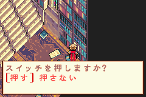
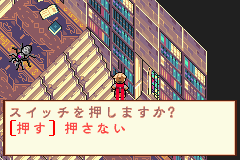  

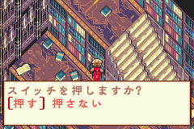

### <span class="puzzle">Lamp Puzzle</span>


  
Open the first chests on the left for a ![][icon_power_nut] Power Nut and a ![][icon_triangle_key] key.

### <span class="puzzle">Green Orb Puzzle</span>

Light the torches with spear and ![][icon_flame] Flame, then push the first block to reach the second one.  
Open the chest whilst pushing the first block for a ![][icon_solar_nut] Solar Nut.  
Push the second block onto the weight switch to activate the lamp.  
Interact with the lamp to obtain the ![][icon_green_orb] Green Orb.

Backtrack to the main room and kill two Ghouls to reach **Lvl 6.**

Backtrack to the room with the trapdoors and hint panel.  
Place the ![][icon_red_orb] Red Orb before going to the top floor if you did not already place it.  
Place the ![][icon_green_orb] Green Orb (2nd option):  


Proceed through the ↖️ exit (Refill life on skylights if low).

Light the torch with ![][icon_flame] Flame and place the ![][icon_blue_orb] Blue Orb.  
Backtrack and proceed down the new stairs in the main room, refill energy on the Solar Station.  
Equip the ![][icon_short_sword] Short Sword and ![][icon_leather_armor] Leather Armor, then put all stat points into STRG.

### <span class="boss">White Duneyrr</span>

- Light the torch in the center with spear and ![][icon_flame] Flame. With precise positioning you can hit all four candles with one attack.
- Line up directly behind Duneyrr and use the ![][icon_short_sword] Short Sword and ![][icon_sol] Sol to attack Duneyrr twice per cycle.
- After she flinches, move onto her position, then switch back to spear and ![][icon_flame] Flame to hit the torch in the center again.
- Repeat until the fight is over, if executed correctly your energy will last until the end of the fight and Duneyrr will never be able to act.
- You should reach **Lvl 7** after this fight.

Proceed through the ↗️ exit to trigger a cutscene.  
Ignore the chest and exit the room.  
After picking up the coffin, unequip your armor and use a ![][icon_power_nut] Power Nut.

Proceed through the top ↖️ exit in the main room.  
Activate the 3 weight switches by using the coffin and pushing the block.  
Proceed through the middle ↖️ exit and open the blue chest (![][icon_circle_key] key) and the chest to the left (![][icon_power_nut] Power Nut).

Drag the coffin back to town and into the piledriver screen.

### <span class="purification">White Duneyrr Purification</span>

Enable max sunlight for purifications, you cannot start a purification sequence without sunlight enabled.

- Activate three generators and leave the fourth inactive until after you've started the purification to skip a long dialog.
- Stand east-southeast of the coffin and aim to knock her back in as soon as she escapes.
- Her first attack begins directly after this, do not stand in it as you will die quickly.

After the purification, choose the first dialog.

## San Miguel (2)

Talk to Smith near the forging house, then proceed through the ↘️ exit and enter the Remains.

## Remains

In the main room with Clay Golems, proceed through the ↖️ exit, then take the stairs.

### <span class="trap">Vampire Bats Trap</span>

- If no armor is equipped, **be careful as you will die in 2 hits.**
- Try to group them up and use ![][icon_sol] Sol.

Unequip armor if you had it equipped for the trap.  
Put all stat points into STRG.

Use no element to kill the Yellow Slimes, they have high elemental resistances.  
Refill health on the Yellow Slime corpses as they die, so that you can pick up a ![][icon_power_nut] Power Nut if one drops.  
Go ↖️ to push a block, then **TURN OFF SUNLIGHT** before proceeding through the ↗️ exit, or Solar Wind will kill you.

Light the torch with ![][icon_flame] Flame and proceed.

During the dialog, choose the first option.  
Backtrack to go outside, then refill health before proceeding down the stairs.

Extinguish the flame with ![][icon_frost] Frost to proceed.  
Push the block, then proceed through the ↖️ exit.

Use ![][icon_flame] Flame to melt the blocks.  
If you did not get a random drop from the Yellow Slimes, open the top chest for a ![][icon_power_nut] Power Nut.

Use ![][icon_frost] Frost to make the floating block fall, then refill life/energy to 100% on the skylight.

### <span class="trap">Sword, Yellow Slimes, Clay Golems Traps</span>

- Sword: Use ![][icon_sol] Sol to deal more damage.
  - You should reach **Lvl 8** after this fight.
- Yellow Slimes: Attack without using any element.
- Clay Golems: Knock on the walls so that they stun each other, then finish them off.
  - With a +0 Short Sword, each set of Clay Golems will need 3 hits with ![][icon_sol] Sol plus 1 additional unenchanted hit to kill quickly.
  - If any Clay Golems kill each other, you must kill extras later to make up the lost EXP.
  - You should reach **Lvl 9** after this fight.

Possible change: Use card manip on the chest in the first trap to get ![][icon_blue_card] The Tower **(塔)**.

Open the blue chest for a ![][icon_triangle_key] key, then proceed through the ↘️ exit and open the door.  
During the dialog, choose the second choice, then proceed up the stairs in the next room.

Kill the Vampire Bat and proceed.  
Refill energy to at least 50% before leaving the room.

### <span class="puzzle">2-Colour Puzzle</span>

Put all stat points into STRG.  
Use a ![][icon_power_nut] Power Nut and push one block towards the start of the room like this:  
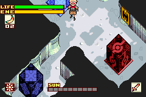  
After that, push the other block on its spot, then do the same with the first block:  
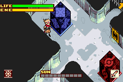

In the next room, push the floating block with sword and ![][icon_cloud] Cloud ↘️, then spear ↗️, then lower it with ![][icon_frost] Frost.

In the newly-unlocked room, destroy the stone block with ![][icon_cloud] Cloud to get the ![][icon_triangle_key] key.  
Backtrack to the previous room and push the block on the left, proceed through the ↖️ exit.  
Break the stone block on the way with ![][icon_cloud] Cloud, then select ![][icon_sol] Sol.

Open the door and kill the Yellow Slime.  
Refill energy to >50% on the Yellow Slime corpses as they die, so that you can pick up a ![][icon_power_nut] Power Nut if one drops.  
Proceed through the ↘️ exit and push the block.  
Backtrack outside and take the stairs, then proceed through the ↘️ exit.

In the room with skulls, make sure that you have no sunlight (deactivates traps).  
Open the chest on the left (bottom) for a ![][icon_speed_nut] Speed Nut, then proceed through the ↗️ exit.

### <span class="puzzle">4-Colour Puzzle</span>

Use a ![][icon_power_nut] Power Nut, then push the blocks like this (start with the ![][icon_flame] Flame block):  


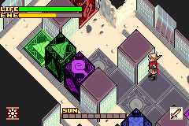


Kill the two Mummies with ![][icon_sol] Sol and proceed up the stairs.

Proceed to the bottom of the next room, then kill the Clay Golem with ![][icon_cloud] Cloud.  
Before exiting, wait for the Clay Golem's death animation before switching to ![][icon_flame] Flame (allows you to wait and see if the Clay Golem drops a weapon).  
Proceed through the immediate ↙️ exit.

In the room with the flame jet, use ![][icon_flame] Flame on the Mummy to activate the torch, then proceed up the stairs.  
Avoid the Yellow Slimes and open the blue chest for a ![][icon_triangle_key] key.

Backtrack downstairs and refill life/energy before proceeding through the ↙️ exit.  
Push the block and proceed through the ↘️ exit.

Open the ↗️ door and proceed.

### <span class="trap">Axe Trap</span>

- It's an axe!!
- Use ![][icon_sol] Sol to deal more damage.
- You should reach **Lvl 10** after this fight.

Open all the chests for a ![][icon_circle_key] key, the ![][icon_dynamite] Dynamite magic, and a ![][icon_green_card] card.  
Use a ![][icon_solar_nut] Solar Nut.  
Backtrack to the first room by proceeding through the ↙️ exits.

Kill all four Clay Golems with ![][icon_cloud] Cloud and proceed through the ↘️ exit.

Kill both Clay Golems with ![][icon_cloud] Cloud and proceed in the same direction.

Open this hidden chest for a ![][icon_warp_leaf] Warp Leaf, then open the door:  
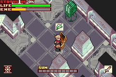

Skip getting water from the fountain, then proceed.

### <span class="puzzle">Desert Puzzle</span>

You must now find three ![][icon_stone_tablet] Stone Tablets that are in fixed spots on eight screens:  
れたオアシスの下 / Beneath a dried-up oasis")
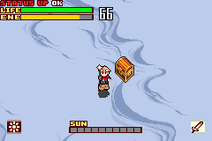
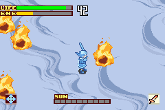
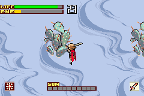

ちたゴーレムの修ろ / Behind a crumbling golem")
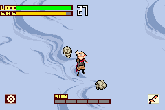
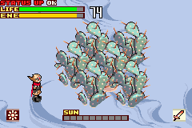

Begin on the southwest screen (first image) and proceed counter-clockwise.  
On the south screen (second image) kill a Clay Golem with ![][icon_cloud] Cloud to reach **Lvl 11**.  
If you already have two ![][icon_stone_tablet] Stone Tablets by this point, proceed ↗️ to the central screen and interact with the statue to check where the remaining tablet is.

When you have all three tablets, proceed to the central screen and talk to the statue on the left:  


Proceed into Remains B.

If you do not currently have two ![][icon_power_nut] Power Nuts in the inventory, open this hidden chest:  
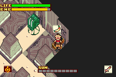

### <span class="puzzle">Torch Puzzle</span>

Light the torches in this order:  
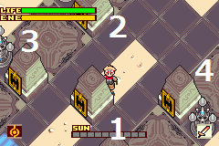

Proceed downstairs, kill the Clay Golem with ![][icon_cloud] Cloud and the Mummies with ![][icon_sol] Sol.  
Proceed through the ↙️ exit.

Start with the puzzle room on the top-right:  
Select spear and ![][icon_cloud] Cloud.  
Push the first block ↘️.  
Push the second block ↘️ onto the weight switch.  
Push the first block ↖️↗️↖️ onto the other switch, then use ![][icon_frost] Frost on both blocks.

Proceed to the puzzle room on the top-left:  
Refill energy on the Solar Station.  
Use ![][icon_flame] Flame on the block, then spear and ![][icon_cloud] Cloud to push it ↖️.  
Use your ![][icon_speed_nut] Speed Nut.  
Use spear and ![][icon_cloud] Cloud to push the block ↙️.

Open this hidden chest for a ![][icon_warp_leaf] Warp Leaf:  


Refill energy to 100% on the Solar Station before leaving the room.

Proceed to the puzzle room on the bottom-left:  
Activate all of the floor switches, then hit the lever with the spear.  
Equip sword and ![][icon_sol] Sol before leaving the room.

Proceed to the final puzzle room on the bottom-right:  
Activate the first lever with the sword, then run ↙️.  
When you're close enough, run ↗️ onto the switch.

**Do not assign stat points before the boss fight.**

- 31 STRG (33 Attack) is enough for the fight, you want to save these stat points for later.

### <span class="boss">Vampire</span>

- Stay away so that Sabata doesn't get hit.
- Position yourself so that the swords don't go in Sabata's direction.
- Only hit the Vampire when the black hole is active.
- Face in the same direction as the Vampire to push him into the black hole faster.
- When the Vampire is stuck in the black hole, use ![][icon_sol] Sol.
  - Follow the specific damage route shown in the below video, or you will get a third cycle:
    <iframe
      style="aspect-ratio: 16/9"
      src="https://www.youtube.com/embed/wKOekb6LSps"
      title="Boktai 2: Ringo 2-cycle w/ +0 Short Sword"
      allowfullscreen
    ></iframe>
- You should reach **Lvl 12** after this fight.

Once you gain control of Sabata, use ![][icon_power_nut] Power Nuts to drag the coffin back to San Miguel.

### <span class="purification">Django Purification</span>

Enable max sunlight, activate the bottom two generators and begin the purification.

![][icon_zero_shift] Zero Shift onto the coffin after gaining control of Sabata and activate the other two generators.  
Position Sabata to the south of the coffin to manipulate Django to move upwards.

![][icon_zero_shift] Zero Shift upwards and knock him back into the coffin from the north.  
Move just north of the coffin and wait for Django to attack one of the generators.  
![][icon_zero_shift] Zero Shift in the appropriate direction and shoot Django back into the coffin.

- If Django goes to a northern generator, shoot diagonally to push him back into the coffin.
- If Django goes to a southern generator, shoot horizontally to push him back into the coffin.

## San Miguel (3)

Unequip your current elements.  
Equip ![][icon_dark] Dark, ![][icon_mouse] Mouse and ![][icon_bat] Bat.  
Raise AGIL to 25.

Buy the ![][icon_elefan] Elefan coffin (160 solls).  
Proceed to the piledriver screen.

Kill the two Dark Roots on the right with spear and ![][icon_dark] Dark, then leave **through the way you came in.**  
Backtrack to the piledriver screen and kill **thirty-four** (34) more Dark Roots this way.  
You should reach **Lvl 15** during this grind.

Proceed through the ↘️ exit and break the two blocks to the south.  
Kill the southern Dark Root with sword and ![][icon_dark] Dark, then proceed through the furthest ↗️ exit.

## Dark City

Open the first chest for a ![][icon_sunscreen] Sunscreen.  
Put all stat points into STRG.  
After leaving the room, proceed through the ↗️ exit, then go around and proceed through the ↘️ narrow passage.

Proceed through the ↙️ exit, then the last exit at the bottom.  
Proceed through the ↗️ exit, then again in the same direction.

In the room with the Zombies, proceed through the ↖️ exit.

After the cutscene, refill life with moonbugs.  
Proceed through the ↖️ exit.

Proceed through the second door, use ![][icon_mouse] Mouse to proceed and activate the lever, then take the stairs.

Kill both Green Slimes with sword for EXP.  
Proceed through the ↙️ exit, then take the stairs.  
Use ![][icon_bat] Bat to go through the window.

Un-transform immediately and proceed through the ↙️ exit.

Use ![][icon_mouse] Mouse on the elevator and proceed through the ↗️ mousehole.  
Attack the Green Slime to push it away from the wall, then proceed through the ↘️ exit and push the block.

Backtrack, then take the elevator without being shapeshifted.  
Use ![][icon_bat] Bat to go over the water and proceed through the ↖️ door.

Open the blue chest for a ![][icon_circle_key] key, then leave the room.

Backtrack and proceed through the ↘️ exit, then through the first ↗️ door.  
Proceed upstairs, kill both Green Slimes with sword and open the locked ↘️ door.

Kill the two Gusts with sword to reach **Lvl 16**, then proceed down the ↙️ stairs.  
Once outside, proceed through the ↖️ exit nearby.  
Use ![][icon_bat] Bat to go over the water, then proceed through the ↗️ door.

Refill energy on the Solar Station, then use ![][icon_bat] Bat on the elevator and go through the window.  
Proceed through the first exit, then go downstairs and through the ↘️ door to push a block.

Backtrack inside but do not take the stairs, proceed through the ↙️ exit instead.

Use ![][icon_bat] Bat to go over the water and switch trap, then open the chest for a ![][icon_circle_key] key.

Proceed through the ↘️ exit, push the block and go through the second ↗️ door.  
Unlock the next ↗️ door, then use ![][icon_bat] Bat to go over the narrow paths.

Avoid the ghosts and use ![][icon_bat] Bat to proceed through the window.  
Go left and proceed through the last exit.

Un-transform immediately, then hug the left wall to go behind the Gust.  
Knock on the wall after passing the first corner to distract the second Gust, then hug the left wall and knock on the wall inside the skylight to cluster all three.

Open the blue chest for a ![][icon_circle_key] key.

When all of the Gusts are in the skylight, enable 9 sunlight to deal 270 damage to them, then immediately disable sunlight before using sword to finish them off.  
Use ![][icon_bat] Bat to proceed through the ↖️ window.  
If you accidentally killed the Gusts with sunlight, kill the Green Slime through the ↗️ exit **eight times** to make up the missing EXP.

Proceed through the first exit, then go downstairs and through the ↘️ door to push another block.  
Backtrack and take the elevator, proceed through the ↙️ exit, then go ↘️ and ↗️ to unlock the next door.

Refill energy on the Solar Station and put all stat points into STRG.  
Select the first option during the dialog.

### <span class="boss">Cheyenne</span>

- Use ![][icon_dark] Dark, keep hitting him non-stop.
- Try to aim in the correct direction so that hits counts as back hits for higher damage.
- Try to cause him to flinch as he pulls out new weapons to keep him disarmed.
- When he attempts to use an item to heal/buff himself, attack him to force him to drop it.

Take the magic circle, then use a ![][icon_warp_leaf] Warp Leaf to leave the dungeon.  
Proceed through the ↙️ and ↖️ exits to backtrack to San Miguel.

Talk to Cheyenne to unlock the weapon shop.  
Buy two ![][icon_broad_sword] Broadswords and equip the ![][icon_gladius] Gladius.  
Place the two ![][icon_broad_sword] Broadswords in the first two inventory slots, and your ![][icon_short_sword] Short Sword in the third slot.  
Go to the forging house and forge a ![][icon_long_sword] Long Sword using the **second** ![][icon_broad_sword] Broadsword + ![][icon_short_sword] Short Sword.

### Katana Manip

Exit and re-enter the forging house.  
Save and soft-reset (A+B+Start+Select).  
**From soft-reset, RNG advances every frame. Use an external timer like EonTimer to assist in the manipulation.**

Set the system time to 2004/05/05 23:56.  
Talk to Smith and begin selecting your weapons to forge with.  
Select the ![][icon_broad_sword] Broadsword and ![][icon_long_sword] Long Sword in the first two slots.  
**Start the forge at these precise times after soft-reset has taken place, for the respective platforms:**

- **Emulator: 34.07 seconds**
- **Nintendo DS: 34.25 seconds**
- **Game Boy Player: 34.23 seconds**

Do precisely 15 strikes in this forge.  
Get at least two GREATs to guarantee an SP weapon.  
If every hit is a GREAT, you will increase the frame window from 8 to 12.  
If the start of forge was timed correctly, the resulting weapon will become a ![][icon_katana] Katana SP.

Backtrack through the ↘️↗️↗️ exits to Dark City.  
If the EXP route has been followed correctly, you will reach **Lvl 17** by this point.

**Do not proceed if you have not reached this level yet**, kill Dark Roots/Yellow Slimes to reach **Lvl 17** or you will be unable to equip the ![][icon_katana] Katana.

## Dark City (2)

Take the magic circle and unlock the ↗️ door.

In the room with Gusts, take the stairs, then proceed through the ↘️ exit.

In the next room, use ![][icon_bat] Bat to go through the window on the left, then keep using ![][icon_mouse] Mouse, go to the right (across the wood), then use ![][icon_bat] Bat to go through the last window.  
**Push the wooden block to open the path before proceeding through the ↗️ door.**

Continue downstairs, ignore all enemies.  
Refill life/energy before entering the boss fight.

### <span class="boss">Red Durathror</span>

- 1st phase:
  - Equip the ![][icon_katana] Katana as the Dark Roots are spawning to react to where the bulb appears.
  - Hit the bulb ten times with ![][icon_dark] Dark before it has a chance to attack.
- 2nd phase:
  - Hit the correct bulb; look for the vibrating bulb, or you can use ![][icon_bat] Bat to see which one it is.
  - Use ![][icon_dark] Dark x3 once the bulb is opened.
- 3rd phase:
  - Hit once with no element, then once with ![][icon_dark] Dark to end each cycle quickly.
  - Hit her right as she spawns to cancel her attacks.

Drag the coffin and solve the puzzles.  
After solving the puzzle with 2 wooden blocks, leave the coffin behind and proceed up the ↗️ staircase.

Use a ![][icon_warp_leaf] Warp Leaf to leave the dungeon.

Proceed through the southern ↖️ exit to go to the piledriver screen.  
You should reach **Lvl 18** by the time you reach this point.  
**Do not enter the piledriver screen through the northern entrance or you will softlock the game.**

Leave the piledriver screen through the same exit, save the game and soft reset (A+B+Start+Select).

Set the system time to 2004/08/31 19:00.  
The coffin is now in the piledriver screen.

### <span class="purification">Red Durathror Purification</span>

Activate one generator and start the purification.  
Enable max sunlight during the cutscene.

After regaining your powers, replace ![][icon_mouse] Mouse with ![][icon_sol] Sol and unequip ![][icon_bat] Bat, then finish the purification.

Choose the second dialog option after the purification.

## San Miguel (4)

Go to Cheyenne's shop and talk to him to get the ![][icon_dash] Dash magic.  
**Use this for movement whenever possible.**

Equip ![][icon_dash] Dash, ![][icon_transform] Transform, ![][icon_sol] Sol and ![][icon_dark] Dark.  
Go outside and talk to Violet to trigger Nero, then follow him.

Open this hidden chest for a ![][icon_warp_leaf] Warp Leaf:  
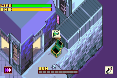

You should now have three (3) ![][icon_warp_leaf] Warp Leaves.

Follow Nero through the ↖️ exit.  
Use ![][icon_dark] Dark to destroy the Dark Root in front of the Treasury, then follow Nero and proceed through the ↖️ exit to the Aqueduct.

## Aqueduct

Go inside the Aqueduct to receive ![][icon_earth] Earth, then leave.

Backtrack to San Miguel through the ↘️ exit, then disable sunlight and immediately go back to the screen you just came from.

Gusts will now spawn on this screen because the Treasury Dark Root is dead; kill the Gust immediately in front of you with ![][icon_sol] Sol, then leave and re-enter the screen to infinitely respawn it.  
Kill this Gust until you reach **Lvl 19**, then kill two more.  
Replace ![][icon_sol] Sol with ![][icon_grow] Grow.

Proceed through the ↗️ exit and backtrack to the Cathedral.

## Cathedral (2)

Proceed through the ↗️ exit.

On the way, open the chest for a ![][icon_power_nut] Power Nut, then proceed through the ↗️ exit.  
Open the red chest near the main entrance for a ![][icon_warp_leaf] Warp Leaf, then use ![][icon_grow] Grow on the lily pads to proceed through the ↖️ exit.  
Use ![][icon_grow] Grow on the lily pads to reach a chest and get a ![][icon_black_card] Tarot Card.

Use a ![][icon_warp_leaf] Warp Leaf to leave.

Backtrack to Dark City, go through the piledriver screen on the way and kill all four Dark Roots with ![][icon_dark] Dark to disable their respawns.

## Dark City (3)

Pick up the ![][icon_sunscreen] Sunscreen in the first main room.

Take the magic circle and proceed through the ↗️ door.

Proceed back to where you fought Durathror, then backtrack along the route you took the coffin through.

Once outside, proceed through the first entrance.

### <span class="puzzle">Element Puzzle</span>

Equip ![][icon_flame] Flame, ![][icon_frost] Frost, ![][icon_cloud] Cloud and ![][icon_earth] Earth.

Use ![][icon_flame] Flame on the bottom block.

Push the iron block like this:  
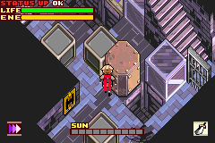

Use ![][icon_earth] Earth to delete the floating block next to the iron block, then push the iron block in the hole.

Use sword and ![][icon_cloud] Cloud to push the top block once ↘️.

Use ![][icon_cloud] Cloud to push the bottom block in these directions:  


- ↖️ (sword)
- ↗️ (spear)
- ↖️ (spear) 2x
- ↗️ (spear)

Now use ![][icon_cloud] Cloud on the other block:  
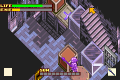

- ↘️ (sword)
- ↗️ (sword)
- ↖️ (spear)
- ↗️ (spear)

Use spear and ![][icon_frost] Frost to lower both blocks at once.

Use both of your ![][icon_solar_nut] Solar Nuts to refill energy.  
Equip ![][icon_sol] Sol, ![][icon_mouse] Mouse, ![][icon_transform] Transform and ![][icon_dash] Dash, then proceed up the stairs.

Use ![][icon_sol] Sol to kill the Gusts as shown in the below video, whilst using ![][icon_mouse] Mouse to go through the ↗️ mousehole.  
Open the chest for a ![][icon_black_card] Tarot Card.  
During the cutscene, choose the first option:

<iframe
  style="aspect-ratio: 16/9"
  src="https://www.youtube.com/embed/3JF41hijDQM"
  title="Boktai 2: Revised Dark City Gust Farm"
  allowfullscreen
></iframe>

After finishing the kill route shown in the video, replace ![][icon_mouse] Mouse with ![][icon_dynamite] Dynamite and ![][icon_sol] Sol with ![][icon_dark] Dark.  
Use a ![][icon_warp_leaf] Warp Leaf to leave.  
You should be **Lvl 21** after finishing the above kills.

Proceed through the ↙️ exit and backtrack to the Remains.

## Remains (2)

In the Clay Golem room, proceed through the ↗️ exit, then the second ↖️ exit.  
Proceed through the ↗️ exit (do not take the stairs).

Use ![][icon_dynamite] Dynamite on the wall next to the Zombie on the top-left, then proceed.  
Kill the Dark Root with ![][icon_dark] Dark and open the chest for the last ![][icon_black_card] Tarot Card.

Use a ![][icon_warp_leaf] Warp Leaf to leave.

Backtrack to the Aqueduct.

## Aqueduct (2)

Open the door, then proceed.

### <span class="trap">Purple Slimes Trap</span>

- Use Red Django, no element and sword.

### <span class="trap">Octopi Trap</span>

- Use ![][icon_flame] Flame, after the fight refill life/energy on the skylight.

### <span class="trap">Skeleton Fencers Trap</span>

- Put all stat points into STRG.
- Equip ![][icon_leather_armor] Leather Armor.
- Use Black Django and ![][icon_dark] Dark.
- Walk into the center of the room to cluster them, then kill all three at the same time.
- You should reach **Lvl 22** after this fight.

Refill life/energy and put all stat points into STRG before entering the boss.

### <span class="boss">Blue Dvalinn</span>

- Use ![][icon_flame] Flame.
- Refill life/energy on the skylight as needed.
- When she charges you, time your hit so that it cancels her attack.
- You can hit the oil bullets with ![][icon_flame] Flame to destroy them before they land.
- If she's at 1 HP and far away, shoot her with ![][icon_elefan] Elefan coffin (Black Django and ![][icon_sleep] Sleeping).
- You should reach **Lvl 23** after this fight.

Use a ![][icon_warp_leaf] Warp Leaf to leave, then backtrack to San Miguel.

## San Miguel (5)

Go into the clockhouse and talk to the NPC.  
Keep talking, then change the system time to 2004/09/30.

Go to Lita's shop:

- Sell your entire inventory except for the two ![][icon_sunscreen] Sunscreens and ![][icon_blue_card] The Tower **(塔)** if you have it
- Buy:
  - 2 ![][icon_speed_nut] Speed Nuts
  - 2 ![][icon_power_nut] Power Nuts
  - 2 ![][icon_warp_leaf] Warp Leaves
  - 6 ![][icon_solar_nut] Solar Nuts
  - Fill the remaining inventory slots with ![][icon_earthly_nut] Earthly Nuts
  - If you have ![][icon_blue_card] The Tower **(塔)** in your inventory, leave one slot free for a ![][icon_bearnut] Bearnut in Spiral Tower

Proceed to the piledriver screen.

### <span class="purification">Blue Dvalinn Purification</span>

Activate all four generators and start the purification.  
Replace ![][icon_flame] Flame with ![][icon_sol] Sol.  
Standard purification method, be careful of the bubble streams as they deal heavy damage.

Proceed through the ↗️ exit, break the wooden block with hammer to continue.

Disable sunlight to open Sabata's half of Spiral Tower.  
Enable sunlight to open Django's half of Spiral Tower.

## Spiral Tower

Hug the top corner to avoid the Black Slime and take the stairs, then proceed through the ↘️ exit.  
Slide along the wall over the narrow walkway (This is no slower than transforming) and push the block.  
Backtrack and fall through the trapdoor on the left side of the room.  
Use spear to hit the switch through the Black Slime.  
Push the block and use the magic circle to switch to Sabata.

Use a ![][icon_speed_nut] Speed Nut as soon as you gain control.  
Proceed upstairs, using ![][icon_zero_shift] Zero Shift to run through enemies.  
On the way, step on the switch to open a gate for Django, then proceed.  
Step on the switch outside, then use the magic circle to switch back to Django.

Upon gaining control of Django, hold Right on the D-pad WITHOUT using ![][icon_dash] Dash, with the ![][icon_leather_armor] Leather Armor equipped you will consistently dodge the Black Slime.  
Proceed upstairs twice.  
In the first room with Cockatrices, replace ![][icon_sol] Sol with ![][icon_earth] Earth, then use it to kill both of them for EXP.  
In the second room with Cockatrices, proceed through the ↘️ exit, then re-enter the room.  
Knock on the upper pillar to attract all three Cockatrices, then kill them all with ![][icon_earth] Earth to reach **Lvl 24.**  
Proceed through the ↘️ exit and step on the switch to activate the elevator.  
Put all stat points into STRG and take the elevator.

### <span class="trap">Sword+ Trap</span>

- Use Black Django and ![][icon_dark] Dark.
- You should reach **Lvl 25** after this fight.

Possible change: use card manip on the chest to get ![][icon_blue_card] The Tower **(塔)**.

Proceed through the ↖️ exit.  
If you have ![][icon_blue_card] The Tower **(塔)** in your inventory, use ![][icon_mouse] Mouse to go through the ↗️ mousehole and pick up a ![][icon_bearnut] Bearnut.  
Once outside, take the stairs and proceed ↗️ indoors.

Put all stat points into STRG.  
Replace ![][icon_earth] Earth with ![][icon_sol] Sol and use it to kill the first Leys once you get indoors.  
Avoid the Stone Golems and proceed through the ↘️ exit, then activate the lever with spear and switch to Sabata.

Use a ![][icon_speed_nut] Speed Nut as soon as you gain control.  
Take the elevator, then proceed upstairs at the bottom of the room.  
Shoot the enemy outside (where Django is), then backtrack and take the other stairs.  
Kill the Ghoul to get a key and open the door.  
**Before going outside, make sure you have some energy.**  
Once outside, shoot the lever and use the magic circle to switch back to Django.

As Django, refill energy whilst taking the elevator, then proceed through the ↘️ exit.

Activate levers and switch characters during this puzzle to activate the brown lever.  
During Sabata's segments, use a charge attack to hit the closest grey lever and minimise movement.

Push the block and backtrack inside, then activate the lever to free Sabata.  
Proceed through the ↖️ exit, then replace ![][icon_sol] Sol with ![][icon_rising_sun] Rising Sun and use it to skip the bomb puzzle. (Your energy must be at 100% to use this)

Open the blue chest for a key, then proceed through the ↘️ door.  
Take the stairs, then proceed through the ↘️ exit to go outside.  
Use ![][icon_bat] Bat to avoid falling off the platform and activate the switch.  
**If no armor is equipped, the flame jets will easily kill you.**  
Backtrack inside and proceed upstairs.

Before using the magic circle, **check the hint panel for the number and the kanji:**  
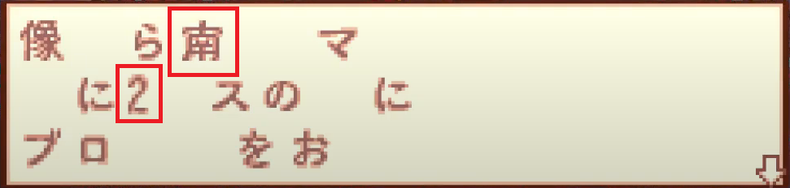

Use the magic circle to switch to Sabata.

Go back indoors, then proceed up the elevator on the south side of the room.

### <span class="puzzle">Sabata Block Puzzle</span>

Use a ![][icon_power_nut] Power Nut:  
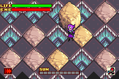
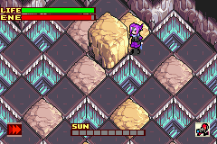
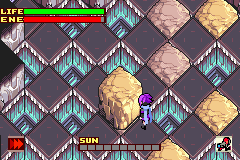

After this, **check the hint panel** and switch back to Django:  
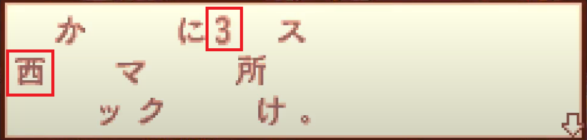

Proceed through the gate and push the iron block based on the hint panels and the statue.  
Note that Django and Sabata's hint panels refer to _each other's_ blocks, inverting the solution as read.  
For instance, 北2 東4 means North 4, East 2, NOT North 2, East 4.

<!-- Maybe this could be replaced with an image or could use icons for the letters -->
**北 = North, 南 = South, 東 = East, 酉 = West.**

### <span class="trap">Axe+ Trap</span>

- Use Black Django and ![][icon_dark] Dark.
- You should reach **Lvl 26** after this fight.

Backtrack inside and proceed upstairs until you take an elevator.  
The outdoors screen has solar wind that will push you if using sunlight.  
Use the solar walkway with <=8 Sunlight to go straight to the next elevator if you don't need the following items.

If you do, open these chests for items (![][icon_jerky] ![][icon_solar_nut] ![][icon_warp_leaf] ![][icon_tasty_meat]) before taking the elevator at the north side of the room:  
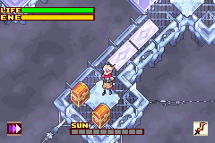
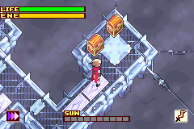

Equip ![][icon_dash] Dash, ![][icon_sol] Sol, ![][icon_frost] Frost and ![][icon_cloud] Cloud.  
Use ![][icon_sol] Sol to kill the Leys, activate the lever, then kill the Leys again to reach **Lvl 27.**  
Push the block and farm Leys for EXP if you did not reach this level.  
Proceed downstairs, put all stat points into STRG, then use a ![][icon_power_nut] Power Nut to do the puzzle.

Push the left block ↘️, then the other block ↙️↘️ so that they're next to each other:  
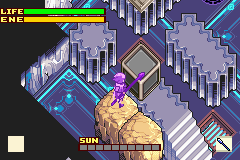

Push the floating block with spear and ![][icon_cloud] Cloud ↗️.  
Break the top stone block so that you can push the bottom one to cross and reach the floating block again:  


Push the floating block onto the switch with spear and ![][icon_cloud] Cloud, then use ![][icon_frost] Frost.  
Proceed through the ↘️ exit.

As Sabata, proceed upstairs.  
![][icon_zero_shift] Zero Shift through the southern Black Slime and proceed upstairs.  
Shoot in the ↗️ direction to activate the final lever.  
Backtrack downstairs and proceed through the ↖️ exit to reach Django.

During the dialog, choose the second dialog option to avoid a Game Over.

### <span class="boss">Black Dainn</span>

- 1st phase:
  - Stay away so that Sabata doesn't get hit.
  - When Dainn spawns dark orbs, destroy them with ![][icon_sol] Sol.
  - Don't attack Dainn, instead, focus on good positions to avoid swords easily.
  - When Dainn is stuck in the black hole, use ![][icon_sol] Sol.
- 2nd phase:
  - Use ![][icon_sol] Sol and avoid Dainn's attacks at all cost.
- You should reach **Lvl 28** after this fight.

Put all stat points into STRG.  
Use a ![][icon_warp_leaf] Warp Leaf to leave.

Backtrack ↙️ to the piledriver screen, then leave through the same exit.

Save the game and soft-reset.  
Change the system time to 2004/10/29 22:xx.

### <span class="purification">Black Dainn Purification</span>

Activate all four generators and enable max sunlight.  
Replace ![][icon_sol] Sol with ![][icon_transform] Transform and ![][icon_frost] Frost with ![][icon_dark] Dark.  
![][icon_transform] Transform into Black Django and begin the purification.

After starting the purification, use ![][icon_sunscreen] Sunscreen to avoid taking damage from the sunlight.  
Black Django will not take lethal damage from the dark orbs, but they should not be ignored during downtime.

Skip the chest after finishing the purification.

Equip ![][icon_dynamite] Dynamite, ![][icon_cloud] Cloud, ![][icon_dash] Dash and ![][icon_frost] Frost.  
Backtrack ↗️ to Spiral Tower.

## Undead Zone B1

In the room on the ↖️ side, knock on the wall to lure the Skeletons, avoid being seen.  
Proceed through the ↗️ exit, break the cacti to proceed.

Knock on the central pillar near the first Skeleton so that it looks in another direction, then proceed.  
Skip the next puzzle by using ![][icon_dynamite] Dynamite near the torch.

In the next room, knock on the wall near the first Skeleton.  
After the stairs, run in the ↘️ direction to avoid being seen.

### <span class="puzzle">B1 Block Puzzle</span>


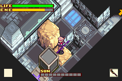
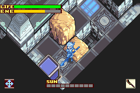

In the next room, use <=8 sunlight to enable the solar walkway and proceed through the ↖️ exit.  
Hit the Skeletons from behind and ![][icon_dash] Dash during their damage animation so that they don't see you.

Replace ![][icon_frost] Frost with ![][icon_transform] Transform and ![][icon_dynamite] Dynamite with ![][icon_bat] Bat.  
Use Black Django and ![][icon_bat] Bat to fly over the traps and get the key, then proceed through the door.  
In the next room, knock on the walls to lure the Skeletons.

Have <=8 sunlight during the next room to enable the solar walkway.  
Push the block and get the key, then backtrack to the first elevator (↘️).

Refill energy on the Solar Station and open the ↗️ door.

### <span class="trap">Sand Worm Trap</span>

- Use ![][icon_cloud] Cloud except when it's doing the tail attack.
- Attack the head to stun it.
- You should reach **Lvl 30** after this fight.

Possible change: use ![][icon_blue_card] The Tower **(塔)** and ![][icon_bearnut] Bearnut to instantly kill it.

Open the blue chest for a ![][icon_circle_key] key, use it on the other door to proceed (refill energy on the Solar Station on the way).

## Undead Zone B2

Equip ![][icon_dash] Dash, ![][icon_flame] Flame, ![][icon_earth] Earth and ![][icon_dynamite] Dynamite.  
Put all stat points into STRG.  
Proceed through the ↘️ exit.

Use ![][icon_dynamite] Dynamite by the first torch.  
Knock on the central wall to lure the Skeleton Fencer, then use ![][icon_flame] Flame to light the other torches to open the gate.

In the third dark room, light the torches on the moving platforms with spear and ![][icon_flame] Flame.  
Have <=8 sunlight to enable the solar walkways in the next room.

Use ![][icon_dynamite] Dynamite on the wall here in this room and proceed through the new ↖️ exit:  
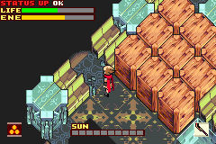

Get the ![][icon_garb_of_darkness] Garb of Darkness armor, then equip it.

Break the wooden blocks and proceed through the ↗️ exit.  
After the rooms with Skeletons, proceed up the stairs and refill energy on the Solar Station.

### <span class="trap">Lich Trap</span>

- Use ![][icon_earth] Earth and hit the Lich from behind.
- You can destroy the lightning balls.
- Avoid the summons and clouds.
- Use ![][icon_solar_nut] Solar Nuts to refill energy.
- You should reach **Lvl 32** after this fight.

Open the blue chest for a ![][icon_circle_key] key, then proceed through the ↙️ exit and take the elevator.

## Undead Zone B3

Proceed through the ↖️ exit and activate the lever.

Backtrack, then proceed through the ↙️↖️↖️ exits to activate another lever and spawn an ice block.  
Proceed through the ↗️↘️↙️ exits.

Use ![][icon_dynamite] Dynamite here, then use the first wall to slide onto this spot and get pushed by the Dynamite:  
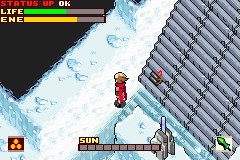

Slide directly downwards, then towards the lever and activate it.

Proceed through the ↗️↘️↙️↙️↖️ exits.  
Proceed through the ↙️ gate, then use the plant to reach the next ↙️ exit.

Refill energy on the Solar Station and put all stat points into STRG before taking the platform.

### <span class="trap">Serpent Trap</span>

- Use ![][icon_flame] Flame and sword, you can hit the tail with precise hits.
- **Use ![][icon_dynamite] Dynamite whilst the Serpent is underwater to force it to jump at you.**
- Only aim for the head and tail.
- Break the bubbles to force it to jump at you.
- You should reach **Lvl 34** after this fight.

Possible change: use ![][icon_blue_card] The Tower **(塔)** and ![][icon_bearnut] Bearnut to instantly kill it.

Open the blue chest for a ![][icon_circle_key] key, then take the new platform and backtrack to the first room to open the ↘️ door.

## Undead Zone B4

Refill energy on the Solar Station, then proceed through the ↗️↘️ exits.

### <span class="puzzle">B4 Block Puzzle</span>

Put all stat points into STRG. You should now be at 98 STRG.  
Push the stone block and use ![][icon_flame] Flame on the floating block.  
Replace ![][icon_dynamite] Dynamite with ![][icon_cloud] Cloud and ![][icon_flame] Flame with ![][icon_frost] Frost.  
Push the floating block with spear and ![][icon_cloud] Cloud ↗️↘️:  
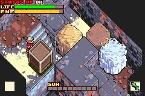

Break the stone block and push the iron block.  
Use ![][icon_earth] Earth on the floating block.  
Walk onto the switch.

Backtrack and proceed through the ↗️↘️↘️ exits.

Equip ![][icon_frost] Frost, ![][icon_dash] Dash, ![][icon_transform] Transform and ![][icon_sleep] Sleeping.

Do not walk onto the platform, instead stand at the corner edge and use spear and ![][icon_frost] Frost to extinguish the fire:  
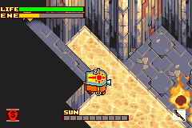

Then use ![][icon_sleep] Sleeping and ![][icon_elefan] Elefan coffin to shoot the lever.

Backtrack and proceed through the ↙️ exit.

Open this hidden chest on the way for a ![][icon_solar_nut] Solar Nut:  
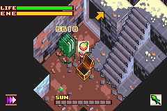

Proceed through the ↘️↘️ exits, then take the stairs.  
Proceed through the ↙️↘️↖️↖️ exits, then refill energy on the Solar Station.

### <span class="trap">Lich+ Trap</span>

- Use ![][icon_frost] Frost and hit the Lich+ from behind.
- Once it begins its rotating attack, damage boost on its back and immediately let go of directional input to land in the correct spot to avoid getting hit.
- Use ![][icon_solar_nut] Solar Nuts to refill energy.
- You should reach **Lvl 36** after this fight.

Proceed through the ↖️ exit, then take the elevator.

## Undead Zone B5

Replace ![][icon_sleep] Sleeping with ![][icon_dark] Dark.  
Raise STRG to 99, then you can put stat points into VIT if you want to be safer, but this is not faster.  
You'll need to enable a solar walkway at the end, so have <=8 sunlight.  
Take the single exits, this map is linear.

### <span class="boss">Jormungandr</span>

- You must have at least 1 sunlight during the entire fight.
- Use Black Django and ![][icon_dark] Dark.
- Use ![][icon_sunscreen] Sunscreen to avoid taking damage from sunlight.
- Aim for the eyes until the tongue is out.
- When the tongue is out, hit it 4 times, then hit the body several times to do more damage.
- During the black breath attack, charge some energy and aim to hit the eyes close to the body to get a chance at hitting the tongue and body at the same time.

During the cutscenes, enable max sunlight.  
After the cutscenes, charge energy.  
Time ends when Jormungandr's life bar reaches zero during this final charge.

<!-- Items -->
[icon_earthly_nut]: ./assets/images/icons/icon_earthly_nut.webp
[icon_solar_nut]: ./assets/images/icons/icon_solar_nut.webp
[icon_speed_nut]: ./assets/images/icons/icon_speed_nut.webp
[icon_power_nut]: ./assets/images/icons/icon_power_nut.webp
[icon_bearnut]: ./assets/images/icons/icon_bearnut.webp
[icon_warp_leaf]: ./assets/images/icons/icon_warp_leaf.webp
[icon_tasty_meat]: ./assets/images/icons/icon_tasty_meat.webp
[icon_jerky]: ./assets/images/icons/icon_jerky.webp
[icon_sunscreen]: ./assets/images/icons/icon_sunscreen.webp
[icon_triangle_key]: ./assets/images/icons/icon_triangle_key.webp
[icon_circle_key]: ./assets/images/icons/icon_circle_key.webp
[icon_blue_card]: ./assets/images/icons/icon_blue_card.webp
[icon_green_card]: ./assets/images/icons/icon_green_card.webp
[icon_black_card]: ./assets/images/icons/icon_black_card.webp
[icon_stone_tablet]: ./assets/images/icons/icon_stone_tablet.webp
[icon_yellow_orb]: ./assets/images/icons/icon_yellow_orb.webp
[icon_red_orb]: ./assets/images/icons/icon_red_orb.webp
[icon_green_orb]: ./assets/images/icons/icon_green_orb.webp
[icon_blue_orb]: ./assets/images/icons/icon_blue_orb.webp
[icon_elefan]: ./assets/images/icons/icon_elefan.webp

<!-- Magic -->
[icon_sol]: ./assets/images/icons/icon_sol.webp
[icon_frost]: ./assets/images/icons/icon_frost.webp
[icon_flame]: ./assets/images/icons/icon_flame.webp
[icon_earth]: ./assets/images/icons/icon_earth.webp
[icon_cloud]: ./assets/images/icons/icon_cloud.webp
[icon_dark]: ./assets/images/icons/icon_dark.webp
[icon_dash]: ./assets/images/icons/icon_dash.webp
[icon_dynamite]: ./assets/images/icons/icon_dynamite.webp
[icon_grow]: ./assets/images/icons/icon_grow.webp
[icon_rising_sun]: ./assets/images/icons/icon_rising_sun.webp
[icon_transform]: ./assets/images/icons/icon_transform.webp
[icon_bat]: ./assets/images/icons/icon_bat.webp
[icon_mouse]: ./assets/images/icons/icon_mouse.webp
[icon_sleep]: ./assets/images/icons/icon_sleep.webp
[icon_zero_shift]: ./assets/images/icons/icon_zero_shift.webp

<!-- Equipment -->
[icon_gladius]: ./assets/images/icons/icon_gladius.webp
[icon_short_sword]: ./assets/images/icons/icon_short_sword.webp
[icon_broad_sword]: ./assets/images/icons/icon_broad_sword.webp
[icon_long_sword]: ./assets/images/icons/icon_long_sword.webp
[icon_katana]: ./assets/images/icons/icon_katana.webp
[icon_spear]: ./assets/images/icons/icon_spear.webp
[icon_club]: ./assets/images/icons/icon_club.webp
[icon_leather_armor]: ./assets/images/icons/icon_leather_armor.webp
[icon_garb_of_darkness]: ./assets/images/icons/icon_garb_of_darkness.webp
