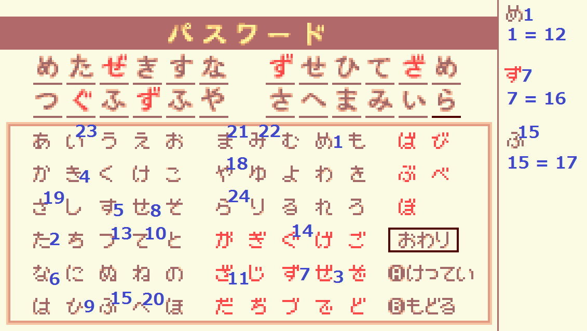
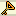
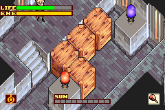
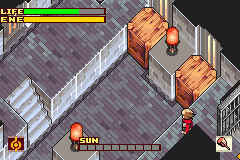
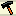

# Boktai 2 (JP) Any% Route

Ported from Google Docs, this is unfinished and might miss content.

## About this guide

- Directions for paths and exits will use ↖️, ↗️, ↙️ and ↘️.

## Before starting

- If playing on BizHawk, make sure Skip BIOS is set to FALSE and RTC is set to FALSE in the GBA Settings (Requires v2.6.3+):  

- Set the system time to August 1st 2004 at 10PM (2004/08/01 22:00).  

- Keep the default region selection.

## Setting up the Dark Boy password
  
Note: The characters to use are to the left of the numbers!  
Dark Boy title grants +2 STRG & AGIL and adds 1  Power Nut &  Bearnut to the inventory.  
After that, use a single character for the player name (saves a few frames each time the name shows up).

- If playing on English, the Dark Boy password is:  
  `h9bfvCgX +>@Hf3>-`  
  `9Sm^0smm nCw86jmJ`

## Tutorial

After the intro, open the menu and change the text speed to Fast:  
 

### Trap

- Go to ↘️ to open a chest and obtain the  Gladius, then go back and hit the skeleton from behind.

Keep going, in the room with another green chest, open it for a  Cloth Armor.  
Unequip your current armor (less defense, faster walking speed).  

### Trap

- Hit the ghoul 3 times to trigger the cutscene, then damage boost and hit it from behind twice.

## San Miguel

After the dialogs, kill the first ghoul for EXP then proceed in the ↗️ direction.  
In the pile driver area take the ↖️ direction.  
Go to ↗️, kill the ghoul for EXP, enter the dungeon.

## Cathedral

Kill two ghouls to reach Lvl 3, upgrade AGIL to 17 and put your remaining stat point into STRG.

Push the blocks on the way (turn on sunlight during block push animations), aim for the ↗️ direction.  
During the cutscene turn off sunlight, after the cutscene go to ↘️.

### Puzzle

  
Open the chest for a  Club.  
Backtrack, kill the ghoul in the cutscene room for EXP.  
Destroy the first wooden block to push the 2 stone blocks, also open the chest for a  Power Nut.  
Proceed in the ↘️ direction by destroying the wooden block.

### Puzzle

- 1st row: Push the 2nd tombstone
- 2nd row: Push 1st
- 3rd row: Push 2nd

Go back and take the stairs, kill five ghouls for EXP.  
In the 5th room, knock on the wall near the center of the room, then hug the right wall to avoid the ghoul.  
Use  Fire on the torches.

### Puzzle
  
Use  Fire and hammer (on levers) to keep going.  
After the dialogs, put stat points into STRG.

### Trap

- Use  Sol and hit the skeletons from behind.
- Stand on the third skeleton's position as it dies in case you get a random drop.

Open the chest for the  Yellow Orb and take the bottom ↖️ exit.  
Knock on the central wall to lure the ghoul onto the switch before opening the chest for a  Warp Leaf and proceed.  
Break and move the wooden blocks to get the  key, then light the torch and place the  Yellow Orb.  
Turn on sunlight during the cutscene, refill life if under 50% and refill energy to at least 70% before leaving the room.

Go back to the trap room, then open the door in the upper ↘️ direction.  
The  Red Orb will be in a random lightspot.  
Check the spot directly next to the stairs, then take the stairs whether or not you found it.

### Trap

- Put stat points into STRG if available.  
- The black ghoul deals heavy damage, be careful.

Proceed in the ↖️ direction, fall down to get the  Short Spear, then go back to this room:  

Use the spear on the lever to open the gate and proceed.

Light the first torch and place the  Red Orb if you already found it, otherwise take the stairs.  
Hold left upon entering the top floor to trigger the trapdoor and light the torch with the hammer to set up the timing to walk over the trapdoor.  
Talk to the hint panel in the bottom-left corner (necessary for a puzzle).  
Drop through a trapdoor and go back to the Red Orb room.

If you did not already get the Red Orb, check all of the lightspots whilst moving through the room, then light the torch with the spear.  
Take the new stairs and go outside.

Once outside, destroy the 2 statues with the spear to obtain the  Blue Orb.  
(Use  Sol to reduce # of hits needed).  
Open the orange chest in that area for a  Warp Leaf.

Go back to the Red Orb room.  
If you did not already find the Red Orb, **do not proceed before finding it.**  
Go back to where you obtained the spear, but instead of falling, keep going in the ↖️ direction.

### Puzzle

Talk to these bookshelves **in this order** to open the gate:

### Puzzle  

  
Open the first chests on the left for a  Power Nut and a  key.

### Puzzle

Light the torches with the spear, then push the first block to reach the second one.  
Push the second block to the left, then push the block on the weight switch to activate the lamp to obtain the  Green Orb.

Now go back to the room with the hint panel and place the  Green Orb (2nd option).  
  

Turn off sunlight during the cutscene.  
Proceed through the door in the ↖️ direction (Refill health on skylights if low).  
Light the torch and place the  Blue Orb.  
Now take the new stairs in the main room and refill energy on the Solar Station.  
Put stat points into STRG and equip the second armor.

### Boss

- Light the torch in the center with the spear. With precise positioning you can hit all four candles with one attack. 
- Use the spear to attack Duneyrr (No element to save energy,  Fire to deal higher damage).
- Kill the adds during downtime to reduce lag.
- Turn on sunlight during her death animation.

Trigger the cutscene after going in the ↗️ direction, then open the chest for a  card.  
After picking up the coffin, unequip the armor and use a  Power Nut.

Take the upper ↖️ exit in the main room.  
Activate the 3 weight switches by using the coffin and pushing the block.  
Take the middle ↖️ exit and open the blue chest ( key), the 3 green chests (   bad weapons) and the chest to the left ( Power Nut).  
Drag the coffin back to town and into the piledriver screen.

Activate three piledrivers and leave the fourth until after you've started the purification to skip a long dialog.  
After the purification, choose the first dialog.

## San Miguel [2]

Talk to Smith near the forging house, then enter it.  
Talk to the second hint panel (the one at the top), then forge a  Short Sword ( + ). 

### Forge

- Use 3-4 sunlight to get the slowest viable bar speed, aim for GREAT hits.
- Do not exceed 25 total hits; this worsens the quality of your final weapon.

If you get a  Gladius instead (80~% chance), forge again with the Gladius and the  in your inventory.

After forging, go in the ↘️ direction, break the wooden block on the way (do not equip the new sword yet).

## Remains

In the main room with golems, go in the ↖️ direction, then take the stairs.

### Trap

- If no armor is equipped, **be careful as you will die in 2 hits.**  
- Try to group them up and use  Sol.

Equip the  Short Sword and spawn the slimes.  
After you level up on the slimes, raise AGIL to 17 and put remaining points into STRG.  
Unequip armor if you had it equipped for the trap.    
Go to the left and push the block, then go back and **TURN OFF SUNLIGHT** before taking the ↗️ exit, or Solar Wind will kill you.

Light the torches and proceed.  
During the dialog, choose the first option.  
Backtrack through the room with the torches, then take the stairs and use  Frost to keep going.

Push the block, then keep going ↖️.  
Use  Fire to melt the blocks.  
Open the chest in the upper-left for a  Power Nut.  
Use  Frost to make the block fall, then replenish life and energy to 100% on the skylight.

### Traps

- 1st: Use  Sol to deal more damage.
- 2nd: Attack without using any element.
- 3rd: Knock on the walls so that the golems stun each other, then finish them off.

Possible change: Use card manip on the chest in the first trap to get  The Tower.

Open the blue chest for a  key, then proceed in the ↘️ direction and open the door.  
During the dialog, choose the second choice, then takes the stairs in the next room.

Kill the bat and keep going.  
Refill energy to at least 70% before leaving the room.

### Puzzle

Use a  Power Nut and push one block towards the start of the room like this:  
  
After that, push the other block on its spot, then do the same with the first block:

In the next room, push the block with sword and  Cloud ↘️, then spear ↗️, then lower it with  Frost.

In the newly-unlocked room, destroy the block with  Cloud to get the  key.  
Go back to the previous room and push the block on the left, keep going in the ↖️ direction.  
Break the block on the way with  Cloud, then select  Fire.

Open the door, kill the slime, then go through the ↘️ exit and push the block.  
Go back outside and take the stairs, then proceed in the ↘️ direction.

In the room with skulls, make sure that you have no sunlight (deactivates traps).  
Open the chest on the left (bottom) for a  Speed Nut, then go in the ↗️ direction.

### Puzzle

Use a  Power Nut, then push the blocks like this (start with the  fire block):  

 

Avoid the mummies and take the stairs.  
Take the stairs to the bottom of the next room, then pass the golem whilst avoiding it.  
Take the immediate ↙️ exit.  
In the room with  fire, use  Fire on the mummy to activate the torch, then take the stairs.  
Avoid the slimes and open the blue chest for a  key.

Go back downstairs and take the ↙️ exit.  
Push the block and go in the ↘️ exit.  
Open the ↗️ door and proceed.

### Trap

- It’s an axe!!  
- Use  Sol to deal more damage.  

Open all the chests for a  key, the  Dynamite magic, and a  card.

If you aren’t Lvl 10 yet, kill a Golem in the central room with  Cloud to reach Lvl 10.

Now go back to where Sabata was (↘️) and keep going the in the same direction.

Open this hidden chest ( Warp Leaf), then open the door.  
  

Once outside, talk to the fountain to get water, then proceed.

You must now find three  stone tablets that are in random spots on eight screens:  
 

When you have all three tablets, go to the central screen and talk to the statue on the left:

In the next area, open this hidden chest ( Power Nut):  

### Puzzle
Light the torches in this order:  
  

Go downstairs, run through the golem and take the ↙️ exit.  

Start with the puzzle room on the top-right:  
Use spear &  Cloud on the first block to push it ↘️.  
Push the second block ↘️ onto the weight switch.  
Push the first block ↖️↗️↖️ onto the other switch, then use  Frost on both blocks.

Proceed to the puzzle room on the top-left:  
Use  Fire on the block, then use  Cloud to push it against the wall, then push it towards the torch.  

Open the hidden chest for a  Warp Leaf:  
  

Put all stat points into STRG, then use your  Speed Nut.  
Refill energy to 50% before leaving the room.

Proceed to the puzzle room on the bottom-left:  
Activate all of the floor switches, then hit the lever with the spear.  
Equip sword and  Sol before leaving the room.

Proceed to the final puzzle room on the bottom-right:  
Activate the first lever with the sword, then run in the south direction.  
When you’re close enough, walk onto the switch.

### Boss

- Stay away so that Sabata doesn’t get hit.
- Position yourself so that the swords don’t go in Sabata’s direction.
- Only hit the vampire when the black hole is active.  
- Face in the same direction as the vampire to push him into the black hole faster.  
- When the vampire is stuck in the black hole, use  Sol.

Once you gain control of Sabata, use  Power Nuts to drag the coffin back to San Miguel.  
**Don’t forget to keep some energy for the purification.**

## San Miguel [3]

Replenish energy and HP, then buy the  Elefan coffin (160 solls).  
Equip  Dark,  Mouse and  Bat, then select spear.

Go to the piledriver area.  
Kill the two dark roots on the right with spear and  Dark, then leave **through the way you came in.**  
Go back to the piledriver ares and  repeat this until you reach lvl 13.  
Take the ↘️ exit, break the two blocks and push the slime with the hammer.  
Take the furthest ↗️ exit.

## Dark Town

Open the first chest for a  Sunscreen.  
After leaving the room, proceed in the ↗️ direction, then go around and go through the narrow passage (↘️ direction).

Take the ↙️ exit, then the last exit at the bottom.  
Take the ↗️ exit, then take the stairs again in the same direction.  

In the room with the ghouls, open this hidden chest:  
  

After the cutscene, go through the narrow pass to break the wooden block, then push the iron block.  
Go back through the narrow pass and proceed in the ↖️ direction.

Go through the second door, use  Mouse to proceed and activate the lever, then take the stairs.  
Take the ↙️ exit, then take the stairs.  
Use  Bat to go through the window.

After the room with mummies, use  Mouse on the elevator to keep going and push a block.  
Go back and take the elevator without  transforming.  
Use  Bat to go over the water, get the  key.

Go back and take the ↘️ exit, then go through the first door to backtrack to where you first used  Mouse.  
Take the stairs and open the locked door, then take the stairs to go down.  
Once outside, take the ↖️ exit nearby, use  Bat to go over the water, then go through the door.

Use  Bat on the elevator and go through the window, then take the first entrance to push a block.

Go back inside but do not take the stairs, proceed in the ↙️ direction instead.  

Pick up this hidden chest on the way:  

 
Use  Bat to go over the water and switch trap, then open the chest for a  key.  
Proceed in the ↘️ direction, push the block and go through the second door.  
After opening the door, use  Bat to go over the narrow paths, then go through the window.  
Go to the left and take the last exit for a  key, there is also a hidden chest:

Go through the window again and take the first exit.  
Go through the door to push another block.  
Go back and take the elevator, exit through ↙️, then go ↘️ and ↗️ to open the door.  
Equip the first armor and put stat points into STRG.  
Select the first option during the dialog.

### Cheyenne

- Use  Dark, keep hitting him non-stop.
- Try to aim in the correct direction so that hits counts as back hits for higher damage.

Take the magic circle, unequip the armor and use a  Warp Leaf to leave the dungeon.  
Take the ↙️ and ↖️ exits to go to San Miguel.  
Talk to Cheyenne to unlock the weapon shop, and buy  Short Sword and  Broadsword.  
Go to the forging house to forge  Long Sword (  + ).

Go back to the dungeon.  
Take the magic circle and unlock the door, open the hidden chest here:  

In the room with mummies, take the stairs, then go through the ↘️ exit.  
Open another hidden chest:  
  

In the next room, use  Bat to go through the window on the left, then keep using  Mouse, go to the right (across the wood), then use  Bat to go through the last window.

Do not push the block, just keep going.  
Refill your life/energy and equip the new sword and second armor before entering the boss fight.

### Boss

- 1st phase:
  - Keep hitting the bulb. Tank the hits and use healing items.
- 2nd phase:
  - Hit the correct bulb; look for the vibrating bulb, or you can use  Bat to see which one it is.
  - Use  Dark x3 once the bulb is opened.
- 3rd phase:
  - Use  Dark, hit her right as she spawns to cancel her attacks.

Go in the ↗️ room for a  card if you need money.  

Drag the coffin and solve the puzzles.  
After solving the puzzle with 2 wooden blocks, leave the coffin.  
Keep going alone and activate the lever.

Possible change: On the way to the lever, get  Blood-Soaked Cloak (hidden chest):  

Use a  Warp Leaf to leave and go to the piledriver area.  
Leave the area through the same exit, save the game and soft reset (A+B+Start+Select). 

Set the system time to 2004/08/31 22:00.  
The coffin is now in the piledriver area.  

Activate one piledriver.  
Equip  Sol and start the purification.  
Enable maximum sunlight during the cutscene.  

Choose the second dialog option after the purification.

## San Miguel [4]

Go to Cheyenne’s shop and talk to him to get the  Dash magic.  
**Use this for movement whenever possible.**  

Equip  Dash,  Transform,  Dark and  Cloud.  
Go outside and talk to Violet to trigger Nero.

Go to Lita’s shop:  
- Buy two  Warp Leaves (you should now have four).  
- Sell   cards & .  

Exit the shop and follow Nero.

Open the hidden chest near the bank for a fifth  Warp Leaf:  
  

Before the Aqueduct, there is an optional dungeon to the ↙️. Go inside it.

## Treasury

Use  Cloud to push the block, then go into the first entrance and solve the puzzles:  
 
  

Open the first chest in the final room for a  Zweihander.  
Use a  Warp Leaf to leave.

## Aqueduct

Go inside the Aqueduct to receive  Earth, then leave.

## Cathedral [2]

Go in the ↗️ direction.  
On the way, open the chest for a  Power Nut, then proceed in the ↖️ direction.  
Use  on the lily pads to open the chest and get a  Tarot Card.  
Use a  Warp Leaf to leave.

On the way to the next dungeon, go through the piledriver area and kill all four dark roots for EXP.

## Dark Town [2]

Pick up the  Sunscreen in the first main room.  
Go in the ↗️ direction past the iron block, then go through the door and take the platform.  
After the rooms with ghouls, take the ↗️ exit.  
Once outside, go through the first entrance.

### Puzzle

Equip  Fire,  Frost,  Cloud and  Earth. 

Use  Fire on the first block.  

Push the iron block like this:   
  

Use  Earth on the block next to the iron block, then push the iron block in the hole.

Use  Cloud & sword to push the block on the left once ↘️.

Use  Cloud to push the first block in the room in these directions:  

- ↖️ (sword)
- ↗️ (spear)
- ↖️ (spear) 2x
- ↗️ (spear)

Now use  Cloud on the other block:  

- ↘️ (sword)
- ↗️ (sword)
- ↖️ (spear)
- ↗️ (spear)

Use spear &  Frost to freeze both blocks at once.  
Take the stairs, equip  Dark,  Mouse,  Transform &  Dash.

Keep going (↙️ ↖️ ↗️), use  Mouse to go through the hole, then open the chest for a  Tarot Card.  
During the cutscene, choose the first option.  
Replace  Mouse with  Dynamite.  
Use a  Warp Leaf to leave.  
Proceed in the ↙️ direction (kill the dark root).  
Go back to the Remains.

## Remains [2]

In the golem room, take the ↗️ exit, then the second ↖️ exit.  
Proceed in the ↗️ direction (do not take the stairs).  
Use  Dynamite on the wall next to the ghoul on the top-left, then proceed.  
Kill the dark root and open the chest for the last  Tarot Card.  
Use a  Warp Leaf to leave.

## San Miguel [5]

Forge  +  to get either a  Flamberge or a  Katana.  
Focus on GOOD hits to get a bonus (+03).  
This leads to more damage compared to having the SP effect because of the damage formula.

Getting a  Katana (R-Rank weapon) is random, however it will save time because  Katana has higher attack.

## Aqueduct [2]

Open the door, then proceed.

### Trap

- Use Black Django, no element & sword.

Farm EXP in the same room until you reach lvl 21.

Keep going, on the way open these two hidden chests for items:  

Raise AGIL to 19, then put remaining stat point into STRG.  
Equip  or , and  2nd armor.

### Trap

- Use  Fire, after the fight replenish life/energy with the skylight.

### Trap

- Use  Sol and hit them in the back, replenish life/energy after this.

### Boss

- Use  Flamberge or  Katana with  Fire.
- Use the skylight to replenish life/energy as needed.
- When she charges you, time your hit so that it cancels her attack.
- If she’s at 1 HP and far away, shoot her with  Elefan coffin (Black Django &  Sleeping).

After the boss fight, use a  Warp Leaf to leave.

## San Miguel [6]

Go into the clockhouse and talk to the NPC.  
Keep talking, then change the system time to 2004/09/30 22:xx.  
Go to the piledriver area and do the purification.  
Go in the ↗️ direction, equip  Dark,  Bat and put stat points into STRG.

Disable sunlight to open Sabata's half of Spiral Tower.  
Enable sunlight to open Django's half of Spiral Tower.

## Spiral Tower

Avoid the slimes and take the stairs, then go in the ↘️ direction.  
Use  Bat to pass over the narrow walkway and push the block.  
Go back and fall through the trapdoor on the left side of the room.  
Use your spear to hit the switch.  
Push the block and use the magic circle to switch to Sabata.

Take the stairs, using  Zero Shift to run through enemies.  
On the way, step on the switch to open a gate for Django, then keep going.  
Step on the switch outside, then use the magic circle to switch back to Django.

Take the stairs to go outside, step on the switch and take the elevator.  
In the second room with cockatrices, have <=8 sunlight to use the solar walkway as a shortcut.

### Trap

- Use Black Django &  Dark.

Possible change: use card manip on the chest to get  The Tower.

Take the ↖️ exit.  
Once outside, take the stairs.  
Dodge the golems and go in the ↘️ direction, then activate the lever and switch to Sabata.  

Take the elevator, then take the stairs at the bottom of the room.  
Shoot the enemy outside (where Django is), then go back and take the other stairs.

Kill the ghoul to get the key and open the door.  
**Before going outside, replenish some energy.**  

Once outside, shoot the lever and use the magic circle to switch back to Django.

As Django, take the elevator, then go through the ↘️ exit.

Activate levers and switch characters during this puzzle to activate the brown lever.  
During Sabata's segments, use a charge attack to hit the closest grey lever and minimise movement.  

Push the block and go back inside, then activate the lever to free Sabata.

### Puzzle

Activate the first switch when the mummy is near its spot, then activate the other switches in order after the first bomb detonates:  

Open the door to keep going, take the stairs, then take the ↘️ exit to go outside.  
Use  Bat to avoid falling off the platform and activate the switch.  
**If no armor is equipped, the flame jets will easily kill you.**

Go back inside and take the stairs.  

Before using the magic circle, **check the hint panel for the number and the kanji:**  
  

As Sabata, take the elevator and keep going.

### Puzzle  
Use a  Power Nut:  

After this, **check the hint panel** and switch back to Django:  

Go through the gate and push the iron block based on the hint panels and the statue.  
**北 = North, 南 = South, 東 = East, 酉 = West**

### Trap

- Put stat points into STRG, use Black Django &  Dark.  

Open the chest afterwards for a random card.

Go back inside and take the stairs until you reach an elevator.  
Take the elevator to go outside. 

This outdoors screen has solar wind that will push you if using sunlight.  
Use the solar walkway to go straight to the next elevator if you don't need pickups.  

If you do need pickups, open these chests for items (   ) before taking the next elevator:  

Use  Sol to kill the ghosts, activate the lever, then kill the ghosts again.

Push the block and farm EXP until you reach lvl 26.  
Put stat points into STRG, equip  Dash,  Sol,  Frost &  Cloud.

Take the stairs to go back to the room below and use a  Power Nut to do the puzzle.  

Push the block on the left in the ↘️ direction, then push the other block (↙️ ↘️) so that they’re next to each other:  

Push the grey block with  Cloud & spear in the ↗️ direction.

Break the second stone block so that you can push the first one to cross and reach the grey block again:  

Push the grey block onto the switch with  Cloud & spear, then use  Frost.  
Proceed in the ↘️ direction.

As Sabata, take the stairs.  
Go through the southern slime and take the stairs.  
Shoot in the ↗️ direction to activate the final lever.  
Go back downstairs and go through the other slime to reach Django (↖️ direction).

During the dialog, choose the second option to avoid a Game Over.

### Boss

- 1st phase:
  - Stay away so that Sabata doesn’t get hit.  
  - When Dainn spawns dark orbs, destroy them with  Sol.  
  - Don’t attack Dainn, instead, focus on good positions to avoid swords easily.
  - When Dainn is stuck in the black hole, use  Sol.

- 2nd phase:
  - Use  Sol & avoid Dainn's attacks at all cost.

Open the chest for a  card.  
Leave the coffin, enter the tower on the ↘️ side, then take the stairs to go down.

Push the grey block with  Cloud, then open the last chest for a  Magic Sword: 

Use a  Warp Leaf to leave.  

Go to the piledriver area, then leave through the same exit.  
Save the game and soft-reset.  
Change the system time to 2004/10/29 23:58.  
Begin the purification.

Do the purification as Black Django, use  Sunscreen to avoid taking damage from the sunlight.  
Skip the chest afterwards.

## San Miguel [7]

Go to Lita’s shop, sell items except for one  Sunscreen and fill the inventory with:

- Six  Solar Nuts.
- Other slots with  Earthly Nuts or better healing items.

Go to Cheyenne’s shop and buy  Claymore and  Bardiche.  
Equip these weapons.  

Put stat points into STRG, equip  Dynamite &  Cloud.  
Proceed in the ↗️ direction.

## Undead Zone [1]

In the room on the ↖️ side, knock on the wall to lure the skeletons, avoid being seen.  
Take the ↗️ exit, break the cacti to keep going.

Hit the first skeleton in the back so that it looks in another direction, then keep going.  
Skip the next puzzle by using  Dynamite near the torch.

In the next room, knock on the wall near the first skeleton.  
After the stairs, walk in the ↘️ direction to avoid being seen.

### Puzzle  

 

In the next room, use <=8 sunlight to enable the solar walkway and take the ↖️ exit.  
Hit the skeletons from behind and  Dash during their damage animation so that they don’t see you.

Use Black Django &  Bat to fly over the traps and get the key, then go through the door.  
In the next room, knock on the walls to lure the skeletons.

Have <=8 sunlight during the next room to enable the solar walkway.  
Push the block and get the key, then go back to the first elevator (↘️).  
Refill energy and open the door.

### Trap

- Use  Cloud except when it's doing the tail attack.
- Attack the head to stun it.

Possible change: use  The Tower and  Bearnut for TRAP.

Open the blue chest for a  key, use it on the other door to proceed (refill energy on the way).

## Undead Zone [2]

Equip  Dash,  Fire,  Earth and  Dynamite.  
Take the ↘️ exit, light all the torches to open the gate.

Avoid the cockatrices in the next rooms, then light the torches on the moving platforms.  
Have <=8 sunlight to enable the solar walkways in the next room.

Use  Dynamite on the wall here in this room:  
  

Get the  Garb of Darkness armor, then equip it &  Magic Sword.  
Raise AGIL to 21, put remaining stat points into STRG.  

Break the wooden blocks and take the ↗️ exit.  
After the rooms with skeletons, take the stairs & refill energy.

### Trap

- Use  Earth and hit the Lich from behind.
- You can destroy the lightning balls.
- Avoid the summons & clouds.
- Use  Solar Nuts to replenish energy.

Open the blue chest for a  key, then open the door in the ↙️ direction & take the elevator.

## Undead Zone [3]

Go in the ↖️ direction and activate the lever.  
Go back and take the ↙️ exit, then ↖️ to activate another lever and spawn an ice block.  
Go through the ↗️ ↘️ ↙️ exits.  
Use  Dynamite here, then use the first wall to slide onto this spot:  

Look in the ↗️ direction and get hit by the dynamite.  

Slide directly downwards, then slide towards the lever and activate it.

Proceed and take the ↗️ ↘️ ↙️ ↙️ ↖️ exits.  
Go through the gate in the ↙️ direction, then use the plant to reach the next ↙️ exit.

Refill energy & put stat points into STRG before taking the platform.

## Trap

- Use  Fire & spear.
- Only aim for the head & tail.
- Break the bubbles to force it to jump at you.

Possible change: use  The Tower and  Bearnut for TRAP.

Open the blue chest for a  key, then take the new platform and go back to the first room to open the ↘️ door.

## Undead Zone [4]

Refill energy, then in the next room, take the ↘️ exit.

### Puzzle

Push the stone block & use  Fire on the grey block.  
Push the grey block with  Cloud & spear (↗️ ↘️):  

Break the stone block & push the iron block.  
Use  Earth on the grey block.  
Walk onto the switch.

Go back and go through the ↗️ ↘️ ↘️ exits.

Equip  Frost,  Dash,  Transform and  Sleeping.  
Put stat points into STRG.  
Do not go on the platform, instead go here and use  Frost & spear to extinguish the  fire:  
  

Then use  Sleeping and  Elefan coffin to shoot the lever.

Go back and go through the ↙️ exit.  

Open this hidden chest on the way for a  Solar Nut:  
  

Go through the ↘️ ↘️ exits, then take the stairs to keep going.  
Refill energy at the Solar Station when you reach it.

### Trap

- Use  Frost & hit the Lich+ from behind.
- If you run into its back to take damage and immediately let go of directional input, you will land in the correct spot to avoid its rotating attack.
- Use  Solar Nuts to replenish energy.

You can open the chest for a random card if you want.

## Undead Zone [5]

Equip  Dark,  Transform &  Dash, put stat points into VIT.  
You’ll need to enable a solar walkway at the end, so have <=8 sunlight.

### Jormungandr

- You need to have at least 1 sunlight during the entire fight.
- Use Black Django &  Dark to deal more damage.
- Use  Sunscreen to avoid taking damage from sunlight.
- Aim for the eyes until the tongue is out.
- When the tongue is out, hit it 4 times, then hit the body to do more damage.
- During the black breath attack, stand at range and use the spear to hit both the eyes and the body at once.

During the cutscenes, enable maximum sunlight.  
After the cutscenes, charge energy.  
Time ends when Jormungandr's health bar reaches zero during this final charge.